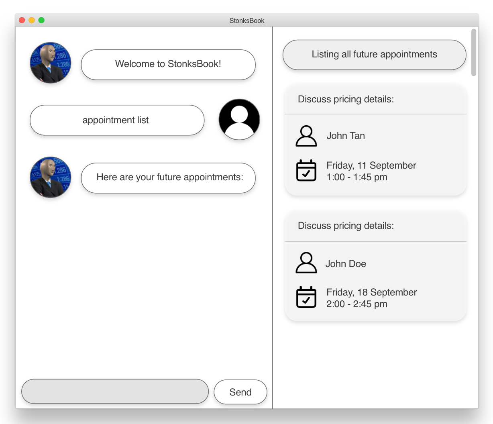

# StonksBook

StonksBook is a desktop app for managing contacts, optimized for use via a Command Line Interface (CLI) while still having the benefits of a Graphical User Interface (GUI). This brownfield project is adapted and evolved from the CS2103T sample project **AddressBook Level 3**.

For a detailed documentation of StonksBook, visit **[our product website](https://ay2021s1-cs2103t-t11-1.github.io/tp/)**.

## Acknowledgements
* This project is based on the AddressBook-Level3 project created by the [SE-EDU Initiative](https://se-education.org).
