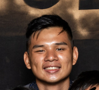
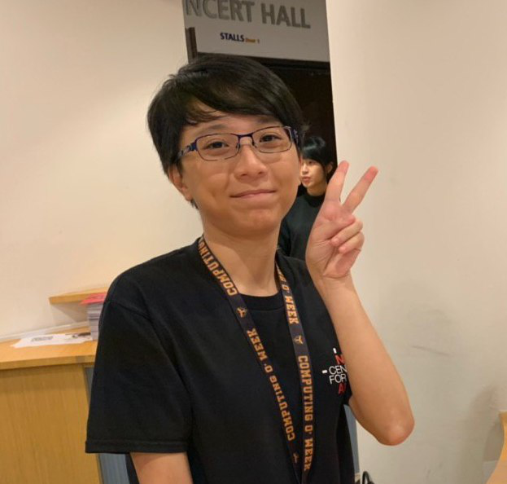
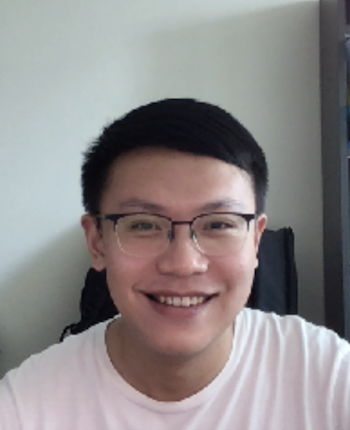
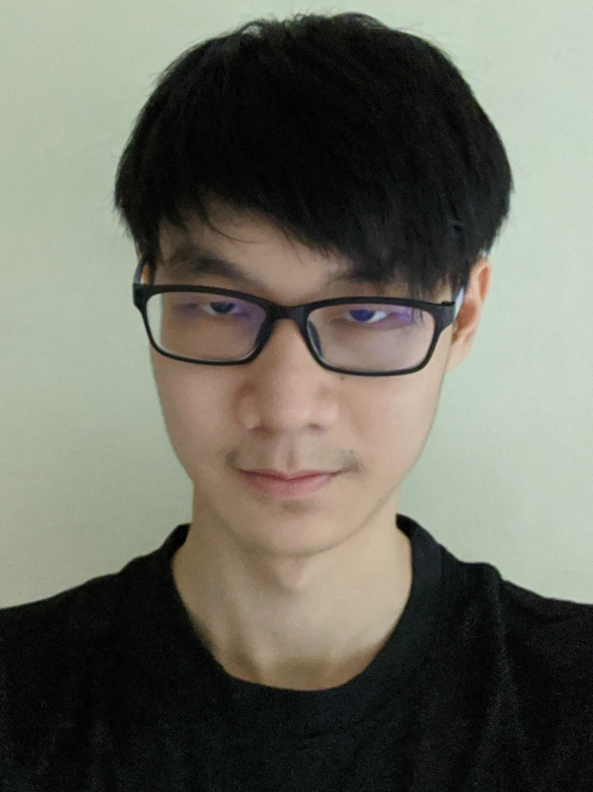

We are a team based in the [School of Computing, National University of Singapore](http://www.comp.nus.edu.sg).

You can reach us at the email `seer[at]comp.nus.edu.sg`

## Project team

### Aaron Seah

[[github](http://github.com/aaronnseah)]
[[portfolio](team/aaronnseah.md)]

* Role: Team Lead
* Responsibilities: Overall Project Coordination

### Sebastian Toh

[[github](http://github.com/sebastiantoh)]
[[portfolio](team/sebastiantoh.md)]

* Role: Developer
* Responsibilities: Documentation

### Kwek Min Yih

[[github](http://github.com/hakujitsu)]
[[portfolio](team/hakujitsu.md)]

* Role: Developer
* Responsibilities: Deliverables and Deadlines

### Wang Luo

[[github](https://github.com/Asthenosphere)]
[[portfolio](team/asthenosphere.md)]

* Role: Developer
* Responsibilities: Testing

### Leong Jin Ming

[[github](https://github.com/jmleong666)]
[[portfolio](team/jmleong666.md)]

* Role: Developer
* Responsibilities: Integration
