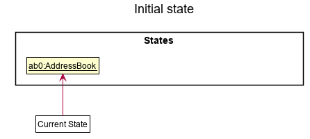
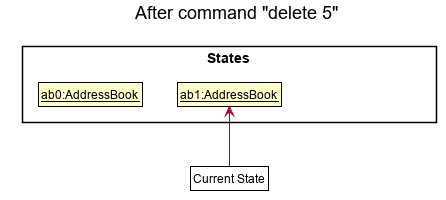
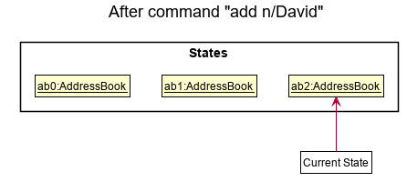
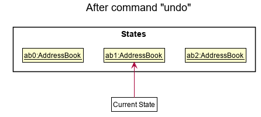
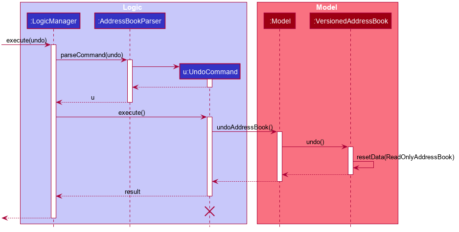
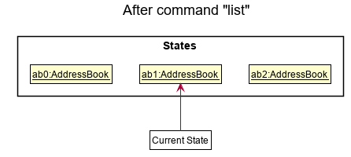
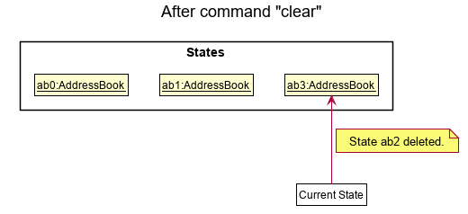
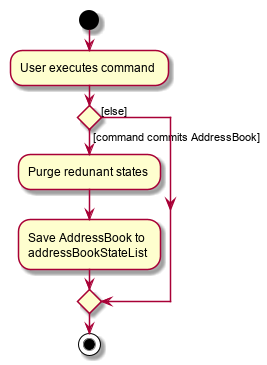

* Table of Contents
{:toc}

## **Introduction**

### Software overview

StonksBook is a sales-optimised contact management application. It is targeted at salesmen who are seeking an all-in-one application that can empower them to effectively curate their contact list.
StonksBook also provides many tools that can boost one's sales peformance through the use of sophisticated data analysis techniques.

### Purpose & scope

This document describes the software architecture and software design decisions for the implementation
of StonksBook. The intended audience of this document is the developers, designers, and software testers of StonksBook.

--------------------------------------------------------------------------------------------------------------------

## **Setting up, getting started**

Refer to the guide [_Setting up and getting started_](SettingUp.md).

--------------------------------------------------------------------------------------------------------------------

## **Design**

### Architecture

The ***Architecture Diagram*** given above explains the high-level design of the App. Given below is a quick overview of each component.

:bulb: **Tip:** The `.puml` files used to create diagrams in this document can be found in the [diagrams](https://github.com/AY2021S1-CS2103T-T11-1/tp/blob/master/docs/diagrams/) folder. Refer to the [_PlantUML Tutorial_ at se-edu/guides](https://se-education.org/guides/tutorials/plantUml.html) to learn how to create and edit diagrams.

**`Main`** has two classes called [`Main`](https://github.com/AY2021S1-CS2103T-T11-1/tp/blob/master/src/main/java/seedu/address/Main.java) and [`MainApp`](https://github.com/AY2021S1-CS2103T-T11-1/tp/blob/master/src/main/java/seedu/address/MainApp.java). It is responsible for,
* At app launch: Initializes the components in the correct sequence, and connects them up with each other.
* At shut down: Shuts down the components and invokes cleanup methods where necessary.

[**`Commons`**](#common-classes) represents a collection of classes used by multiple other components.

The rest of the App consists of four components:

* [**`UI`**](#ui-component): The UI of the App.
* [**`Logic`**](#logic-component): The command executor.
* [**`Model`**](#model-component): Holds the data of the App in memory.
* [**`Storage`**](#storage-component): Reads data from, and writes data to, the hard disk.

Each of the four components,

* defines its *API* in an `interface` with the same name as the Component.
* exposes its functionality using a concrete `{Component Name}Manager` class (which implements the corresponding API `interface` mentioned in the previous point.

For example, the `Logic` component (see the class diagram given below) defines its API in the `Logic.java` interface and exposes its functionality using the `LogicManager.java` class which implements the `Logic` interface.

**How the architecture components interact with each other**

The *Sequence Diagram* below shows how the components interact with each other for the scenario where the user issues the command `contact delete 1`.

The sections below give more details of each component.

### UI component

**API** :
[`Ui.java`](https://github.com/AY2021S1-CS2103T-T11-1/tp/blob/master/src/main/java/seedu/address/ui/Ui.java)

The UI consists of a `MainWindow` that is made up of parts e.g.`CommandBox`, `ResultDisplay`, `PersonListPanel`, `StatusBarFooter` etc. All these, including the `MainWindow`, inherit from the abstract `UiPart` class.

The `UI` component uses JavaFx UI framework. The layout of these UI parts are defined in matching `.fxml` files that are in the `src/main/resources/view` folder. For example, the layout of the [`MainWindow`](https://github.com/AY2021S1-CS2103T-T11-1/tp/blob/master/src/main/java/seedu/address/ui/MainWindow.java) is specified in [`MainWindow.fxml`](https://github.com/AY2021S1-CS2103T-T11-1/tp/blob/master/src/main/resources/view/MainWindow.fxml)

The `UI` component,

* Executes user commands using the `Logic` component.
* Listens for changes to `Model` data so that the UI can be updated with the modified data.

### Logic component

**API** :
[`Logic.java`](https://github.com/AY2021S1-CS2103T-T11-1/tp/blob/master/src/main/java/seedu/address/logic/Logic.java)

1. `Logic` uses the `StonksBookParser` class to parse the user command.
1. This results in a `Command` object which is executed by the `LogicManager`.
1. The command execution can affect the `Model` (e.g. adding a person).
1. The result of the command execution is encapsulated as a `CommandResult` object which is passed back to the `Ui`.
1. In addition, the `CommandResult` object can also instruct the `Ui` to perform certain actions, such as displaying help to the user.

Given below is the Sequence Diagram for interactions within the `Logic` component for the `execute("contact delete 1")` API call.

:information_source: **Note:** The lifeline for `DeleteCommandParser` should end at the destroy marker (X) but due to a limitation of PlantUML, the lifeline reaches the end of diagram.

### Model component

**API** : [`Model.java`](https://github.com/AY2021S1-CS2103T-T11-1/tp/blob/master/src/main/java/seedu/address/model/Model.java)

The `Model`,

* stores a `UserPref` object that represents the user’s preferences.
* stores the address book data.
* exposes the following unmodifiable lists that can be 'observed' e.g. the UI can be bound to this list so that the UI automatically updates when the data in the list change.
    1. `ObservableList<Person>`
    2. `ObservableList<Meeting>`
    3. `ObservableList<Reminder>`
    3. `ObservableList<Sale>`
* does not depend on any of the other three components.

:information_source: **Note:** An alternative (arguably, a more OOP) model is given below. It has a `Tag` list in the `StonksBook`, which `Person` references. This allows `StonksBook` to only require one `Tag` object per unique `Tag`, instead of each `Person` needing their own `Tag` object. 

### Storage component

**API** : [`Storage.java`](https://github.com/AY2021S1-CS2103T-T11-1/tp/blob/master/src/main/java/seedu/address/storage/Storage.java)

The `Storage` component,
* can save `UserPref` objects in json format and read it back.
* can save the address book data in json format and read it back.

### Common classes

Classes used by multiple components are in the `seedu.StonksBook.commons` package.

--------------------------------------------------------------------------------------------------------------------

## **Implementation**

This section describes some noteworthy details on how certain features are implemented.

### Meetings feature \[Sebastian Toh Shi Jian\]

The meetings feature allows the user to add, delete, or update meetings in StonksBook.
Meetings are displayed in increasing order based on the start date of the meeting.

The feature consists of the following commands:
- `meeting add` - Adds a meeting to the meeting list.
- `meeting delete` - Delete a meeting from the meeting list.
- `meeting edit` - Edit a meeting from the meeting list.
- `meeting list` - Display the list of all meetings in the user interface.

#### Parsing of commands within the `Logic` component

The parsing of commands begins once the `LogicManager` receives and tries to execute the user input.

In order to handle the many commands in our application, we introduced an intermediate layer between `AddressBookParser` and the relevant command parsers, e.g. `AddCommandParser`.
The intermediate layer will first determine which model type the command corresponds to, before dispatching it to the corresponding command parser.
For all meeting-related commands, we have the `MeetingCommandsParser` which serves as the intermediate class.

These are the steps that will be taken when parsing a meeting-related user command:
1. An `AddressBookParser` will check if the command is meetings-related. The `AddressBookParser` will then create a `MeetingCommandsParser`.
2. The `MeetingCommandsParser` will check what type of command it is and create the corresponding parsers as follows:
    - `meeting add` command: `AddCommandParser`
    - `meeting delete` command: `DeleteCommandParser`
    - `meeting edit` command: `EditCommandParser`
    - `meeting list` command: `ListCommandParser`
3. The respective parsers all implement the `Parser` interface, and the `Parser#parse` method will then be called.
4. Within `Parser#parse`, static methods in `ParserUtil` may be called to parse the arguments.

Given below is a sequence diagram for interactions inside the `Logic` component for the `execute(meeting add <args>)` API call.
- Note that the command is truncated for brevity and `<args>` is used as a placeholder to encapsulate the remaining arguments supplied by the user.
- For example, if the full command was `meeting add c/2 m/Lunch with Alice d/2020-10-30 10:10`, then `<args>` is equivalent to `c/2 m/Lunch with Alice d/2020-10-30 10:10`.

:information_source: **Note:** The lifeline for `MeetingCommandsParser` and `AddCommandParser` should end at the destroy marker (X) but due to a limitation of PlantUML, the lifeline reaches the end of diagram.

#### Execution of commands within the `Logic` component

After the user input has been parsed into a `Command`, it is executed with `model` passed in as a parameter.

First, relevant methods in `model` are called to retrieve related objects or check for the existence of the sale.
In this case, `getSortedPersonList()` is called to retrieve the `id` of the contact that is to be associated with the
meeting and `hasMeeting(newMeeting)` is called to ensure that `newMeeting` to be added does not already exist.

Second, objects to be added or edited are created. For `AddCommand`, the new `Meeting` object to be added is created.

Next, relevant `model` methods are called to edit the lists of `Meeting` objects. For `AddCommand`, `addMeeting` is
 called to add the newly created meeting to the `model`.

Lastly, a `CommandResult` object containing the message to be displayed to the user is returned to `LogicManager`.

The sequence diagram below illustrates how the `AddCommand` that is created from parsing `meeting add <args>` is
 executed.

 

#### Error handling within the `Logic` component

The below activity diagram shows the overall process of the execution of `meeting add <args>`.

In order to ensure data cleanliness and that the inputs by the users are valid, errors are thrown at various stages if:
- Incorrect command format is used (e.g. missing/incorrect prefixes)
- Invalid index/values provided (e.g. non-positive and non-integer values are provided as index, non-alphanumeric
 character included in message, unrecognised date formats, etc.)

#### Modelling `Meeting`s

Meetings are modelled according to the class diagram below.

`LocalDateTime` and `Duration` are classes from Java's `java.time` package.

We enforce a composition relationship between `Meeting` and its attribute as we do not want `Meeting` to exist when either of its attributes no longer exist.
With that, whenever a `Person` is deleted, all associated `Meeting`s are deleted as well. Similarly, we also enforce that all `Meeting`s must be associated with a non-empty `Message`.

#### Design consideration:

##### Aspect: Whether it should be necessary to enforce a `message` field in a `Meeting` object
* **Alternative 1 (current choice):**: Create a `Message` class which enforces a non-empty message association to a `Meeting` object.
  * Pros:
    * Easier implementation of meeting commands since every field is necessary.
    * Better data cleanliness.
  * Cons:
    * Have to implement a separate class as well as implement validation of inputs.

* **Alternative 2:** Set the `Meeting` object to be associated to a `String` which acts as the message of a meeting.
  * Pros:
    * No need to implement validation of inputs for this `message` field.
  * Cons:
    * Will need to implement some kind of placeholder text for `Meeting`s without a message when displaying meetings in the user interface.
    * Will have to be more careful in implementation of meeting commands to allow for an optional field.

Alternative 1 is chosen as we found that the importance of enforcing data cleanliness far outweighs the associated
 cost that is required to implement this enforcement.

##### Aspect: What fields should be stored to represent a `Meeting`

* **Alternative 1 (current choice):** Store just the start date of a meeting, along with its duration.
  * Pros:
    * More user-friendly since users tend to schedule meetings based on a start date and its duration.
  * Cons:
    * May have slight performance dip since the end date of a meeting may have to be computed repeatedly for display in the user interface.

* **Alternative 2:** Store both start and end date of the meeting.
  * Pros:
    * May have slightly improved performance since there is no need to compute the end date.
  * Cons:
    * User will have to input both start and end date, which can be tedious.

* **Alternative 3:** Store start date, end date, and duration of the meeting.
  * Pros:
    * More user-friendly since users can schedule meetings using just the start date and its duration.
    * More performant since the end date need not be re-computed.
  * Cons:
    * There is the possibility that the three fields may no longer be in sync. Extra emphasis must be taken to ensure that these fields remain synchronised whenever either of these fields changes.

Alternative 1 is chosen as it is the most user-friendly option. It also makes maintaining the data easy.
Because only future meetings are displayed by default, the slight performance dip associated with alternative 1 may
 not actually be an issue as we do not foresee the list of future meetings to be very large.

##### Aspect: How to serialize the start date and duration of a `Meeting`
* **Alternative 1 (current choice):** Deserialize them according to ISO-8601 format.
   * Pros:
     * Unambiguous and well-defined method of representing dates and times
     * Easier integration with other date and time libraries should such an integration be necessary.
   * Cons:
     * Should the user decide to open the data file, the ISO-8601 format may not be very familiar or readable. This
      increases the likelihood of corruption of data.

* **Alternative 2:** Serialize them in a format that is human readable. e.g. storing dates in dd-MM-yyyy format and
 durations as an integer representing number of minutes
   * Pros:
     * Should the user decide to open the data file, he can easily understand and make relevant modifications without
      corrupting the data format.
   * Cons:
     * Parsing and deserializing the data may pose some difficulties.

Alternative 1 is chosen as it is a well-established international standard which would facilitate the integration of
 other libraries if necessary.

### Reminders feature \[Sebastian Toh Shi Jian\]
The reminders feature allows the user to add, delete, or update reminders in StonksBook.
Reminders are displayed in increasing order based on the scheduled date of the reminder.

The feature consists of the following commands:
- `reminder add` - Adds a reminder to the reminder list.
- `reminder delete` - Delete a reminder from the reminder list.
- `reminder edit` - Edit a reminder from the reminder list.
- `reminder list` - Display the list of all reminders in the user interface.

#### Parsing of commands within the `Logic` component

The parsing of commands begins once the `LogicManager` receives and tries to execute the user input.

In order to handle the many commands in our application, we introduced an intermediate layer between
 `AddressBookParser` and the relevant command parsers, e.g. `DeleteCommandParser`.
The intermediate layer will first determine which model type the command corresponds to, before dispatching it to the corresponding command parser.
For all reminder-related commands, we have the `ReminderCommandsParser` which serves as the intermediate class.

These are the steps that will be taken when parsing a reminder-related user command:
1. An `AddressBookParser` will check if the command is reminder-related. The `AddressBookParser` will then create a
 `ReminderCommandsParser`.
2. The `ReminderCommandsParser` will check what type of command it is and create the corresponding parsers as follows:
    - `reminder add` command: `AddCommandParser`
    - `reminder delete` command: `DeleteCommandParser`
    - `reminder edit` command: `EditCommandParser`
    - `reminder list` command: `ListCommandParser`
3. The respective parsers all implement the `Parser` interface, and the `Parser#parse` method will then be called.
4. Within `Parser#parse`, static methods in `ParserUtil` may be called to parse the arguments.

Given below is a sequence diagram for interactions inside the `Logic` component for the `execute(reminder delete 1)` API call.

:information_source: **Note:** The lifeline for `ReminderCommandsParser` and `DeleteCommandParser` should end at the destroy marker (X) but due to a limitation of PlantUML, the lifeline
 reaches the end of diagram.

#### Execution of commands within the `Logic` component

After the user input has been parsed into a `Command`, it is executed with `model` passed in as a parameter.

First, relevant methods in `model` are called to retrieve related objects or check for the existence of the reminder.
For the case of `DeleteCommand`, `getSortedReminder()` is called to retrieve the list of all reminders
 that are currently displayed in the user interface.

Next, relevant model methods are called to edit the lists of `Reminder`objects. For `DeleteCommand`, `deleteReminder`
is used to delete the reminder corresponding to the specified index.

Lastly, a `CommandResult` object containing the message to be displayed to the user is returned to `LogicManager`.

The sequence diagram below illustrates how the `DeleteCommand` that is created from parsing `reminder delete 1` is
 executed.

#### Error Handling within the `Logic` component

The below activity diagram shows the overall process of the execution of `reminder delete 1`.

In order to ensure data cleanliness and that the inputs by the users are valid, errors are thrown at various stages if:
* Incorrect command format is used (e.g. missing/incorrect prefixes)
* Invalid index/values provided (e.g. non-positive and non-integer values are provided as index)

#### Modelling `Reminder`s

`Reminder` is modelled according to the class diagram below.

`Reminder` objects are saved within a `UniqueReminderList` stored in `AddressBook`.

We enforce a composition relationship between `Reminder` and its attribute as we do not want `Reminder` to exist when
 either of its attributes no longer exist. With that, whenever a `Person` is deleted, all associated `Reminder`s are
  deleted as well. Similarly, we also enforce that all `Reminder`s must be associated with a non-empty `Message`.

#### Design consideration:

##### Aspect: Whether it should be necessary to enforce a `message` field in a `Reminder` object
* **Alternative 1 (current choice):**: Create a `Message` class which enforces a non-empty message association to a
 `Reminder` object.
  * Pros:
    * Easier implementation of reminder commands since every field is necessary.
    * Better data cleanliness.
  * Cons:
    * Have to implement a separate class as well as implement validation of inputs.

* **Alternative 2:** Set the `Reminder` object to be associated to a `String` which acts as the message of a reminder.
  * Pros:
    * No need to implement validation of inputs for this `message` field.
  * Cons:
    * Will need to implement some kind of placeholder text for `Reminder`s without a message when displaying
     reminders in the user interface.
    * Will have to be more careful in implementation of reminder commands to allow for an optional field.

A similar consideration was made when implementing [`Meeting`s](#aspect-whether-it-should-be-necessary-to-enforce-a-message-field-in-a-meeting-object).
This further strengthened our choice to go for Alternative 1 given that the cost of having to validate the inputs
 would be spread over multiple features.

##### Aspect: How to serialize the scheduled date of a `Reminder`
* **Alternative 1 (current choice):** Deserialize the date according to ISO-8601 format.
   * Pros:
     * Unambiguous and well-defined method of representing dates and times
     * Easier integration with other date and time libraries should such an integration be necessary.
   * Cons:
     * Should the user decide to open the data file, the ISO-8601 format may not be very familiar or readable. This
      increases the likelihood of corruption of data.

* **Alternative 2:** Serialize them in a format that is human readable. e.g. storing dates in dd-MM-yyyy format and
 durations as an integer representing number of minutes
   * Pros:
     * Should the user decide to open the data file, he can easily understand and make relevant modifications without
      corrupting the data format.
   * Cons:
     * Parsing and deserializing the data may pose some difficulties.

A similar consideration was made when implementing [`Meeting`s](#aspect-how-to-serialize-the-start-date-and-duration
-of-a-meeting).
Alternative 1 was chosen so as to have a consistent and standardised way of handling date and time handled within our code base.

### Sale Feature [Kwek Min Yih]

The Sales feature allows users to add and manage Sales made to contacts in StonksBook. Sales are ordered from most to least recently made.

This feature consists of the following commands:
* `sale add` – Adds a sale to the sale list.
* `sale delete` – Deletes a sale to the sale list.
* `sale edit` – Edits a sale to the sale list.
* `sale list` – Display the list of all sales in the user interface.

#### Parsing of commands within the `Logic` component

The parsing of commands begins once the `LogicManager` receives and tries to execute the user input.

In order to handle the many commands in our application, we introduced an intermediate layer between `AddressBookParser` and the relevant command parsers, e.g. `AddCommandParser`.
The intermediate layer will first determine which model type the command corresponds to, before dispatching it to the corresponding command parser.
For all sale-related commands, we have the `SaleCommandsParser` which serves as the intermediate class.

These are the steps that will be taken when parsing a sale-related user command:
1. An `AddressBookParser` will check if the command is sale-related. The `AddressBookParser` will then create a `SaleCommandsParser`.
3. The `SaleCommandsParser` will check what type of command it is and create the corresponding parsers as follows:
    - `sale add` command: `AddCommandParser`
    - `sale delete` command: `DeleteCommandParser`
    - `sale edit` command: `EditCommandParser`
    - `sale list` command: `ListCommandParser`
4. The respective parsers all implement the `Parser` interface, and the `Parser#parse` method will then be called.
5. Within the `Parser#parse`, static methods in `ParserUtil` may be called to parse the arguments.

Given below is a sequence diagram for interactions inside the `Logic` component for the `execute(sale add <args>)` API call.
- Note that the command is truncated for brevity and `<args>` is used as a placeholder to encapsulate the remaining arguments supplied by the user.
- For example, if the full command was `sale add c/4 n/Notebook d/2020-10-30 15:00 p/6.00 q/2 t/stationery`, then `<args>` is equivalent to `c/4 n/Notebook d/2020-10-30 15:00 p/6.00 q/2 t/stationery`.

#### Execution of commands within the `Logic` component

After command has been parsed into an `AddCommand`, it is executed with `model` passed in as a parameter.

First, relevant methods in `model` are called to retrieve related objects or check for the existence of the sale.
In this case, `getSortedPersonList()` is called to retrieve the `id` of the buyer and `hasSale(newSale)` is called to ensure that the `sale` to be added does not already exist.

Second, objects to be added or edited are created.
For `AddCommand`, the new `Sale` object to be added is created, and a new `editedPerson` object is created containing an updated `totalSalesAmount` variable.

Next, relevant `model` methods are called to edit the lists of `Sale` and `Person` objects,
with `setPerson()` and `addSale()` being used to replace an existing `Person` object and add a new `Sale` object respectively.

Lastly, a `CommandResult` object containing the message to be displayed to the user is returned to `LogicManager`.

#### Error Handling within the `Logic` component

The below activity diagram shows the overall process of execution of `sale add <args>`.

In order to ensure data cleanliness and that the inputs by the users are valid, errors are thrown at various stages if:
* Incorrect command format is used (e.g. missing/incorrect prefixes)
* Invalid index/values provided (e.g. alphabetical characters provided for numerical fields such as `Quantity`)
* Sale object provided already exists

#### Modelling `Sale`s

`Sale` is modelled according to the class diagram below.

`Sale` objects are saved within a `UniqueSaleList` stored in `AddressBook`.
There is a composition relationship between `Sale` and its attributes, as we want the attributes (e.g. `ItemName`, `UnitPrice`) to exist dependently on the `Sale` object it belongs to.
The attributes are abstracted out into different classes, instead of being stored as values within Sale, to allow for greater input validation and attribute specific functionality.

#### Design Consideration:

##### Aspect: How to implement currency related fields
* **Alternative 1 (current choice):**: Use BigDecimal to store currency related fields.
  * Pros:
    * Accurate currency calculations are possible.
  * Cons:
    * Need to import the BigDecimal package.

* **Alternative 2:** Use Float variables to store currency variables.
  * Pros:
    * No need to import any packages.
  * Cons:
    * Will likely result in accurate currency calculations due to float rounding errors.

* **Alternative 3:** Store dollars and cents independently as integers
  * Pros:
    * Accurate currency calculations are possible.
  * Cons:
    * Cumbersome currency calculations due to converting every hundred cents to dollars.

### Archive feature \[Leong Jin Ming\]

The Archive feature allows users to archive contacts who are no longer active.

This feature consists of the following commands:
* `archive add` — Adds a contact to the archive.
* `archive list` — Lists all contacts in the archive.
* `archive remove` — Removes a contact from the archive.

#### Parsing of commands within the `Logic` component

Much like other core features, we introduced an intermediate layer between the `AddressBookParser` and the archive command parsers, which in this case is the `ArchiveCommandsParser`.

These are the steps that will be taken when parsing an archive-related user command:
1. The `AddressBookParser` checks if the user command is archive-related. Then, it creates an `ArchiveCommandsParser`.
1. The `ArchiveCommandsParser` checks what type of command it is and creates the corresponding parsers/commands as follows:
    - `archive add` command: `AddCommandParser`
    - `archive list` command: `ListCommand`
    - `archive remove` command: `RemoveCommandParser`
1. The relevant parser, which implements the `Parser` interface, parses the command via `Parser#parse`.
1. If the user command is valid, the parser creates the corresponding `Command` object for execution.

Given below is a sequence diagram for interactions inside the Logic component for the `execute("archive add 1")` API call.

#### Execution of commands within the `Logic` component

Since the execution of the `RemoveCommand` is similar to the `AddCommand`, we shall only look at the execution of the latter.

When an `AddCommand` is created by the `AddCommandParser`, it is executed with `model` passed in as the parameter.

Firstly, relevant methods in `model` are called to retrieve related objects or check for the existence of the contact. Here, `getSortedPersonList()` is called to get the list of contacts currently being displayed in the UI.

Secondly, objects to be added or edited are created. In this case, a new `archivedPerson` is created with the `archived` flag set to `true`.

Next, relevant `model` methods are called to edit the list of `Person` objects, with `setPerson()` used to replace an existing Person object.

Finally, a `CommandResult` object containing the message to be displayed to the user is returned to `LogicManager`.

#### Error Handling within the `Logic` component

The below activity diagram shows the overall process of execution of `archive add 1`.

In order to ensure data cleanliness and that the inputs by the users are valid, errors are thrown at various stages if:

- Incorrect command format is used (i.e. missing index as argument)
- Invalid index is provided
- The incorrect list is being displayed

### \[Proposed\] Undo/redo feature

#### Proposed Implementation

The proposed undo/redo mechanism is facilitated by `VersionedStonksBook`. It extends `StonksBook` with an undo/redo history, stored internally as an `StonksBookStateList` and `currentStatePointer`. Additionally, it implements the following operations:

* `VersionedStonksBook#commit()` — Saves the current address book state in its history.
* `VersionedStonksBook#undo()` — Restores the previous address book state from its history.
* `VersionedStonksBook#redo()` — Restores a previously undone address book state from its history.

These operations are exposed in the `Model` interface as `Model#commitStonksBook()`, `Model#undoStonksBook()` and `Model#redoStonksBook()` respectively.

Given below is an example usage scenario and how the undo/redo mechanism behaves at each step.

Step 1. The user launches the application for the first time. The `VersionedStonksBook` will be initialized with the initial address book state, and the `currentStatePointer` pointing to that single address book state.

Step 2. The user executes `delete 5` command to delete the 5th person in the address book. The `delete` command calls `Model#commitStonksBook()`, causing the modified state of the address book after the `delete 5` command executes to be saved in the `StonksBookStateList`, and the `currentStatePointer` is shifted to the newly inserted address book state.

Step 3. The user executes `add n/David …​` to add a new person. The `add` command also calls `Model#commitStonksBook()`, causing another modified address book state to be saved into the `StonksBookStateList`.

:information_source: **Note:** If a command fails its execution, it will not call `Model#commitStonksBook()`, so the address book state will not be saved into the `StonksBookStateList`.

Step 4. The user now decides that adding the person was a mistake, and decides to undo that action by executing the `undo` command. The `undo` command will call `Model#undoStonksBook()`, which will shift the `currentStatePointer` once to the left, pointing it to the previous address book state, and restores the address book to that state.

:information_source: **Note:** If the `currentStatePointer` is at index 0, pointing to the initial StonksBook state, then there are no previous StonksBook states to restore. The `undo` command uses `Model#canUndoStonksBook()` to check if this is the case. If so, it will return an error to the user rather
than attempting to perform the undo.

The following sequence diagram shows how the undo operation works:

:information_source: **Note:** The lifeline for `UndoCommand` should end at the destroy marker (X) but due to a limitation of PlantUML, the lifeline reaches the end of diagram.

The `redo` command does the opposite — it calls `Model#redoStonksBook()`, which shifts the `currentStatePointer` once to the right, pointing to the previously undone state, and restores the address book to that state.

:information_source: **Note:** If the `currentStatePointer` is at index `StonksBookStateList.size() - 1`, pointing to the latest address book state, then there are no undone StonksBook states to restore. The `redo` command uses `Model#canRedoStonksBook()` to check if this is the case. If so, it will return an error to the user rather than attempting to perform the redo.

Step 5. The user then decides to execute the command `list`. Commands that do not modify the address book, such as `list`, will usually not call `Model#commitStonksBook()`, `Model#undoStonksBook()` or `Model#redoStonksBook()`. Thus, the `StonksBookStateList` remains unchanged.

Step 6. The user executes `clear`, which calls `Model#commitStonksBook()`. Since the `currentStatePointer` is not pointing at the end of the `StonksBookStateList`, all address book states after the `currentStatePointer` will be purged. Reason: It no longer makes sense to redo the `add n/David …​` command. This is the behavior that most modern desktop applications follow.

The following activity diagram summarizes what happens when a user executes a new command:

#### Design consideration:

##### Aspect: How undo & redo executes

* **Alternative 1 (current choice):** Saves the entire address book.
  * Pros: Easy to implement.
  * Cons: May have performance issues in terms of memory usage.

* **Alternative 2:** Individual command knows how to undo/redo by
  itself.
  * Pros: Will use less memory (e.g. for `delete`, just save the person being deleted).
  * Cons: We must ensure that the implementation of each individual command are correct.

_{more aspects and alternatives to be added}_

### \[Proposed\] Data archiving

_{Explain here how the data archiving feature will be implemented}_

--------------------------------------------------------------------------------------------------------------------

## **Documentation, logging, testing, configuration, dev-ops**

* [Documentation guide](Documentation.md)
* [Testing guide](Testing.md)
* [Logging guide](Logging.md)
* [Configuration guide](Configuration.md)
* [DevOps guide](DevOps.md)

--------------------------------------------------------------------------------------------------------------------

## **Appendix: Requirements**

### Product scope

**Target user profile**:

* Managing a large client base
* Values sales optimisation
*  Analytical
*  Performance-driven
* prefer desktop apps over other types
* can type fast
* prefers typing to mouse interactions
* is reasonably comfortable using CLI apps

**Value proposition**: Effectively curate sales-optimised contact list and conveniently conduct data analysis to gain business insights and boost sales performance.

### User stories

Priorities: High (must have) - `* * *`, Medium (nice to have) - `* *`, Low (unlikely to have) - `*`

| Priority | As a …​                            | I want to …​                                               | So that I can…​                                                                            |
| -------- | --------------------------------- | ------------------------------------------------------------- | --------------------------------------------------------------------------------------------- |
| `* *`    | well-connected salesman           | see a history of the number of contacts made with someone     | determine if this contact is worth investing more time to                                     |
| `* *`    | forgetful salesman                | set reminders associated with contacts                        | keep track of crucial tasks to be done                                                        |
| `* *`    | efficient salesman                | set meeting / call time with contacts                         | plan my meetings without another app                                                          |
| `* * *`  | new salesman                      | add contacts                                                  | expand my contact list                                                                        |
| `* *`    | normal user who makes mistakes    | update contacts                                               | quickly and conveniently append any mistakes made.                                            |
| `* * *`  | careless user                     | delete contacts                                               | avoid having wrong data                                                                       |
| `* *`    | visual salesman                   | have chatbot GUI                                              | visually keep track of my actions                                                             |
| `* *`    | busy salesman                     | clear past interactions with the app                          | remove the clutter on the GUI                                                                 |
| `* *`    | careless typer                    | be notified of an erroneous input                             | easily identify my mistakes                                                                   |
| `* *`    | well-connected salesman           | associate remarks to contacts                                 | remember key information about this contact and distinguish between contacts with same names  |
| `* *`    | efficient salesman                | see the relevant sales information to the contact information | make sales decisions without referring to other app                                           |
| `* * *`  | well-connected salesman           | categorise my contacts                                        | navigate through a large list of contacts with ease.                                          |
| `* *`    | efficient salesman                | search contacts who are in certain groups                     | identify contacts belong to a sales group easily                                              |
| `* *`    | well-connected salesman           | search for contacts based on fuzzy match                      | easily find the contacts I am interested in                                                   |
| `* *`    | forgetful salesman                | see the command list with a single command                    | easily recall how to use the app                                                              |
| `* * *`  | user                              | have my contact list sorted alphabetically be default         | easily find the contacts I am interested in manually                                          |
| `* *`    | careless user                     | be suggested the right command when I input wrongly           | correct my mistakes easily                                                                    |
| `* *`    | efficient user                    | sort my contact list by certain attributes                    | easily find people of interest according the sorted result                                    |
| `* *`    | forgetful user                    | see the command list with a single command                    | recall how to use quickly                                                                     |
| `* * *`  | efficient salesman                | add sales to contacts                                         | make better sales decisions to my clients                                                     |
| `* * *`  | salesman                          | delete sales belonging to contacts                            | ensure updated and correct sales information                                                  |
| `* * *`  | efficient salesman                | list all sales of a contact                                   | see all sales made to a contact easily                                                        |
| `* *`    | careless user                     | be notified if a similar record already exists                | ensure no duplicate records are created                                                       |
| `* *`    | visual user                       | quickly identify overdue reminders                            | work on it without further delay                                                              |
| `* *`    | efficient salesman                | be notified when I attempt to schedule a clashing meeting     | schedule meetings without worrying for accidental clashes                          |
| `* *`    | well-connected salesman           | archive contacts who are no longer active                     | I can focus on contacts that are more likely to respond                                       |

### Use cases

(For all use cases below, the **System** is the `StonksBook` and the **Actor** is the `user`, unless specified otherwise)

#### Use case: Delete a person
{:.no_toc}

**MSS**

1.  User requests to list persons
2.  StonksBook shows a list of persons
3.  User requests to delete a specific person in the list
4.  StonksBook deletes the person

  Use case ends.

**Extensions**

* 2a. The list is empty.

  Use case ends.

* 3a. The given index is invalid.

    * 3a1. StonksBook shows an error message.

      Use case resumes at step 2.

#### Use case: Add a tag
{:.no_toc}

**MSS**

1.  User requests to add a new tag.
2.  StonksBook adds the provided tag.

    Use case ends.

**Extensions**

* 2a. The provided tag already exists in the tag list.

    Use case ends.

#### Use case: View all tags
{:.no_toc}

**MSS**

1.  User requests to list all tags.
2.  StonksBook displays a list of all tags.

    Use case ends.

**Extensions**

* 2a. The list of tags is empty.

    Use case ends.

#### Use case: Update a tag
{:.no_toc}

**MSS**

1.  User requests to list tags.
2.  StonksBook shows a list of tags.
3.  User requests to update a specific tag in the list.
4.  StonksBook updates the tag and updates all items associated with this tag.

    Use case ends.

**Extensions**

* 2a. The list of tags is empty.

    Use case ends.

* 3a. The given index is invalid.

    * 3a1. StonksBook shows an error message.

        Use case resumes at step 2.

#### Use case: Delete a tag
{:.no_toc}

**MSS**

1.  User requests to list tags.
2.  StonksBook shows a list of tags.
3.  User requests to delete a specific tag in the list.
4.  StonksBook deletes the tag and updates all items associated with this tag.

    Use case ends.

**Extensions**

* 2a. The list of tags is empty.

    Use case ends.

* 3a. The given index is invalid.

    * 3a1. StonksBook shows an error message.

        Use case resumes at step 2.

#### Use case: Retrieve entries by tag
{:.no_toc}

**MSS**

1.  User requests to list tags.
2.  StonksBook shows a list of tags.
3.  User requests to search for items under a specific tag in the list.
4.  StonksBook displays all entries under the given tag.

    Use case ends.

**Extensions**

* 2a. The list of tags is empty.

    Use case ends.

* 3a. The given index is invalid.

    * 3a1. StonksBook shows an error message.

        Use case resumes at step 2.

* 3b. The user specifies a different model to search for.

    * 3b1. StonksBook displays items of the specified model under the given tag.

#### Use case: Clear past interactions
{:.no_toc}

**MSS**
1.  User enters the clear command.
2.  StonksBook clears the chatbox GUI.

    Use case ends.

#### Use case: Clear all data
{:.no_toc}

**MSS**
1.  User enters the purge command.
2.  StonksBook clears all saved data.

    Use case ends.

**Extensions**
* 1a. StonksBook requests for confirmation.
    * 1a1. User confirms.

        Use case resumes at step 2.

#### Use case: Find a contact
{:.no_toc}

**MSS**

1.  User requests to find a contact by giving keyword(s).
2.  StonksBook outputs a contact list.

    Use case ends.

**Extensions**

* 2a. The list is empty.

  Use case ends.

* 2b. There is no given keyword.

    * 3a1. StonksBook shows an error message.

      Use case ends.

#### Use case: Add a meeting
{:.no_toc}

**MSS**

1. User requests to list contacts
2. StonksBook shows a list of contacts
3. User requests to add a meeting associated with a specific contact in the list
4. StonksBook adds a meeting associated with the contact

  Use case ends.

**Extensions**

* 2a. The list of contacts is empty.

  Use case ends.

* 3a. The given index is invalid.

    * 3a1. StonksBook shows an error message.

      Use case resumes at step 2.

* 3b. The given meeting date is invalid.

    * 3b1. StonksBook shows an error message.

      Use case resumes at step 2.

* 3c. The given meeting duration is invalid.

    * 3c1. StonksBook shows an error message.

      Use case resumes at step 2.

* 3d. The given meeting message is invalid.

    * 3d1. StonksBook shows an error message.

      Use case resumes at step 2.

* 3e. The given meeting conflicts with some existing meetings.
    
    * 3e1. StonksBook shows an error message.
    
      Use case resumes at step 2.

#### Use case: View all meetings
{:.no_toc}

**MSS**

1. User requests to list all meetings
2. StonksBook shows a list of all meetings

  Use case ends.

**Extensions**

* 1a. A index is specified, but the given index is invalid

    * 1a1. StonksBook shows an error message.

      Use case resumes at step 1.

* 2a. The list of meetings is empty.

  Use case ends.

#### Use case: Delete a meeting
{:.no_toc}

**MSS**

1. User requests to list meetings
2. StonksBook shows a list of meetings
3. User requests to delete a specific meeting in the list
4. StonksBook deletes the meeting

  Use case ends.

**Extensions**

* 2a. The list of meetings is empty.

  Use case ends.

* 3a. The given index is invalid.

    * 3a1. StonksBook shows an error message.

      Use case resumes at step 2.

#### Use case: Add a reminder
{:.no_toc}

**MSS**

1. User requests to list contacts
2. StonksBook shows a list of contacts
3. User requests to add a reminder associated with a specific contact in the list
4. StonksBook adds a reminder associated with the contact

  Use case ends.

**Extensions**

* 2a. The list of contacts is empty.

  Use case ends.

* 3a. The given index is invalid.

    * 3a1. StonksBook shows an error message.

      Use case resumes at step 2.

* 3b. The given reminder date is invalid.

    * 3b1. StonksBook shows an error message.

      Use case resumes at step 2.

* 3c. The given reminder message is invalid.

    * 3c1. StonksBook shows an error message.

      Use case resumes at step 2.

#### Use case: Edit a reminder

This use case is similar to `Add a reminder` except that the user has the additional option to update the status of the reminder to indicate whether the reminder is completed.

#### Use case: View all reminders
{:.no_toc}

**MSS**

1. User requests to list all reminders
2. StonksBook shows a list of all reminders

  Use case ends.

**Extensions**

* 2a. The list of reminders is empty.

  Use case ends.

#### Use case: Delete a reminder
{:.no_toc}

**MSS**

1. User requests to list reminders
2. StonksBook shows a list of reminders
3. User requests to delete a specific reminder in the list
4. StonksBook deletes the reminder

  Use case ends.

**Extensions**

* 2a. The list of reminders is empty.

  Use case ends.

* 3a. The given index is invalid.

    * 3a1. StonksBook shows an error message.

      Use case resumes at step 2.

#### Use case: Filter reminders
{:.no_toc}

**MSS**

1. User requests to list reminders based on completion status
2. StonksBook shows a list of completed or pending reminders

  Use case ends.

**Extensions**

* 2a. The list of reminders is empty.

  Use case ends.

#### Use case: Get help on available commands
{:.no_toc}

**MSS**

1.  User requests for help on the available commands.
2.  StonksBook lists the available commands, command description and example usage as well as the link to the User Guide.

    Use case ends.

#### Use case: Get help for a command
{:.no_toc}

**MSS**

1.  User requests for help for a command.
2.  StonksBook lists the command description and example usage.

  Use case ends.

#### Use case: Add a sale to a contact
{:.no_toc}

**MSS**

1.  User requests to list contacts.
2.  StonksBook shows a list of contacts.
3.  User requests to add a sale to a specific contact in the list.
4.  StonksBook adds a sale to the specific contact.

    Use case ends.

**Extensions**

* 2a. The list of contacts is empty.

  Use case ends.

* 3a. The given contact index is invalid.

    * 3a1. StonksBook shows an error message. No sale is created.

      Use case resumes at step 2.

* 3b. The given sale already exists.

    * 3b1. StonksBook shows an error message stating that the given sale already exists. No sale is created.

      Use case ends.

* 3c. Any of the given parameters (e.g. contact index, unit price, quantity) are missing.

    * 3c1. StonksBook shows an error message, reminding the user of the correct command format. No sale is created.

      Use case resumes at step 2.

* 3d. Any of the given parameters (e.g. unit price, quantity) are not in the correct format.

    * 3d1. StonksBook shows an error message, reminding the user of the correct format. No sale is created.

      Use case resumes at step 2.
      
      
#### Use case: Add a sale to a multiple contacts
{:.no_toc}

**MSS**

1.  User requests to list contacts.
2.  StonksBook shows a list of contacts.
3.  User requests to add a sale to multiple contacts in the list.
4.  StonksBook adds a sale to the multiple contacts specified.

    Use case ends.

**Extensions**

* 2a. The list of contacts is empty.

  Use case ends.

* 3a. A least one of the given contact indexes are invalid.

    * 3a1. StonksBook shows an error message highlighting the invalid contact indexes. No sales are created.

      Use case resumes at step 2.

* 3b. At least one of the given sales already exists.

    * 3b1. StonksBook shows an error message listing the duplicate sales. The remaining valid sales are created, but the duplicate sales are not.

      Use case ends.

* 3c. Any of the given parameters (e.g. contact indexes, unit price, quantity) are missing.

    * 3c1. StonksBook shows an error message, reminding the user of the correct command format. No sales are created.

      Use case resumes at step 2.

* 3d. Any of the given parameters (e.g. unit price, quantity) are not in the correct format.

    * 3d1. StonksBook shows an error message, reminding the user of the correct format. No sales are created.

      Use case resumes at step 2.      

#### Use case: List all sales
{:.no_toc}

**MSS**

1.  User requests to list all sales.
2.  StonksBook shows all sales.

    Use case ends.

#### Use case: List all sales belonging to a contact
{:.no_toc}

**MSS**

1.  User requests to list contacts.
2.  StonksBook shows a list of contacts.
3.  User requests to view all sales belonging to a specific contact in the list.
4.  StonksBook shows all sales belonging to the specific contact.

    Use case ends.

**Extensions**

* 2a. The list of contacts is empty.

  Use case ends.

* 3a. The given contact index is invalid.

    * 3a1. StonksBook shows an error message.

      Use case resumes at step 2.

#### Use case: Delete a sale

**MSS**

1.  User requests to list sales.
2.  StonksBook shows a list of sales.
3.  User requests to delete a sale.
4.  StonksBook deletes the specified sale.

    Use case ends.

**Extensions**

* 2a. The list of sales is empty.

  Use case ends.

* 4a. No sale index is provided.

    * 4a1. StonksBook shows an error message. No sale is deleted.

      Use case resumes at step 2.

* 4b. The given sale index is invalid.

    * 4b1. StonksBook shows an error message. No sale is deleted.

      Use case resumes at step 2.
      
#### Use case: Delete multiple sales

**MSS**

1.  User requests to list sales.
2.  StonksBook shows a list of sales.
3.  User requests to delete multiple sales.
4.  StonksBook deletes the specified sales.

    Use case ends.

**Extensions**

* 2a. The list of sales is empty.

  Use case ends.

* 3a. No sale indexes are provided.

    * 3a1. StonksBook shows an error message. No sale is deleted.

      Use case resumes at step 2.

* 3b. Any of the given sale indexes are invalid.

    * 3b1. StonksBook shows an error message. No sales are deleted.

      Use case resumes at step 2.
      
#### Use case: Edit a sale

**MSS**

1.  User requests to list sales.
2.  StonksBook shows a list of sales.
3.  User requests to edit a sale.
4.  StonksBook edits the sale.

    Use case ends.

**Extensions**

* 2a. The list of contacts is empty.

  Use case ends.

* 3a. No sale index is provided.

    * 3a1. StonksBook shows an error message. No sale is edited.

      Use case resumes at step 2.

* 3b. The given sale index is invalid.

    * 3b1. StonksBook shows an error message. No sale is edited.

      Use case resumes at step 2.

* 3c. The given sale already exists.

    * 3c1. StonksBook shows an error message stating that the given sale already exists. The sale is not edited.

      Use case ends.
      
* 3d. No sale parameters are provided besides the sale index.

    * 3d1. StonksBook shows an error message, reminding the user to provide at least one field to edit. The sale is not edited.

      Use case resumes at step 2.

* 3e. Any of the given parameters (e.g. unit price, quantity) are not in the correct format.

    * 3e1. StonksBook shows an error message, reminding the user of the correct format. The sale is not edited.

      Use case resumes at step 2.
      
#### Use case: Edit multiple sales

**MSS**

1.  User requests to list sales.
2.  StonksBook shows a list of sales.
3.  User requests to edit multiple sales.
4.  StonksBook edits multiple sales.

    Use case ends.

**Extensions**

* 2a. The list of contacts is empty.

  Use case ends.

* 3a. No sale indexes are provided.

    * 3a1. StonksBook shows an error message. No sales are edited.

      Use case resumes at step 2.

* 3b. Any of the given sale indexes are invalid.

    * 3b1. StonksBook shows an error message. No sales are edited.

      Use case resumes at step 2.

* 3c. Any of the given sales already exists.

    * 3c1. StonksBook shows an error message listing the duplicate sales. All sales besides the duplicate sales are edited.

      Use case ends.
      
* 3d. No sale parameters are provided besides the sale index.

    * 3d1. StonksBook shows an error message, reminding the user to provide at least one field to edit. No sales are edited.

      Use case resumes at step 2.

* 3e. Any of the given parameters (e.g. unit price, quantity) are not in the correct format.

    * 3e1. StonksBook shows an error message, reminding the user of the correct format. No sales are edited.

      Use case resumes at step 2.

#### Use case: Display sale breakdown

**MSS**

1.  User requests to display sale breakdown.
2.  StonksBook shows the sale breakdown in a pop-up window.

    Use case ends.

**Extensions**

* 2a. No sale tags or sales exist.

    * 2a1. StonksBook shows an error message.

  Use case ends.

#### Use case: Add contact to archive

**MSS**

1.  User requests to list contacts.
2.  StonksBook shows a list of contacts.
3.  User requests to add a specific person in the list to archive.
4.  StonksBook adds the person to archive.

  Use case ends.

**Extensions**

* 3a. The given index is invalid.

    * 3a1. StonksBook shows an error message.

      Use case resumes at step 2.

### Non-Functional Requirements

1.  Should work on any _mainstream OS_ as long as it has Java `11` or above installed.
2.  Should be able to hold up to 1000 persons without a noticeable sluggishness in performance for typical usage.
3.  A user with above average typing speed for regular English text (i.e. not code, not system admin commands) should be able to accomplish most of the tasks faster using commands than using the mouse.
4.  The size of the application should not exceed 100Mb.
5.  The features of the application should be easily testable.
6.  The application, along with all my existing data, should be portable.
7.  Should be able to function without having to rely on being connected to a network.
8.  The data should be stored locally and should be in a human editable text file.

### Glossary

* **Mainstream OS**: Windows, Linux, Unix, OS-X
* **Private contact detail**: A contact detail that is not meant to be shared with others

--------------------------------------------------------------------------------------------------------------------

## **Appendix: Instructions for manual testing**

Given below are instructions to test the app manually.

:information_source: **Note:** These instructions only provide a starting point for testers to work on;
testers are expected to do more *exploratory* testing.

### Launch and shutdown

1. Initial launch

   1. Download the jar file and copy into an empty folder

   1. Open the jar file by double-clicking it or running `java -jar stonksbook.jar`  
        Expected: Shows the GUI with a set of sample contacts, sales, meetings and reminders. The window size may not be optimum.

1. Saving window preferences

   1. Resize the window to an optimum size. Move the window to a different location. Close the window.

   1. Re-launch the app by double-clicking the jar file. 
       Expected: The most recent window size and location is retained.

1. _{ more test cases …​ }_

### Deleting a person

1. Deleting a person while all persons are being shown

   1. Prerequisites: List all persons using the `contact list` command. Multiple persons in the list.

   1. Test case: `contact delete 1` 
      Expected: First contact is deleted from the list. Details of the deleted contact shown in the status message. Timestamp in the status bar is updated.

   1. Test case: `contact delete 0` 
      Expected: No person is deleted. Error details shown in the status message. Status bar remains the same.

   1. Other incorrect delete commands to try: `contact delete`, `contact delete x`, `...` (where x is larger than the
    list
    size) 
      Expected: Similar to previous.

1. _{ more test cases …​ }_

### Saving data

1. Dealing with missing/corrupted data files

   1. _{explain how to simulate a missing/corrupted file, and the expected behavior}_

1. _{ more test cases …​ }_

### Listing sales

1. Listing sales belonging to a specific contact

   1. Prerequisites: List all contacts using the `contact list` command. Multiple contacts in the list.

   1. Test case: Enter `sale list c/1` 
      Expected: The Sale List displays all sales belonging to the first contact in the currently displayed list of contacts.
      The sale list should remain sorted in ascending order based on the datetime of purchase.
      
   1. Test case: Enter `sale list` 
      Expected: No change in sale list. Error details shown in the status message. Status bar remains the same.
      
   1. Test case: Enter `sale list c/0` 
         Expected: No change in sale list. Error details shown in the status message. Status bar remains the same.

### Adding a sale

1. Adding a sale while all contacts are being shown

   1. Prerequisites: List all contacts using the `contact list` command. At least 3 contacts in the list.

   1. Test case: Enter `sale add c/1 n/Guitar Tuner d/2020-10-30 15:00 p/10.00 q/100 t/music` 
      Expected: A new sale is created that is associated with the first contact in the currently displayed list of
      contacts, has item name "Guitar Tuner", has datetime of purchase 30 October 2020, 3pm, has unit price of $10.00, 
      has quantity of 100 and has a sale tag "music". 
      The sale list should remain sorted in ascending order based on the datetime of purchase.
      
   1. Test case: Enter `sale add c/1 c/2 c/3 n/Guitar String d/2020-10-30 15:00 p/10.00 q/100 t/music` 
      Expected: 3 new sales are created with item name "Guitar String", has datetime of purchase 30 October 2020, 3pm, 
      has unit price of $10.00, has quantity of 100 and has a sale tag "music". 
      They are associated with the first, second and third contacts in the currently displayed list of persons.
      The sale list should remain sorted in ascending order based on the datetime of purchase.

   1. Test case: Enter `sale add c/1 n/Guitar Case d/2020-10-30 16:00 p/30.00 q/20 t/music` twice 
      Expected: After the entry of the command, a new sale is created. 
      However, after the entry of the command again, an error message appears, stating that a duplicate sale cannot be created.
      
   1. Test case: Enter `sale add c/1 n/Guitar Pick d/2020-10-30 16:00 p/30 q/20 t/music`  
      Expected: No sale is added. An error message shows that the unit price format is incorrect,
      and specifies the correct format.
      
   1. Test case: `sale add` 
      Expected: No sale is added. Error details shown in the status message. Sale list remains the same.

   1. Other incorrect delete commands to try: `sale add c/1 d/2020-10-30 16:00 p/30.00 q/20 t/music`, 
      `sale add c/1 n/Guitar Case p/30.00 q/20 t/music`, `sale add c/1 n/Guitar Case d/2020-10-30 16:00 p/30.00 q/20`, 
      `sale add c/1 n/Guitar Case d/2020-10-30 16:00 q/20 t/music` 
      Expected: Similar to previous.
      
1. Adding a sale while no persons are shown

    1. Prerequisites: Use `contact find` command with a search term that does not match any contact to clear the contact list.

    1. Test case: `sale add c/1 n/Guitar Case d/2020-10-30 16:00 p/25.00 q/20 t/music`  
        Expected: No sale is added. An error message shows that the person index is invalid.
  

### Deleting a sale

1. Deleting a sale while all sales are being shown

   1. Prerequisites: List all sales using the `sale list` command. At least 5 sales in the sale list.

   1. Test case: `sale delete s/1` 
      Expected: First sale is deleted from the list. Details of the deleted sale shown in the status message.

   1. Test case: `sale delete s/0` 
      Expected: No sale is deleted. Error details shown in the status message. Status bar remains the same.

   1. Test case: `sale delete s/1 s/3 s/5` 
      Expected: First, third and fifth sales are deleted from the list. 
      Details of the deleted sales are shown in the status message.

   1. Other incorrect delete commands to try: `sale delete`, `sale delete x`, `...` (where x is larger than the
    list size) 
      Expected: Similar to previous.

### Displaying sale breakdown

1. Display sale breakdown with no existing sale tags or sales.

   1. Prerequisites: There are no existing sale tags or sales

   1. Test case: `sale breakdown` 
      Expected: No popup window showing sale breakdown appears. Error details shown in the status message. Status bar remains the same.

1. Display sale breakdown with less than 5 existing sale tags.

   1. Prerequisites: There are less than 5 existing sale tags.

   1. Test case: `sale breakdown` 
      Expected: A popup window showing the sale breakdown appears. All sale tags appear in the bar chart.

1. Display sale breakdown with 5 or more sale tags

   1. Prerequisites: There are 5 or more existing sale tags.

   1. Test case: `sale breakdown` 
      Expected: A popup window showing the sale breakdown appears. The top 5 sale tags appear in the bar chart.

### Adding a meeting

1. Adding a meeting while all persons are being shown

   1. Prerequisites: List all persons using the `contact list` command. Multiple persons in the list.

   1. Test case: `meeting add c/1 m/Lunch with Bob d/2020-10-30 12:00 du/60` 
      Expected: A new meeting is created that is associated with the first contact in the currently displayed list of
      persons, has message "Lunch with Bob", and is scheduled from 30 October 2020, 12pm to 1pm. The meeting list
      should remain sorted in ascending order based on the scheduled date.

   1. Test case: `meeting add` 
      Expected: No meeting is added. Error details shown in the status message. Status bar remains the same.

   1. Other incorrect delete commands to try: `meeting add c/-1 m/Lunch with Bob d/2020-10-30 12:00 du/60`, `meeting
    add c/1 m/ d/2020-10-30 12:00 du/60`, `meeting add c/1 m/Lunch with Bob d/30/10/2020 12pm du/60`, `meeting add c
    /1 m/Lunch with Bob d/2020-10-30 12:00 du/30min` 
      Expected: Similar to previous.

### Deleting a meeting

1. Deleting a meeting while all meetings are being shown

   1. Prerequisites: List all meetings using the `meeting list` command. Multiple meetings in the list.

   1. Test case: `meeting delete 1` 
      Expected: First meeting is deleted from the list. Details of the deleted meeting shown in the status message.

   1. Test case: `meeting delete 0` 
      Expected: No meeting is deleted. Error details shown in the status message. Status bar remains the same.

   1. Other incorrect delete commands to try: `meeting delete`, `meeting delete x`, `...` (where x is larger than the
    list size) 
      Expected: Similar to previous.

### Adding a reminder

1. Adding a reminder while all persons are being shown

   1. Prerequisites: List all persons using the `contact list` command. Multiple persons in the list.

   1. Test case: `reminder add c/1 m/Follow up with Bob d/2020-10-30 12:00` 
      Expected: A new reminder is created that is associated with the first contact in the currently displayed list of
      persons, has message "Follow up with Bob", and is scheduled on 30 October 2020, 12pm. The reminder list
      should remain sorted in ascending order based on the scheduled date.

   1. Test case: `reminder add` 
      Expected: No meeting is reminder. Error details shown in the status message. Status bar remains the same.

   1. Other incorrect delete commands to try: `reminder add c/-1 m/Follow up with Bob d/2020-10-30 12:00`, `reminder
    add c/1 m/ d/2020-10-30 12:00`, `reminder add c/1 m/Follow up with Bob d/30/10/2020 12pm` 
      Expected: Similar to previous.

### Deleting a reminder

1. Deleting a reminder while all reminder are being shown

   1. Prerequisites: List all reminder using the `reminder list` command. Multiple reminder in the list.

   1. Test case: `reminder delete 1` 
      Expected: First reminder is deleted from the list. Details of the deleted reminder shown in the status message.

   1. Test case: `reminder delete 0` 
      Expected: No reminder is deleted. Error details shown in the status message. Status bar remains the same.

   1. Other incorrect delete commands to try: `reminder delete`, `reminder delete x`, `...` (where x is larger than the
    list size) 
      Expected: Similar to previous.
