* Table of Contents
{:toc}

## 1. **Introduction**

### 1.1. Software overview

StonksBook is a sales-optimised contact management application. It is targeted at salesmen who are seeking an all-in-one application that can empower them to effectively curate their contact list.
StonksBook also provides many tools that can boost one's sales performance through the use of sophisticated data analysis techniques.

### 1.2. Purpose & scope

This document describes the software architecture and software design decisions for the implementation
of StonksBook. The intended audience of this document is the developers, designers, and software testers of StonksBook.

--------------------------------------------------------------------------------------------------------------------

## 2. **Setting up, getting started**

Refer to the guide [_Setting up and getting started_](SettingUp.md).

--------------------------------------------------------------------------------------------------------------------

## 3. **Design**

### 3.1. Architecture

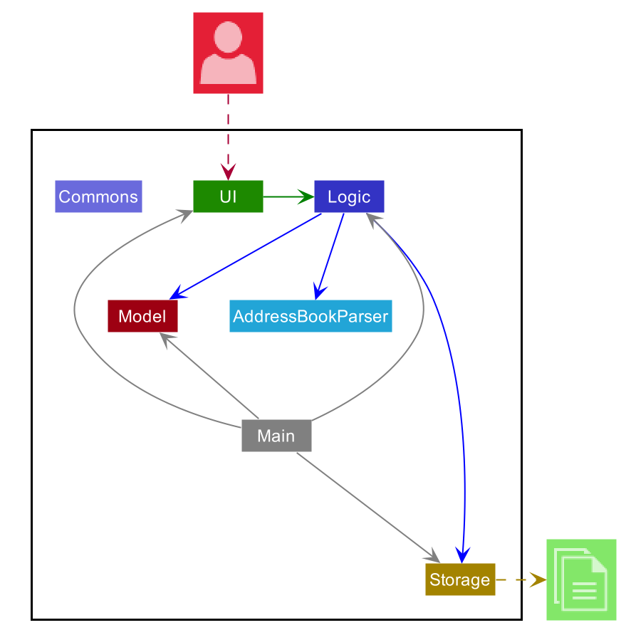

*Fig. 1 - Architecture diagram*
 
The ***Architecture Diagram*** given above explains the high-level design of the App. Given below is a quick overview of each component.

:bulb: **Tip:** The `.puml` files used to create diagrams in this document can be found in the [diagrams](https://github.com/AY2021S1-CS2103T-T11-1/tp/blob/master/docs/diagrams/) folder. Refer to the [_PlantUML Tutorial_ at se-edu/guides](https://se-education.org/guides/tutorials/plantUml.html) to learn how to create and edit diagrams.

**`Main`** has two classes called [`Main`](https://github.com/AY2021S1-CS2103T-T11-1/tp/blob/master/src/main/java/seedu/address/Main.java) and [`MainApp`](https://github.com/AY2021S1-CS2103T-T11-1/tp/blob/master/src/main/java/seedu/address/MainApp.java). It is responsible for,
* At app launch: Initializes the components in the correct sequence, and connects them up with each other.
* At shut down: Shuts down the components and invokes cleanup methods where necessary.

[**`Commons`**](#36-common-classes) represents a collection of classes used by multiple other components.

The rest of the App consists of four components:

* [**`UI`**](#32-ui-component): The UI of the App.
* [**`Logic`**](#33-logic-component): The command executor.
* [**`Model`**](#34-model-component): Holds the data of the App in memory.
* [**`Storage`**](#35-storage-component): Reads data from, and writes data to, the hard disk.

Each of the four components,

* defines its *API* in an `interface` with the same name as the Component.
* exposes its functionality using a concrete `{Component Name}Manager` class (which implements the corresponding API `interface` mentioned in the previous point.

For example, the `Logic` component (see the class diagram given below) defines its API in the `Logic.java` interface and exposes its functionality using the `LogicManager.java` class which implements the `Logic` interface.

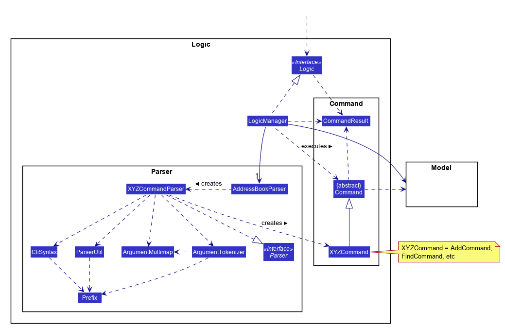

*Fig. 2 - Class diagram of the `Logic` component*

**How the architecture components interact with each other**

The *Sequence Diagram* below shows how the components interact with each other for the scenario where the user issues the command `contact delete 1`.

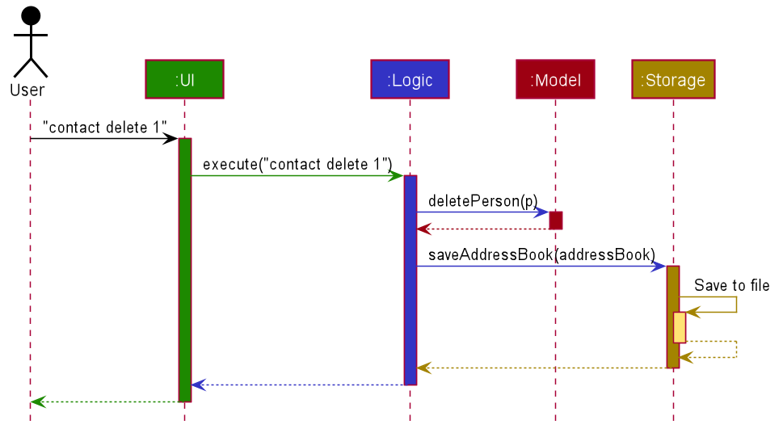

*Fig. 3 - Interactions between components for the `contact delete 1` command*

The sections below give more details of each component.

### 3.2. UI component

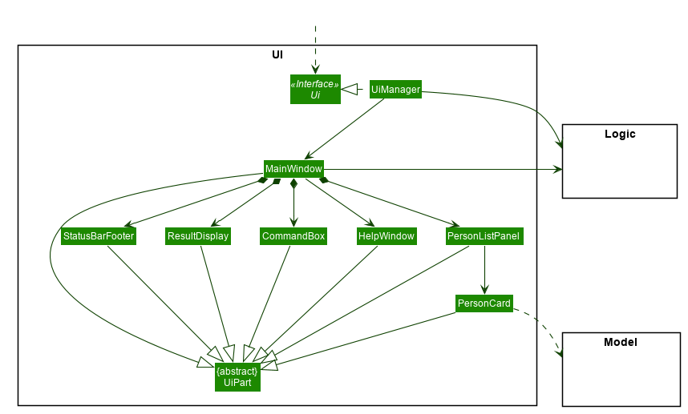

*Fig. 4 - Structure of the `UI` component*

**API** :
[`Ui.java`](https://github.com/AY2021S1-CS2103T-T11-1/tp/blob/master/src/main/java/seedu/address/ui/Ui.java)

The UI consists of a `MainWindow` that is made up of parts e.g.`CommandBox`, `ResultDisplay`, `PersonListPanel` etc. All these, including the `MainWindow`, inherit from the abstract `UiPart` class.

The `UI` component uses JavaFx UI framework. The layout of these UI parts are defined in matching `.fxml` files that are in the `src/main/resources/view` folder. For example, the layout of the [`MainWindow`](https://github.com/AY2021S1-CS2103T-T11-1/tp/blob/master/src/main/java/seedu/address/ui/MainWindow.java) is specified in [`MainWindow.fxml`](https://github.com/AY2021S1-CS2103T-T11-1/tp/blob/master/src/main/resources/view/MainWindow.fxml)

The `UI` component,

* Executes user commands using the `Logic` component.
* Listens for changes to `Model` data so that the UI can be updated with the modified data.

### 3.3. Logic component

*Fig. 5 - Structure of the `Logic` component*

**API** :
[`Logic.java`](https://github.com/AY2021S1-CS2103T-T11-1/tp/blob/master/src/main/java/seedu/address/logic/Logic.java)

1. `Logic` uses the `AddressBookParser` class to parse the user command.
1. This results in a `Command` object which is executed by the `LogicManager`.
1. The command execution can affect the `Model` (e.g. adding a person).
1. The result of the command execution is encapsulated as a `CommandResult` object which is passed back to the `Ui`.
1. In addition, the `CommandResult` object can also instruct the `Ui` to perform certain actions, such as displaying help to the user.

Given below is the Sequence Diagram for interactions within the `Logic` component for the `execute("contact delete 1")` API call.

*Fig. 6 - Interactions inside the `Logic` component for the `contact delete 1` command*

:information_source: **Note:** The lifeline for `ContactCommandParser`, `DeleteCommandParser` and `DeleteCommand` should end at the destroy marker (X) but due to a limitation of PlantUML, the lifeline reaches the end of diagram.

### 3.4. Model component

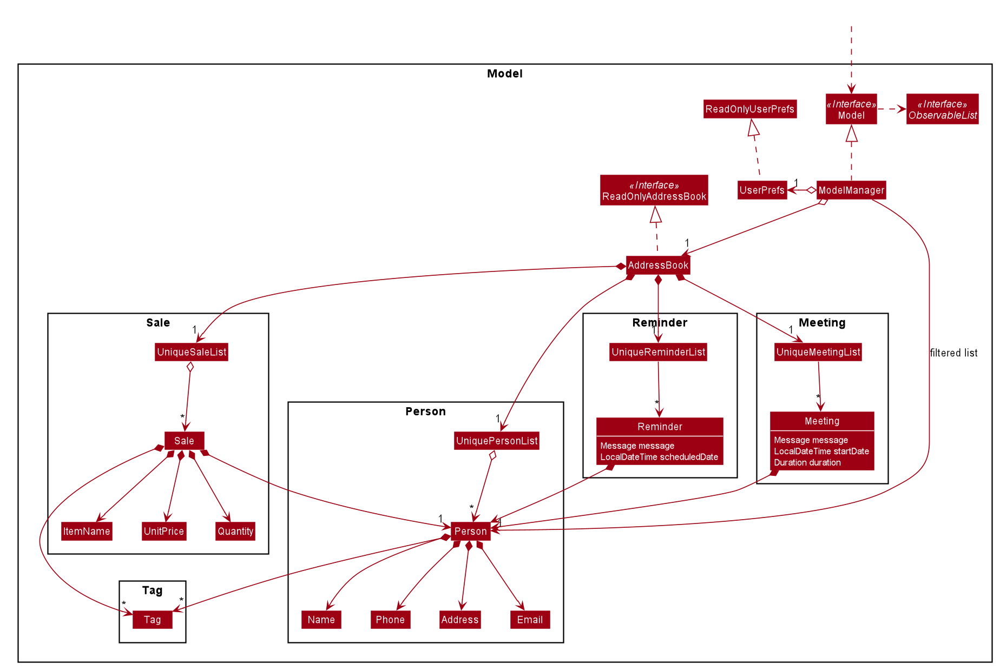

*Fig. 7 - Structure of the `Model` component*

**API** : [`Model.java`](https://github.com/AY2021S1-CS2103T-T11-1/tp/blob/master/src/main/java/seedu/address/model/Model.java)

The `Model`,

* stores a `UserPref` object that represents the user’s preferences.
* stores the address book data.
* exposes the following unmodifiable lists that can be 'observed' e.g. the UI can be bound to this list so that the UI automatically updates when the data in the list change.
    1. `ObservableList<Person>`
    2. `ObservableList<Meeting>`
    3. `ObservableList<Reminder>`
    3. `ObservableList<Sale>`
* does not depend on any of the other three components.

:information_source: **Note:** An alternative (arguably, a more OOP) model is given below. It has a `Tag` list in the `AddressBook`, which `Person` references. This allows `AddressBook` to only require one `Tag` object per unique `Tag`, instead of each `Person` needing their own `Tag` object. 
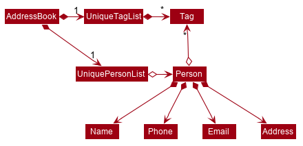
 
*Fig. 8 - Alternative class diagram of the `Model` component*

### 3.5. Storage component

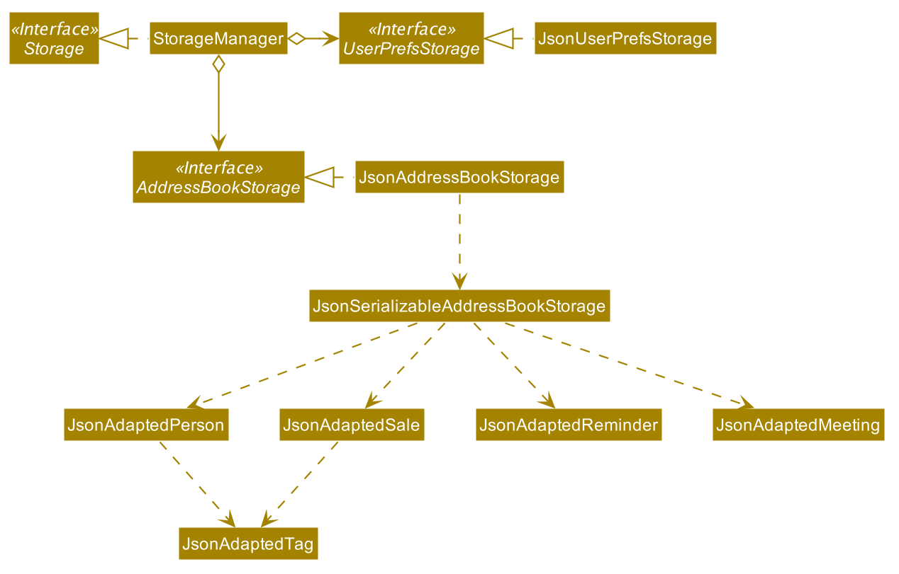

*Fig. 9 - Structure of the `Storage` component*

**API** : [`Storage.java`](https://github.com/AY2021S1-CS2103T-T11-1/tp/blob/master/src/main/java/seedu/address/storage/Storage.java)

The `Storage` component,
* can save `UserPref` objects in json format and read it back.
* can save the address book data in json format and read it back.

### 3.6. Common classes

Classes used by multiple components are in the `seedu.address.commons` package.

--------------------------------------------------------------------------------------------------------------------

## 4. **Implementation**

This section describes some noteworthy details on how certain features are implemented.

### 4.1. Tags feature \[Wang Luo\]

The tags feature allows the user to add, delete or update tags in StonksBook, as well as categorising contacts and sales using created tags.
Tags are separated into contact tags and sales tags, and they are displayed in alphabetical order.

The feature consists of the following commands:
- `tag add` - Adds a tag to the contact tag list (or sales tag list).
- `tag delete` - Deletes a tag from the contact tag list (or sales tag list), and update the associated contacts (or sales).
- `tag edit` - Edits a contact tag (or sales tag), and update the associated contacts (or sales).
- `tag list` - Displays the contact tag list and sales tag list in the graphical user interface.
- `tag find` - Searches contacts (or sales) based on tags.

#### 4.1.1. Parsing of commands within the `Logic` component

The parsing of commands begins once the `LogicManager` receives and tries to execute the user input.

In order to handle the many commands in our application, we introduced an intermediate layer between `AddressBookParser` and the relevant command parsers, e.g. `AddCommandParser`.
The intermediate layer will first determine which model type the command corresponds to, before dispatching it to the corresponding command parser.
For all tag-related commands, we have the `TagCommandsParser` which serves as the intermediate class.

These are the steps that will be taken when parsing a tag-related user command:
1. An `AddressBookParser` will check if the command is tag-related. The `AddressBookParser` will then create a `TagCommandsParser`.
2. The `TagCommandsParser` will check what type of command it is and create the corresponding parsers as follows:
    - `tag add` command: `AddCommandParser`
    - `tag delete` command: `DeleteCommandParser`
    - `tag edit` command: `EditCommandParser`
    - `tag list` command: `ListCommandParser`
    - `tag find` command: `FindCommandParser`
3. The respective parsers all implement the `Parser` interface, and the `Parser#parse` method will then be called.
4. Within `Parser#parse`, static methods in `ParserUtil` may be called to parse the arguments.

Given below is a sequence diagram for interactions inside the `Logic` component for the `execute(tag add <args>)` API call.
- Note that the command is truncated for brevity and `<args>` is used as a placeholder to encapsulate the remaining arguments supplied by the user.
- For example, if the full command was `tag add st/electronics`, then `<args>` is equivalent to `st/electronics`.

*Fig. 10 - Interactions inside the `Logic` component for the `tag add <args>` command*

:information_source: **Note:** The lifeline for `TagCommandsParser` and `AddCommandParser` should end at the destroy marker (X) but due to a limitation of PlantUML, the lifeline reaches the end of diagram.

#### 4.1.2. Execution of commands within the `Logic` component

After the user input has been parsed into a `Command`, it is executed with `model` passed in as a parameter.

First, relevant methods in `model` are called to retrieve related objects or check for the existence of the tag.
In this case, if the user attempts to add a contact tag, the `hasContactTag(newTag)` method is called to ensure that the `newTag` does not already exists in contact tag list.
Similarly, the `hasSaleTag(newTag)` method is called to check for the existence of the `newTag` in the sales tag list.

Second, objects to be added or edited are created. For `AddCommand`, the new `Tag` object to be added is created.

Next, relevant `model` methods are called to edit the lists of contact (or sales) `Tag` objects. For `AddCommand`, if the user adds a contact tag, `addContactTag` is
 called to add the newly created tag to the `model`, if the user adds a sales tag, `addSaleTag` is called instead to add the newly created tag to `model`.

Lastly, a `CommandResult` object containing the message to be displayed to the user is returned to `LogicManager`.

The sequence diagram below illustrates how the `AddCommand` that is created from parsing `tag add <args>` is
 executed.

 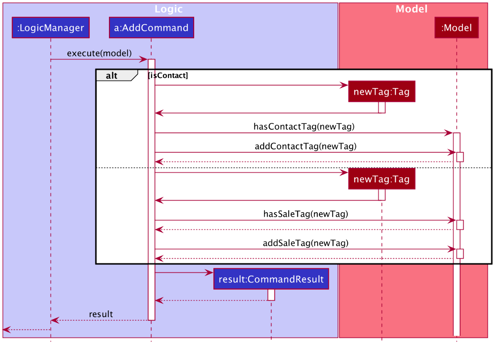

*Fig. 11 - Sequence diagram illustrating the execution of `AddCommand`*

#### 4.1.3. Error handling within the `Logic` component

The below activity diagram shows the overall process of the execution of `tag add <args>`.

In order to ensure data cleanliness and that the inputs by the users are valid, errors are thrown at various stages if:
- Incorrect command format is used (e.g. missing/incorrect prefixes)
- Invalid index/values provided (e.g. non-positive and non-integer values are provided as index, non-alphanumeric
 character included in the tag name.)

*Fig. 12 - The different outcomes of the program that can occur from the `tag add <args>` command*

##### 4.1.3.1. Data retrieval

The following sequence diagram shows how the retrieval of contacts (or sales) with tags work.

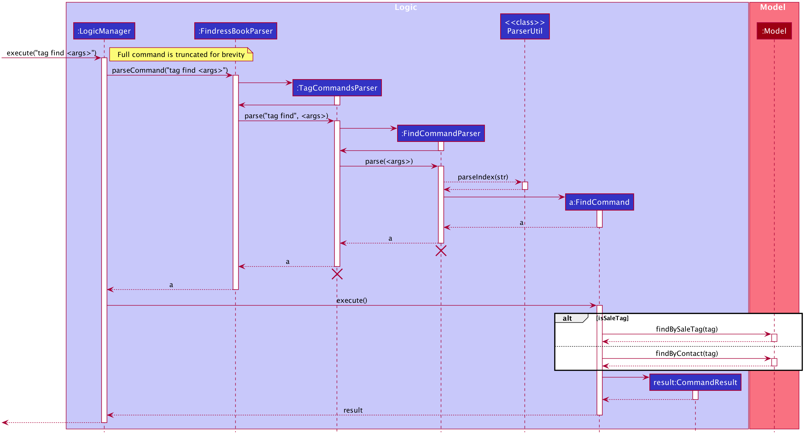

*Fig. 13 - Sequence diagram illustrating the retrieval of contacts (or sales)*

:information_source: **Note:** The lifeline for `TagCommandsParser` and `FindCommandParser` should end at the destroy marker (X) but due to a limitation of PlantUML, the lifeline reaches the end of diagram.

The below activity diagram shows the overall process of executing `tag find <args>`.

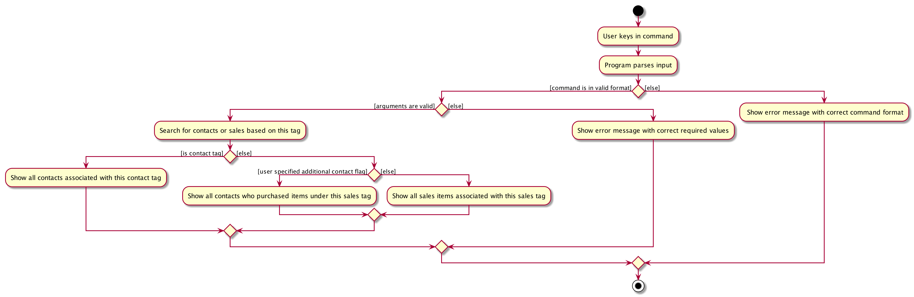

*Fig. 14 - Activity diagram illustrating the process of executing `tag find <args>`*

#### 4.1.4. Modelling `Tag`s

Tags are modelled according to the class diagram below.

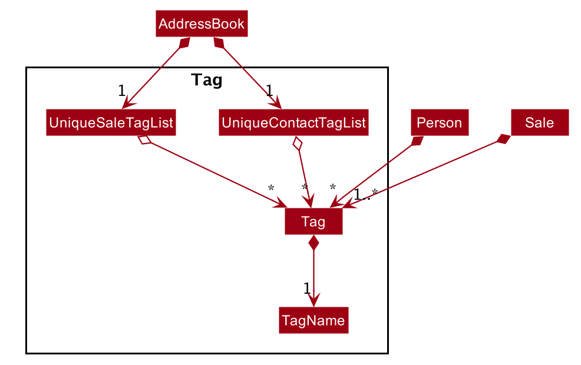

*Fig. 15 - Class diagram used to model tags*

We enforce an association between `Sale` and `Tag` to aid data analytics in the `sale breakdown` command.

#### 4.1.5. Design consideration:

##### 4.1.5.1. Aspect: Whether a `Tag` should have a type attribute
* **Alternative 1:** Add a type attribute in `Tag` to indicate whether it is a contact tag or sales tag.
  * Pros:
    * Increased type safety and contact tags and sales tag are separated from each other.
  * Cons:
    * Decreased level of abstraction as contact tags and sales tags are extremely similar.

* **Alternative 2 (current choice):** Type of `Tag` is determined by whether it is in contact tag list or sales tag list.
  * Pros:
    * `Tag` class does not need to know whether it belongs to contacts or sales, improved level of abstraction.
    * Classes interacting with `Tag` via the contact list or sales list.
  * Cons:
    * Will have to implement two tag lists separately.

Alternative 2 is chosen as we found the importance of abstraction and scalability outweighs the additional work in
implementing two independent tag lists.

### 4.2. Meetings feature \[Sebastian Toh Shi Jian\]

The meetings feature allows the user to add, delete, or update meetings in StonksBook.
Meetings are displayed in increasing order based on the start date of the meeting.

The feature consists of the following commands:
- `meeting add` - Adds a meeting to the meeting list.
- `meeting delete` - Deletes a meeting from the meeting list.
- `meeting edit` - Edits a meeting from the meeting list.
- `meeting list` - Displays the list of all meetings in the graphical user interface.

#### 4.2.1. Parsing of commands within the `Logic` component

The parsing of commands begins once the `LogicManager` receives and tries to execute the user input.

In order to handle the many commands in our application, we introduced an intermediate layer between `AddressBookParser` and the relevant command parsers, e.g. `AddCommandParser`.
The intermediate layer will first determine which model type the command corresponds to, before dispatching it to the corresponding command parser.
For all meeting-related commands, we have the `MeetingCommandsParser` which serves as the intermediate class.

These are the steps that will be taken when parsing a meeting-related user command:
1. An `AddressBookParser` will check if the command is meetings-related. The `AddressBookParser` will then create a `MeetingCommandsParser`.
2. The `MeetingCommandsParser` will check what type of command it is and create the corresponding parsers as follows:
    - `meeting add` command: `AddCommandParser`
    - `meeting delete` command: `DeleteCommandParser`
    - `meeting edit` command: `EditCommandParser`
    - `meeting list` command: `ListCommandParser`
3. The respective parsers all implement the `Parser` interface, and the `Parser#parse` method will then be called.
4. Within `Parser#parse`, static methods in `ParserUtil` may be called to parse the arguments.

Given below is a sequence diagram for interactions inside the `Logic` component for the `execute(meeting add <args>)` API call.
- Note that the command is truncated for brevity and `<args>` is used as a placeholder to encapsulate the remaining arguments supplied by the user.
- For example, if the full command was `meeting add c/2 m/Lunch with Alice d/2020-10-30 10:10`, then `<args>` is equivalent to `c/2 m/Lunch with Alice d/2020-10-30 10:10`.

*Fig. 16 - Interactions inside the `Logic` component for the `meeting add <args>` command*

:information_source: **Note:** The lifeline for `MeetingCommandsParser` and `AddCommandParser` should end at the destroy marker (X) but due to a limitation of PlantUML, the lifeline reaches the end of diagram.

#### 4.2.2. Execution of commands within the `Logic` component

After the user input has been parsed into a `Command`, it is executed with `model` passed in as a parameter.

First, relevant methods in `model` are called to retrieve related objects or check for the existence of the contact.
In this case, `getSortedPersonList()` is called to retrieve the `id` of the contact that is to be associated with the
meeting and `hasMeeting(newMeeting)` is called to ensure that `newMeeting` to be added does not already exist.

Second, objects to be added or edited are created. For `AddCommand`, the new `Meeting` object to be added is created.

Next, relevant `model` methods are called to edit the lists of `Meeting` objects. For `AddCommand`, `addMeeting` is
 called to add the newly created meeting to the `model`.

Lastly, a `CommandResult` object containing the message to be displayed to the user is returned to `LogicManager`.

The sequence diagram below illustrates how the `AddCommand` that is created from parsing `meeting add <args>` is
 executed.

 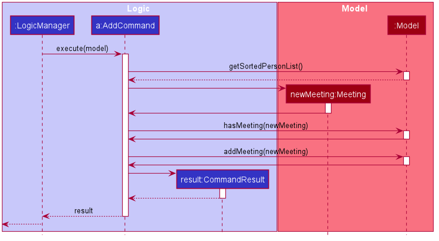

*Fig. 17 - Sequence diagram illustrating the execution of `AddCommand`* 

:information_source: **Note:** The lifeline for `AddCommand` should end at the destroy marker (X) but due to a limitation of PlantUML, the lifeline
 reaches the end of diagram.

 

#### 4.2.3. Error handling within the `Logic` component

The below activity diagram shows the overall process of the execution of `meeting add <args>`.

In order to ensure data cleanliness and that the inputs by the users are valid, errors are thrown at various stages if:
- Incorrect command format is used (e.g. missing/incorrect prefixes)
- Invalid index/values provided (e.g. non-positive and non-integer values are provided as index, non-alphanumeric
 character included in message, unrecognised date formats, etc.)

*Fig. 18 - The different outcomes of the program that can occur from the `meeting add <args>` command* 

#### 4.2.4. Modelling `Meeting`s

Meetings are modelled according to the class diagram below.

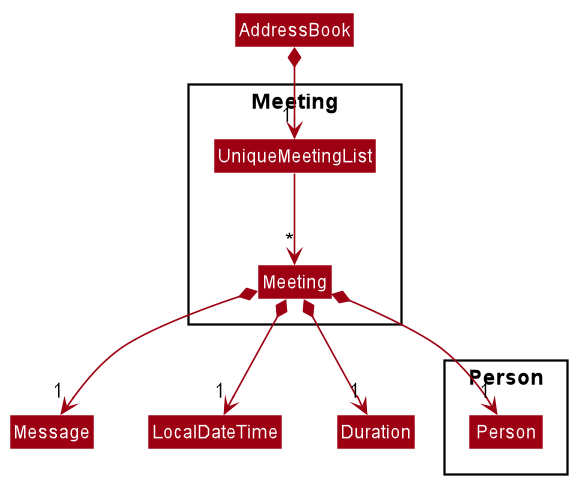

*Fig. 19 - Class diagram used to model meetings* 

`LocalDateTime` and `Duration` are classes from Java's `java.time` package.

We enforce a composition relationship between `Meeting` and its attribute as we do not want `Meeting` to exist when either of its attributes no longer exist.
With that, whenever a `Person` is deleted, all associated `Meeting`s are deleted as well. Similarly, we also enforce that all `Meeting`s must be associated with a non-empty `Message`.

#### 4.2.5. Design consideration:

##### 4.2.5.1. Aspect: Whether it should be necessary to enforce a `message` field in a `Meeting` object
* **Alternative 1 (current choice):** Create a `Message` class which enforces a non-empty message association to a `Meeting` object.
  * Pros:
    * Easier implementation of meeting commands since every field is necessary.
    * Better data cleanliness.
  * Cons:
    * Have to implement a separate class as well as implement validation of inputs.

* **Alternative 2:** Set the `Meeting` object to be associated to a `String` which acts as the message of a meeting.
  * Pros:
    * No need to implement validation of inputs for this `message` field.
  * Cons:
    * Will need to implement some kind of placeholder text for `Meeting`s without a message when displaying meetings in the user interface.
    * Will have to be more careful in implementation of meeting commands to allow for an optional field.

Alternative 1 is chosen as we found that the importance of enforcing data cleanliness far outweighs the associated
 cost that is required to implement this enforcement.

##### 4.2.5.2. Aspect: What fields should be stored to represent a `Meeting`

* **Alternative 1 (current choice):** Store just the start date of a meeting, along with its duration.
  * Pros:
    * More user-friendly since users tend to schedule meetings based on a start date and its duration.
  * Cons:
    * May have slight performance dip since the end date of a meeting may have to be computed repeatedly for display in the user interface.

* **Alternative 2:** Store both start and end date of the meeting.
  * Pros:
    * May have slightly improved performance since there is no need to compute the end date.
  * Cons:
    * User will have to input both start and end date, which can be tedious.

* **Alternative 3:** Store start date, end date, and duration of the meeting.
  * Pros:
    * More user-friendly since users can schedule meetings using just the start date and its duration.
    * More performant since the end date need not be re-computed.
  * Cons:
    * There is the possibility that the three fields may no longer be in sync. Extra emphasis must be taken to ensure that these fields remain synchronised whenever either of these fields changes.

Alternative 1 is chosen as it is the most user-friendly option. It also makes maintaining the data easy.
Because only future meetings are displayed by default, the slight performance dip associated with alternative 1 may
 not actually be an issue as we do not foresee the list of future meetings to be very large.

##### 4.2.5.3. Aspect: How to serialize the start date and duration of a `Meeting`
* **Alternative 1 (current choice):** Deserialize them according to ISO-8601 format.
   * Pros:
     * Unambiguous and well-defined method of representing dates and times
     * Easier integration with other date and time libraries should such an integration be necessary.
   * Cons:
     * Should the user decide to open the data file, the ISO-8601 format may not be very familiar or readable. This
      increases the likelihood of corruption of data.

* **Alternative 2:** Serialize them in a format that is human readable. e.g. storing dates in dd-MM-yyyy format and
 durations as an integer representing number of minutes
   * Pros:
     * Should the user decide to open the data file, he can easily understand and make relevant modifications without
      corrupting the data format.
   * Cons:
     * Parsing and deserializing the data may pose some difficulties.

Alternative 1 is chosen as it is a well-established international standard which would facilitate the integration of
 other libraries if necessary.

### 4.3. Reminders feature \[Sebastian Toh Shi Jian\]
The reminders feature allows the user to add, delete, or update reminders in StonksBook.
Reminders are displayed in increasing order based on the scheduled date of the reminder.

The feature consists of the following commands:
- `reminder add` - Adds a reminder to the reminder list.
- `reminder delete` - Delete a reminder from the reminder list.
- `reminder edit` - Edit a reminder from the reminder list.
- `reminder list` - Display the list of all reminders in the user interface.

#### 4.3.1. Parsing of commands within the `Logic` component

The parsing of commands begins once the `LogicManager` receives and tries to execute the user input.

In order to handle the many commands in our application, we introduced an intermediate layer between
 `AddressBookParser` and the relevant command parsers, e.g. `DeleteCommandParser`.
The intermediate layer will first determine which model type the command corresponds to, before dispatching it to the corresponding command parser.
For all reminder-related commands, we have the `ReminderCommandsParser` which serves as the intermediate class.

These are the steps that will be taken when parsing a reminder-related user command:
1. An `AddressBookParser` will check if the command is reminder-related. The `AddressBookParser` will then create a
 `ReminderCommandsParser`.
2. The `ReminderCommandsParser` will check what type of command it is and create the corresponding parsers as follows:
    - `reminder add` command: `AddCommandParser`
    - `reminder delete` command: `DeleteCommandParser`
    - `reminder edit` command: `EditCommandParser`
    - `reminder list` command: `ListCommandParser`
3. The respective parsers all implement the `Parser` interface, and the `Parser#parse` method will then be called.
4. Within `Parser#parse`, static methods in `ParserUtil` may be called to parse the arguments.

Given below is a sequence diagram for interactions inside the `Logic` component for the `execute(reminder delete 1)` API call.

*Fig. 20 - Interactions inside the `Logic` component for the `reminder delete 1` command* 

:information_source: **Note:** The lifeline for `ReminderCommandsParser` and `DeleteCommandParser` should end at the destroy marker (X) but due to a limitation of PlantUML, the lifeline
 reaches the end of diagram.

#### 4.3.2. Execution of commands within the `Logic` component

After the user input has been parsed into a `Command`, it is executed with `model` passed in as a parameter.

First, relevant methods in `model` are called to retrieve related objects or check for the existence of the reminder.
For the case of `DeleteCommand`, `getSortedReminder()` is called to retrieve the list of all reminders
 that are currently displayed in the user interface.

Next, relevant model methods are called to edit the lists of `Reminder`objects. For `DeleteCommand`, `deleteReminder`
is used to delete the reminder corresponding to the specified index.

Lastly, a `CommandResult` object containing the message to be displayed to the user is returned to `LogicManager`.

The sequence diagram below illustrates how the `DeleteCommand` that is created from parsing `reminder delete 1` is
 executed.

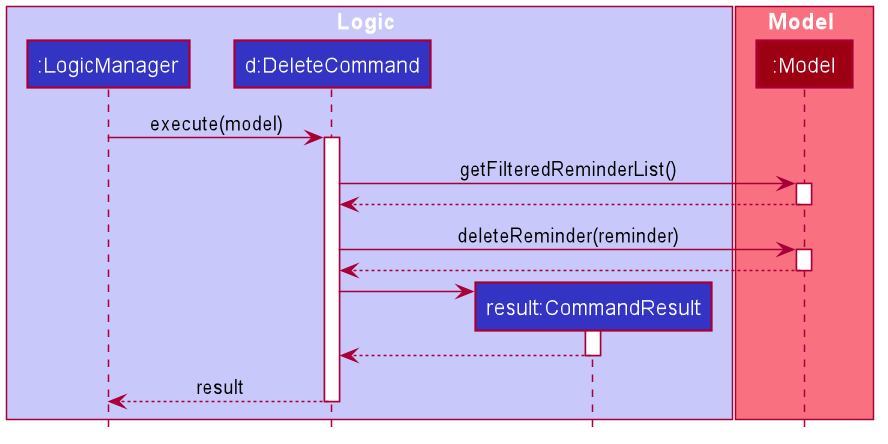

*Fig. 21 - Sequence diagram illustrating the execution of the `DeleteCommand`* 

:information_source: **Note:** The lifeline for `DeleteCommand` should end at the destroy marker (X) but due to a limitation of PlantUML, the lifeline
 reaches the end of diagram.

 

#### 4.3.3. Error handling within the `Logic` component

The below activity diagram shows the overall process of the execution of `reminder delete 1`.

In order to ensure data cleanliness and that the inputs by the users are valid, errors are thrown at various stages if:
* Incorrect command format is used (e.g. missing/incorrect prefixes)
* Invalid index/values provided (e.g. non-positive and non-integer values are provided as index)

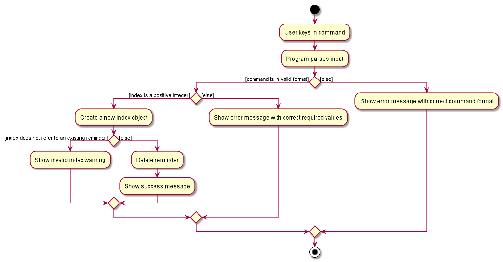

*Fig. 22 - The different outcomes of the program that can occur from the `reminder delete 1` command*

#### 4.3.4. Modelling `Reminder`s

`Reminder` is modelled according to the class diagram below.

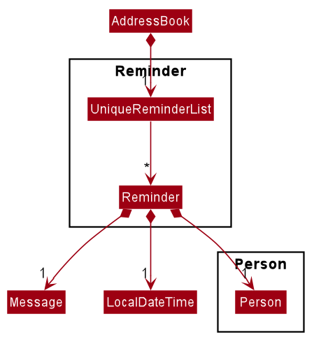

*Fig. 23 - Class diagram used to model reminders*

`Reminder` objects are saved within a `UniqueReminderList` stored in `AddressBook`.

We enforce a composition relationship between `Reminder` and its attribute as we do not want `Reminder` to exist when
 either of its attributes no longer exist. With that, whenever a `Person` is deleted, all associated `Reminder`s are
  deleted as well. Similarly, we also enforce that all `Reminder`s must be associated with a non-empty `Message`.

#### 4.3.5. Design consideration:

##### 4.3.5.1. Aspect: Whether it should be necessary to enforce a `message` field in a `Reminder` object
* **Alternative 1 (current choice):** Create a `Message` class which enforces a non-empty message association to a
 `Reminder` object.
  * Pros:
    * Easier implementation of reminder commands since every field is necessary.
    * Better data cleanliness.
  * Cons:
    * Have to implement a separate class as well as implement validation of inputs.

* **Alternative 2:** Set the `Reminder` object to be associated to a `String` which acts as the message of a reminder.
  * Pros:
    * No need to implement validation of inputs for this `message` field.
  * Cons:
    * Will need to implement some kind of placeholder text for `Reminder`s without a message when displaying
     reminders in the user interface.
    * Will have to be more careful in implementation of reminder commands to allow for an optional field.

A similar consideration was made when implementing [`Meeting`s](#4251-aspect-whether-it-should-be-necessary-to-enforce-a-message-field-in-a-meeting-object).
This further strengthened our choice to go for Alternative 1 given that the cost of having to validate the inputs
 would be spread over multiple features.

##### 4.3.5.2. Aspect: How to serialize the scheduled date of a `Reminder`
* **Alternative 1 (current choice):** Deserialize the date according to ISO-8601 format.
   * Pros:
     * Unambiguous and well-defined method of representing dates and times
     * Easier integration with other date and time libraries should such an integration be necessary.
   * Cons:
     * Should the user decide to open the data file, the ISO-8601 format may not be very familiar or readable. This
      increases the likelihood of corruption of data.

* **Alternative 2:** Serialize them in a format that is human readable. e.g. storing dates in dd-MM-yyyy format and
 durations as an integer representing number of minutes
   * Pros:
     * Should the user decide to open the data file, he can easily understand and make relevant modifications without
      corrupting the data format.
   * Cons:
     * Parsing and deserializing the data may pose some difficulties.

A similar consideration was made when implementing [`Meeting`s](#4253-aspect-how-to-serialize-the-start-date-and-duration-of-a-meeting).
Alternative 1 was chosen so as to have a consistent and standardised way of handling date and time handled within our code base.

### 4.4. Sales feature [Kwek Min Yih]

The Sales feature allows users to add and manage Sales made to contacts in StonksBook. 
Sales are displayed in increasing order based on the datetime of purchase of the sale.

This feature consists of the following commands:
* `sale add` – Adds a sale to the sale list.
* `sale delete` – Deletes a sale to the sale list.
* `sale edit` – Edits a sale to the sale list.
* `sale list` – Display the list of all sales in the user interface.
* `sale breakdown` – Displays the number of sales belonging to the top 5 tags.

#### 4.4.1. Parsing of commands within the `Logic` component

The parsing of commands begins once the `LogicManager` receives and tries to execute the user input.

In order to handle the many commands in our application, we introduced an intermediate layer between `AddressBookParser` and the relevant command parsers, e.g. `AddCommandParser`.
The intermediate layer will first determine which model type the command corresponds to, before dispatching it to the corresponding command parser.
For all sale-related commands, we have the `SaleCommandsParser` which serves as the intermediate class.

These are the steps that will be taken when parsing a sale-related user command:
1. An `AddressBookParser` will check if the command is sale-related. The `AddressBookParser` will then create a `SaleCommandsParser`.
2. The `SaleCommandsParser` will check what type of command it is and create the corresponding parsers if there are any arguments to parse:
    - `sale add` command: `AddCommandParser`
    - `sale delete` command: `DeleteCommandParser`
    - `sale edit` command: `EditCommandParser`
    - `sale list` command: `ListCommandParser`
    - `sale breakdown` command: no parser is created as there are no arguments to parse.
3. The respective parsers all implement the `Parser` interface, and the `Parser#parse` method will then be called.
4. Within the `Parser#parse`, static methods in `ParserUtil` may be called to parse the arguments.

Given below is a sequence diagram for interactions inside the `Logic` component for the `execute(sale add <args>)` API call.
- Note that the command is truncated for brevity and `<args>` is used as a placeholder to encapsulate the remaining arguments supplied by the user.
- For example, if the full command was `sale add c/4 n/Notebook d/2020-10-30 15:00 p/6.00 q/2 t/stationery`, 
then `<args>` is equivalent to `c/4 n/Notebook d/2020-10-30 15:00 p/6.00 q/2 t/stationery`.

*Fig. 24 - Interactions inside the `Logic` component for the `sale add <args>` command*

:information_source: **Note:** The lifeline for `SaleCommandsParser` and `AddCommandParser` should end at the destroy marker (X) but due to a limitation of PlantUML, the lifeline reaches the end of diagram.

#### 4.4.2. Execution of commands within the `Logic` component

After command has been parsed into an `AddCommand`, it is executed with `model` passed in as a parameter.

First, relevant methods in `model` are called to retrieve related objects.
In this case, `getSortedPersonList()` is called to retrieve the `id` of the buyer.

Second, the indexes and tags provided are verified by calling `arePersonIndexesValid()` and  `saleTagsExist()` 
in `MassSaleCommandUtil` and `model` respectively. 
`MassSaleCommandUtil` is a utility class used in multiple `Sale` commands that allows for the parsing and handling of multiple
sales and contacts.

Next, all the contact indexes provided are iterated through. For each contact corresponding to the index provided,
a `Sale` object is created. If it is not identified to be a duplicate, it will be added to StonksBook.

Lastly, a relevant `CommandResult` object containing the message to be displayed to the user is created and returned to `LogicManager`.
The message is generated by private methods in `AddCommand`, which call the `listAllSales()` method in `MassSaleCommandUtil`.

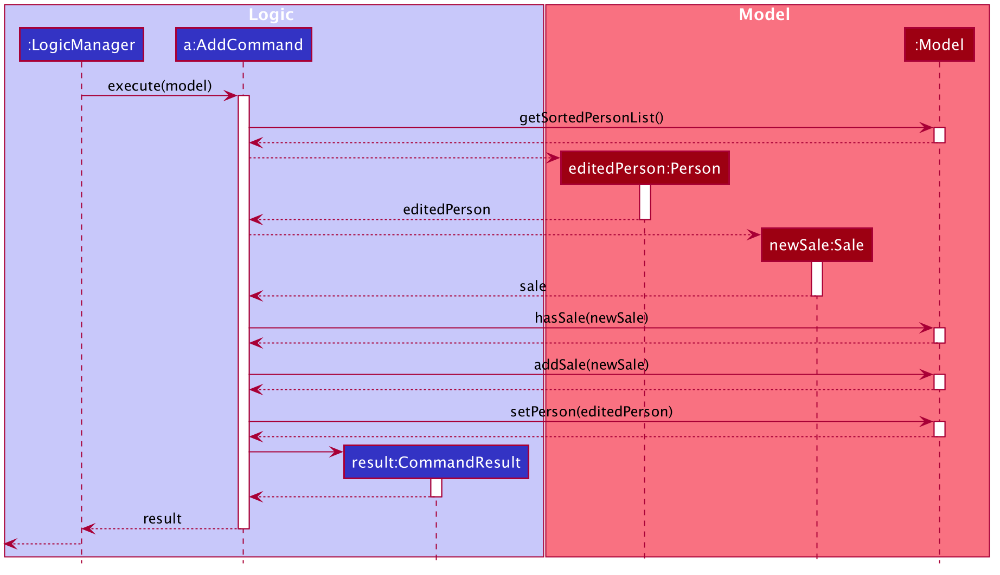

*Fig. 25 - Sequence diagram illustrating the execution of `AddCommand`*

:information_source: **Note:** The lifeline for `AddCommand` should end at the destroy marker (X) but due to a limitation of PlantUML, the lifeline reaches the end of diagram.

#### 4.4.3. Error handling within the `Logic` component

The below activity diagram shows the overall process of execution of `sale add <args>`.

In order to ensure data cleanliness and that the inputs by the users are valid, exceptions are thrown at various stages if:
* Incorrect command format is used (e.g. missing/incorrect prefixes)
* Invalid index/values provided (e.g. alphabetical characters provided for numerical fields such as `Quantity`)

In the occasion that the Sale object provided already exists, an exception is not thrown. 
This is because the `sale add <args>` command has the ability to add sales to multiple contacts.
Throwing an exception would halt the execution of the command, which may cause the other sales specified in the command to not be added.
Instead, sales identified as duplicates are not added to StonksBook, but stored in a list.
This list of duplicate sales is printed to the user along with a corresponding error message.

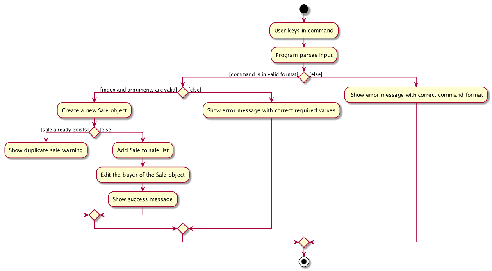

*Fig. 26 - The different outcomes of the program that can occur from the `sale add <args>` command*

#### 4.4.4. Modelling `Sale`s

`Sale` is modelled according to the class diagram below.

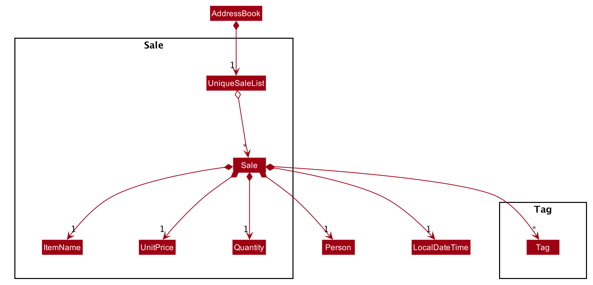

*Fig. 27 - Class diagram used to model sales*

`Sale` objects are saved within a `UniqueSaleList` stored in `AddressBook`.
There is a composition relationship between `Sale` and its attributes, 
as we want the attributes (e.g. `ItemName`, `UnitPrice`) to exist dependently on the `Sale` object it belongs to.
The attributes are abstracted out into different classes, instead of being stored as values within Sale, 
to allow for greater input validation and attribute specific functionality.

#### 4.4.5. Design consideration:

##### 4.4.5.1. Aspect: How to implement currency related fields
* **Alternative 1 (current choice):** Use BigDecimal to store currency related fields.
  * Pros:
    * Accurate currency calculations are possible.
  * Cons:
    * Need to import the BigDecimal package.

* **Alternative 2:** Use Float variables to store currency variables.
  * Pros:
    * No need to import any packages.
  * Cons:
    * Will likely result in inaccurate currency calculations due to float rounding errors.

* **Alternative 3:** Store dollars and cents independently as integers
  * Pros:
    * Accurate currency calculations are possible.
  * Cons:
    * Cumbersome currency calculations due to converting every hundred cents to dollars.

Alternative 1 was chosen as it was the most appropriate given the size of inputs we wanted to handle, and ensured accuracy.

##### 4.4.5.2. Aspect: How to implement the relationship between Sale and Person
* **Alternative 1:** Store the Person id in the Sale model and storage.
  * Pros:
    * Less storage space needed.
  * Cons:
    * Difficult to retrieve Person attributes without using `Model`.

* **Alternative 2:** Store the Person in model and storage.
  * Pros:
    * Easier to retrieve Person attributes, without any need to use `Model`.
  * Cons:
    * Need to update Sale whenever corresponding Person is updated.
    * Large amount of duplicate data stored in the JSON file
    
* **Alternative 3:** Store the person in model, but store Person id in storage
  * Pros:
    * Easier to retrieve Person attributes, without any need to use `Model`.
    * Less storage space needed.
  * Cons:
    * Need to update Sale whenever corresponding Person is updated.
    
    
Alternative 3 was chosen as it is the most balanced option, reducing duplicate data stored in JSON file and 
making retrieval of Person attributes easier. 
A similar consideration was made when implementing `Meeting` and `Reminder`. 

### 4.5. Archive feature \[Leong Jin Ming\]

The Archive feature allows users to archive contacts who are no longer active.

This feature consists of the following commands:
* `archive add` — Adds a contact to the archive.
* `archive list` — Lists all contacts in the archive.
* `archive remove` — Removes a contact from the archive.

#### 4.5.1. Parsing of commands within the `Logic` component

Much like other core features, we introduced an intermediate layer between the `AddressBookParser` and the archive command parsers, which in this case is the `ArchiveCommandsParser`.

These are the steps that will be taken when parsing an archive-related user command:
1. The `AddressBookParser` checks if the user command is archive-related. Then, it creates an `ArchiveCommandsParser`.
1. The `ArchiveCommandsParser` checks what type of command it is and creates the corresponding parsers/commands as follows:
    - `archive add` command: `AddCommandParser`
    - `archive list` command: `ListCommand`
    - `archive remove` command: `RemoveCommandParser`
1. The relevant parser, which implements the `Parser` interface, parses the command via `Parser#parse`.
1. If the user command is valid, the parser creates the corresponding `Command` object for execution.

Given below is a sequence diagram for interactions inside the Logic component for the `execute("archive add 1")` API call.
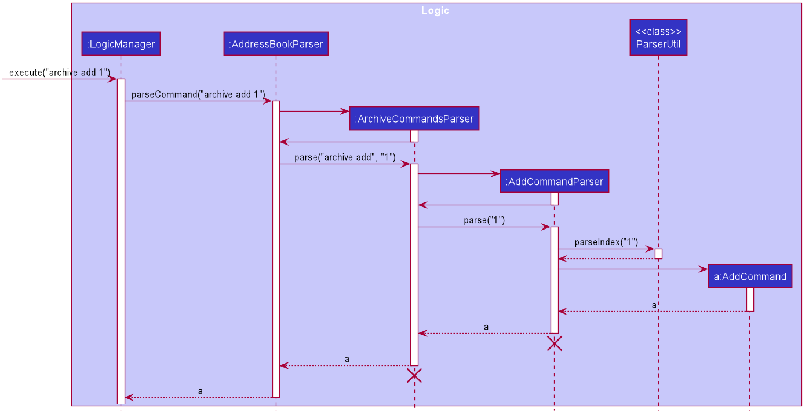

*Fig. 28 - Interactions inside the `Logic` component for the `archive add 1` command*

:information_source: **Note:** The lifeline for `ArchiveCommandsParser` and `AddCommandParser` should end at the destroy marker (X) but due to a limitation of PlantUML, the lifeline reaches the end of diagram.

#### 4.5.2. Execution of commands within the `Logic` component

Since the execution of the `RemoveCommand` is similar to the `AddCommand`, we shall only look at the execution of the latter.

When an `AddCommand` is created by the `AddCommandParser`, it is executed with `model` passed in as the parameter.

Firstly, relevant methods in `model` are called to retrieve related objects or check for the existence of the contact. Here, `getSortedPersonList()` is called to get the list of contacts currently being displayed in the UI.

Secondly, objects to be added or edited are created. In this case, a new `archivedPerson` is created with the `archived` flag set to `true`.

Next, relevant `model` methods are called to edit the list of `Person` objects, with `setPerson()` used to replace an existing Person object.

Finally, a `CommandResult` object containing the message to be displayed to the user is returned to `LogicManager`.

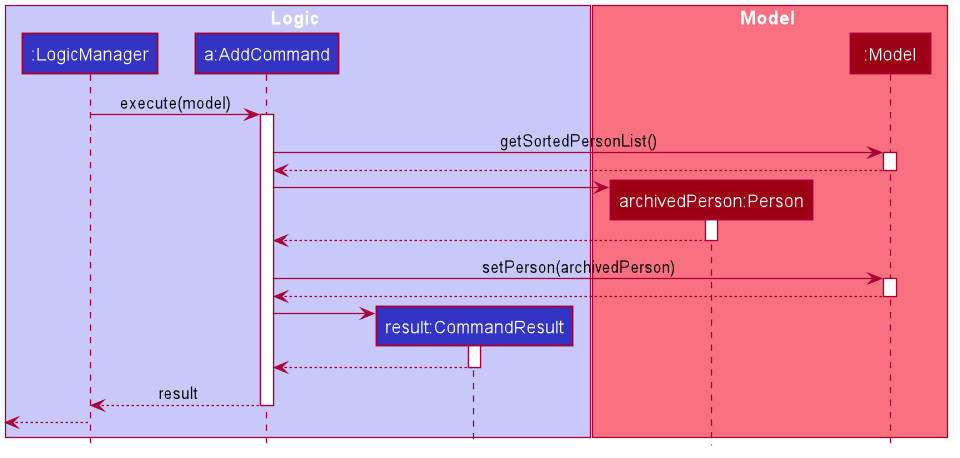

*Fig. 29 - Sequence diagram illustrating the execution of the `AddCommand`*

#### 4.5.3. Error handling within the `Logic` component

The below activity diagram shows the overall process of execution of `archive add 1`.

In order to ensure data cleanliness and that the inputs by the users are valid, errors are thrown at various stages if:

- Incorrect command format is used (i.e. missing index as argument)
- Invalid index is provided
- The incorrect list is being displayed

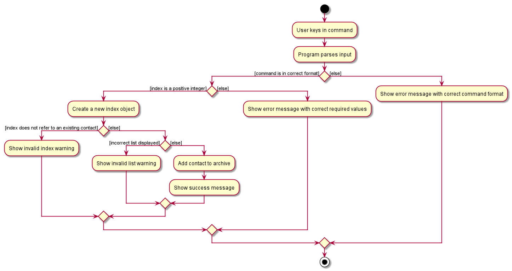

*Fig. 30 - The different outcomes of the program that can occur from the `archive add 1` command*

#### 4.5.4. Design consideration:

##### 4.5.4.1. Aspect: How to implement the archive
* **Alternative 1 (current choice):** Add a flag to the `Person` model to indicate whether the contact is archived.
  * Pros:
    * Less time consuming to implement.
    * Easier to impose restrictions, e.g. cannot add sale to an archived `Person`, etc.
    * Makes use of the filtering of the `FilteredPersonList`.
  * Cons:
    * Distinction between contacts and archived contacts is not clear in the implementation.

* **Alternative 2:** Introduce a list of archived `Person`s to the `AddressBook` model.
  * Pros:
    * Clear distinction between contacts and archived contacts in the implementation.
  * Cons:
    * More time consuming to implement.
    * Needs extra checking to identify archived contacts, which brings us to Alternative 1.

Alternative 1 was chosen to give more flexibility to the implementation and other design considerations (such as whether to archive the sales associated with the `Person`) and also due to time constraints.

### 4.6. Monthly statistics feature [Aaron Seah]

#### 4.6.1. Implementation

The monthly statistics mechanism is facilitated by `MonthlyListMap` and `StatisticsWindow`.
`MonthlyListMap` gets the monthly statistics data and `StatisticsWindow` populates the UI with the data.

The commands `meeting stats` and `sale stats` implement this feature.
This feature will be demonstrated in the context of `meeting stats`.

`MonthlyListMap` has two sets of operations: Data Manipulation and Data Retrieval.

##### 4.6.1.1. Data manipulation
* `MonthlyListMap#addItem(Month month, Year year, T item)` — Adds item of type T to an item list based on the key of month and year.
* `MonthlyListMap#removeItem(Month month, Year year, T item)` — Removes item of type T from an item list based on the key of month and year if the item exists.
* `MonthlyListMap#clear()` — Removes all entries in the `MonthlyListMap`.

The Data Manipulation operations are used to propagate changes to `MonthlyListMap`
when a meeting command `meeting add`, `meeting delete` or `meeting edit` is executed
to keep the data in the `MonthlyListMap` up to date.

Given below is the class diagram for the Monthly Statistics Feature.

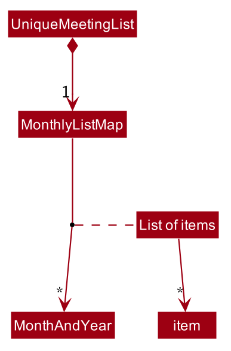

*Fig. 31 - Class diagram for the Monthly Statistics Feature*

Given below are object diagrams for the Monthly Statistics Feature to illustrate 
how `MonthlyListMap` will be kept up to date after meeting commands `meeting add`, `meeting delete` and `meeting edit` are executed.

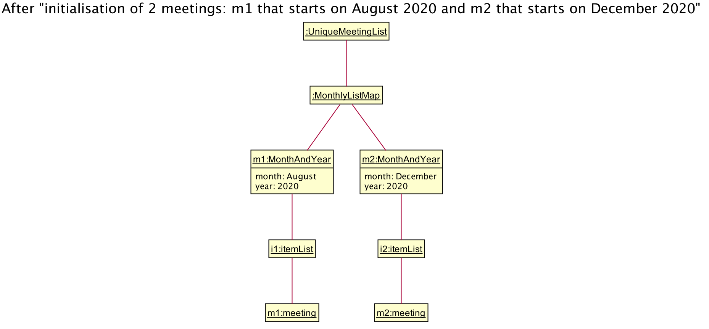

*Fig. 32 - Object diagram after initialisation of meetings, `m1` and `m2`*

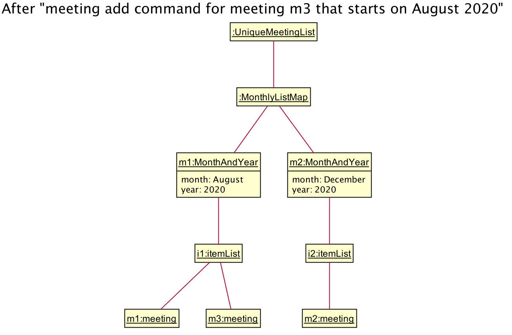

*Fig. 33 - Object diagram after adding meeting `m3`*

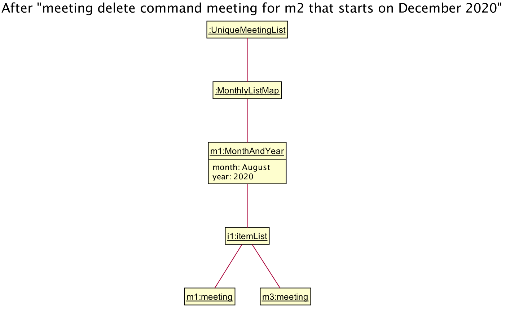

*Fig. 34 - Object diagram after deleting meeting `m2`*

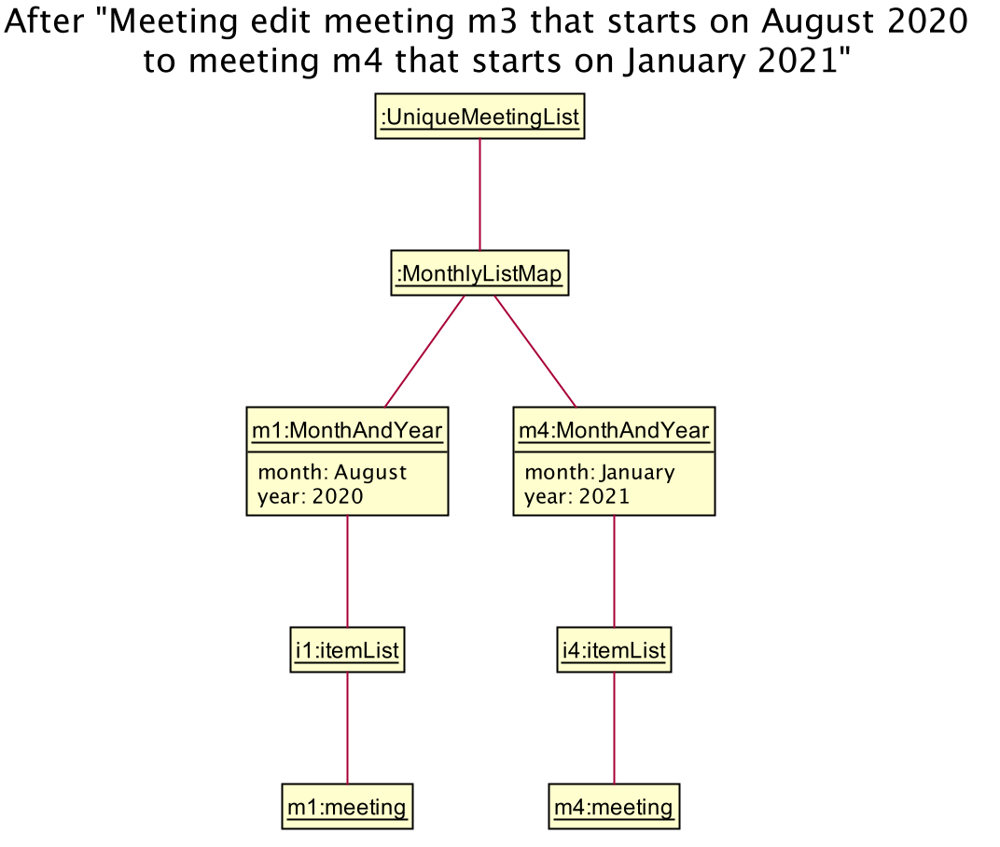

*Fig. 35 - Object diagram after editing meeting `m3`*

##### 4.6.1.2. Data retrieval
* `MonthlyListMap#getMultipleMonthCount(Month month, Year year, int numberOfMonths)` — Gets the item counts for the given month and year and the previous (numberOfMonths - 1) months.
* `MonthlyListMap#getPreviousMonthAndYear(Month month, Year year)` —  Gets the month and year for the month before the given month and year.

`MonthlyListMap#getMultipleMonthCount(Month month, Year year, int numberOfMonths)` operation is exposed in the `Model` interface as
`Model#getMultipleMonthCount(Month month, Year year, int numberOfMonths)`.

The following sequence diagrams shows how the Monthly Statistics Feature works:

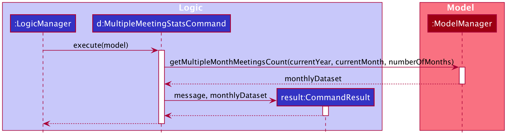

*Fig. 36 - Sequence diagram illustrating interactions between `Logic` and `Model`*

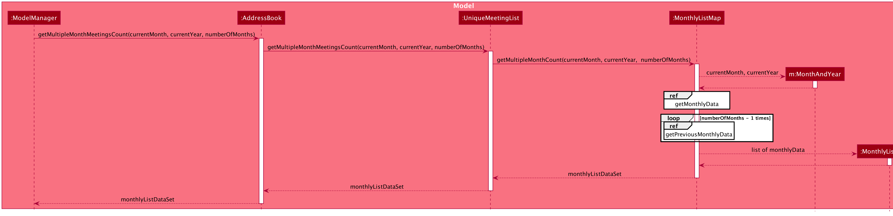

*Fig. 37 - Sequence diagram illustrating interactions between `ModelManager`, `AddressBook` and `UniqueMeetingList`*

*Fig. 38 - Sequence diagram illustrating interactions between `UniqueMeetingList`, `MonthlyListMap`, `MonthAndYear` and `MonthlyListDataSet`*

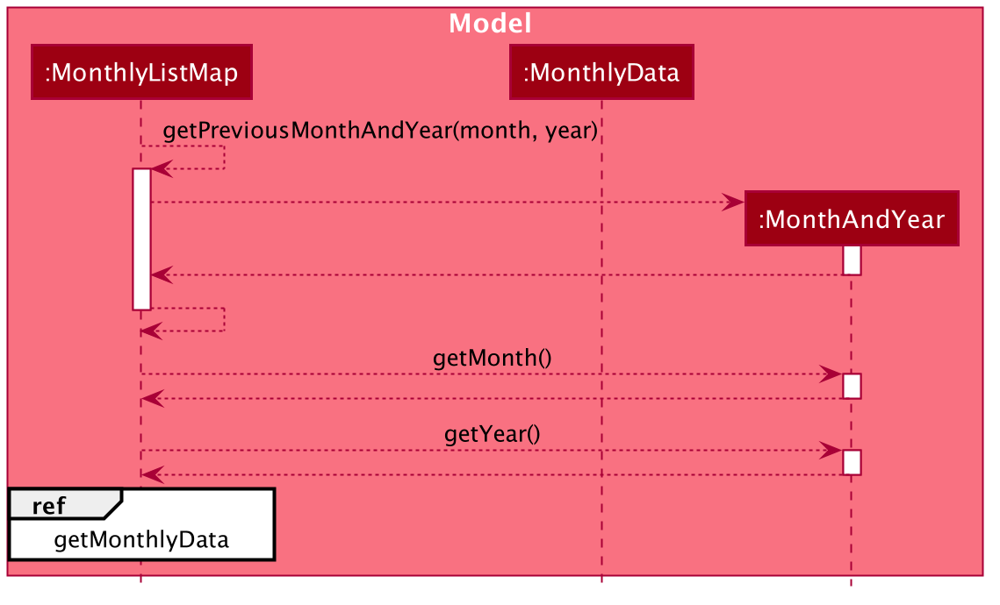

*Fig. 39 - Sequence diagram for `getPreviousMonthlyData`*

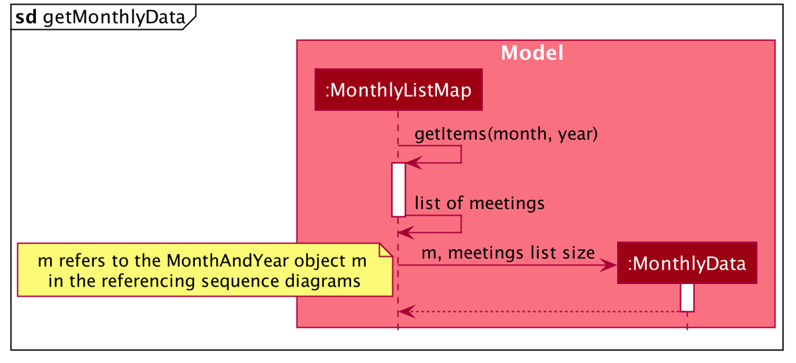

*Fig. 40 - Sequence diagram for `getMonthlyData`*

The following activity diagram summarizes what happens when a user executes the `meeting stats` command:

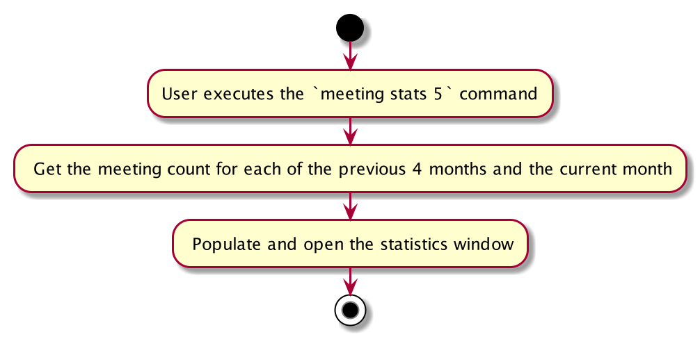

*Fig. 41 - Activity diagram summarising what happens when a user executes the `meeting stats` command*

#### 4.6.2. Design consideration:

##### 4.6.2.1. Aspect: Whether to separate `MonthlyListMap` and `UniqueMeetingList`
* **Alternative 1 (current choice):** Make `MonthlyListMap` a part of `UniqueMeetingList`.
  * Pros: Easy to implement and less error-prone as all changes to meeting objects are done by `UniqueMeetingList` methods
   and it is easy to propagate the changes to `MonthListMap` within them.
  * Cons: Might be better object-oriented design to separate the two.

* **Alternative 2:** separate `MonthlyListMap` from `UniqueMeetingList`.
  * Pros: Might be better object-oriented design.
  * Cons: We must ensure that whenever the meeting objects in the `UniqueMeetingList` changes,
   the changes are reflected to the `MonthlyListMap` to keep the data reliable.

##### 4.6.2.2. Aspect: Whether to use month only or month and year to identify a unique month
* **Alternative 1 (current choice):** Use month and year to identify a unique month.
  * Pros: Easy to identify a unique month.
  * Cons: Special care is needed to get the previous month when the current month is January as the year has to be decreased by 1 too. An additional parameter, year, for user to type.

* **Alternative 2:** Use month only.
  * Pros: One less parameter for user to type, easier to implement.
  * Cons: Limits the functionality scope to statistics for the current year only.

--------------------------------------------------------------------------------------------------------------------

## 5. **Documentation, logging, testing, configuration, dev-ops**

* [Documentation guide](Documentation.md)
* [Testing guide](Testing.md)
* [Logging guide](Logging.md)
* [Configuration guide](Configuration.md)
* [DevOps guide](DevOps.md)

--------------------------------------------------------------------------------------------------------------------

## 6. **Appendix: Requirements**

### 6.1. Product scope

**Target user profile**:

* Managing a large client base
* Values sales optimisation
* Analytical
* Performance-driven
* Prefer desktop apps over other types
* Can type fast
* Prefers typing to mouse interactions
* Is reasonably comfortable using CLI apps

**Value proposition**: Effectively curate sales-optimised contact list and conveniently conduct data analysis to gain business insights and boost sales performance.

### 6.2. User stories

Priorities: High (must have) - `* * *`, Medium (nice to have) - `* *`, Low (unlikely to have) - `*`

| Priority | As a …​                            | I want to …​                                                   | So that I can…​                                                                            |
| -------- | --------------------------------- | ------------------------------------------------------------- | --------------------------------------------------------------------------------------------- |
| `* * *`  | new salesman                      | add contacts                                                  | expand my contact list                                                                        |
| `* *`    | normal user who makes mistakes    | update contacts                                               | quickly and conveniently append any mistakes made.                                            |
| `* * *`  | careless user                     | delete contacts                                               | avoid having wrong data                                                                       |
| `* *`    | well-connected salesman           | associate remarks to contacts                                 | remember key information about this contact and distinguish between contacts with same names  |
| `* * *`  | user                              | have my contact list sorted alphabetically by default         | easily find the contacts I am interested in manually                                          |
| `* *`    | efficient user                    | sort my contact list by certain attributes                    | easily find people of interest according to the sorted result                                    |
| `* * *`  | well-connected salesman           | categorise my contacts                                        | navigate through a large list of contacts with ease.                                          |
| `* *`    | efficient salesman                | search contacts who are in certain groups                     | identify contacts belong to a sales group easily                                              |
| `* *`    | well-connected salesman           | search for contacts based on fuzzy match                      | easily find the contacts I am interested in                                                   |
| `* *`    | well-connected salesman           | archive contacts who are no longer active                     | focus on contacts that are more likely to respond                                             |
| `* *`    | salesman                          | remove contacts from the archive                              | focus on inactive contacts who are now active again                                           |
| `* *`    | efficient salesman                | create, view and manage sales related to contacts             | make sales decisions without referring to other app                                           |
| `* *`    | busy salesman                     | perform operations on multiple sales or contacts at once      | save time                                                                                     |
| `* * *`  | performance driven salesman       | see the proportion of sales across sales categories           | identify the proportion of sales made and tweak sales strategies to boost the high ones       |
| `* *`    | forgetful salesman                | set reminders associated with contacts                        | keep track of crucial tasks to be done                                                        |
| `* *`    | visual user                       | quickly identify overdue reminders                            | work on it without further delay                                                              |
| `* *`    | efficient salesman                | set meeting / call time with contacts                         | plan my meetings without another app                                                          |
| `* *`    | efficient salesman                | be notified when I attempt to schedule a clashing meeting     | schedule meetings without worrying for accidental clashes                                     |
| `* *`    | careless typer                    | be notified of an erroneous input                             | easily identify my mistakes                                                                   |
| `* *`    | careless user                     | be notified if a similar record already exists                | ensure no duplicate records are created                                                       |
| `* *`    | visual salesman                   | have chatbot GUI                                              | visually keep track of my actions                                                             |
| `*`      | user who enjoys customisation     | switch to a light theme                                       | my eyes will not be strained when working late in the night                                   |
| `* *`    | busy salesman                     | clear past interactions with the app                          | remove the clutter on the GUI                                                                 |
| `* *`    | forgetful salesman                | see the command list with a single command                    | easily recall how to use the app                                                              |
| `* *`    | careless user                     | be suggested the right command when I input wrongly           | correct my mistakes easily                                                                    |
| `* *`    | fast typer with low accuracy      | retrieve my previous command with a single keystroke          | I can correct my typos easily                                                                 |

### 6.3. Use cases

(For all use cases below, the **System** is the `StonksBook` and the **Actor** is the `user`, unless specified otherwise)

#### 6.3.1. Use case: Delete a person
{:.no_toc}

**MSS**

1.  User requests to list persons
2.  StonksBook shows a list of persons
3.  User requests to delete a specific person in the list
4.  StonksBook deletes the person

    Use case ends.

**Extensions**

* 2a. The list is empty.

  Use case ends.

* 3a. The given index is invalid.

    * 3a1. StonksBook shows an error message.

      Use case resumes at step 2.

#### 6.3.2. Use case: Add a tag
{:.no_toc}

**MSS**

1.  User requests to add a new tag.
2.  StonksBook adds the provided tag.

    Use case ends.

**Extensions**

* 2a. The provided tag already exists in the tag list.

    Use case ends.

#### 6.3.3. Use case: View all tags
{:.no_toc}

**MSS**

1.  User requests to list all tags.
2.  StonksBook displays a list of all tags.

    Use case ends.

**Extensions**

* 2a. The list of tags is empty.

    Use case ends.

#### 6.3.4. Use case: Update a tag
{:.no_toc}

**MSS**

1.  User requests to list tags.
2.  StonksBook shows a list of tags.
3.  User requests to update a specific tag in the list.
4.  StonksBook updates the tag and updates all items associated with this tag.

    Use case ends.

**Extensions**

* 2a. The list of tags is empty.

    Use case ends.

* 3a. The given index is invalid.

    * 3a1. StonksBook shows an error message.

        Use case resumes at step 2.

#### 6.3.5. Use case: Delete a tag
{:.no_toc}

**MSS**

1.  User requests to list tags.
2.  StonksBook shows a list of tags.
3.  User requests to delete a specific tag in the list.
4.  StonksBook deletes the tag and updates all items associated with this tag.

    Use case ends.

**Extensions**

* 2a. The list of tags is empty.

    Use case ends.

* 3a. The given index is invalid.

    * 3a1. StonksBook shows an error message.

        Use case resumes at step 2.

#### 6.3.6. Use case: Retrieve entries by tag
{:.no_toc}

**MSS**

1.  User requests to list tags.
2.  StonksBook shows a list of tags.
3.  User requests to search for items under a specific tag in the list.
4.  StonksBook displays all entries under the given tag.

    Use case ends.

**Extensions**

* 2a. The list of tags is empty.

    Use case ends.

* 3a. The given index is invalid.

    * 3a1. StonksBook shows an error message.

        Use case resumes at step 2.

* 3b. The user specifies a different model to search for.

    * 3b1. StonksBook displays items of the specified model under the given tag.

#### 6.3.7. Use case: Clear past interactions
{:.no_toc}

**MSS**
1.  User enters the clear command.
2.  StonksBook clears the chatbox GUI.

    Use case ends.

#### 6.3.8. Use case: Clear all data
{:.no_toc}

**MSS**
1.  User enters the purge command.
2.  StonksBook clears all saved data.

    Use case ends.

**Extensions**
* 1a. StonksBook requests for confirmation.
    * 1a1. User confirms.

        Use case resumes at step 2.

#### 6.3.9. Use case: Find a contact
{:.no_toc}

**MSS**

1.  User requests to find a contact by giving keyword(s).
2.  StonksBook outputs a contact list.

    Use case ends.

**Extensions**

* 2a. The list is empty.

  Use case ends.

* 2b. There is no given keyword.

    * 3a1. StonksBook shows an error message.

      Use case ends.

#### 6.3.10. Use case: Add a meeting
{:.no_toc}

**MSS**

1. User requests to list contacts
2. StonksBook shows a list of contacts
3. User requests to add a meeting associated with a specific contact in the list
4. StonksBook adds a meeting associated with the contact

    Use case ends.

**Extensions**

* 2a. The list of contacts is empty.

  Use case ends.

* 3a. The given index is invalid.

    * 3a1. StonksBook shows an error message.

      Use case resumes at step 2.

* 3b. The given meeting date is invalid.

    * 3b1. StonksBook shows an error message.

      Use case resumes at step 2.

* 3c. The given meeting duration is invalid.

    * 3c1. StonksBook shows an error message.

      Use case resumes at step 2.

* 3d. The given meeting message is invalid.

    * 3d1. StonksBook shows an error message.

      Use case resumes at step 2.

* 3e. The given meeting conflicts with some existing meetings.
    
    * 3e1. StonksBook shows an error message.
    
      Use case resumes at step 2.

#### 6.3.11. Use case: View all meetings
{:.no_toc}

**MSS**

1. User requests to list all meetings
2. StonksBook shows a list of all meetings

    Use case ends.

**Extensions**

* 1a. An index is specified, but the given index is invalid

    * 1a1. StonksBook shows an error message.

      Use case resumes at step 1.

* 2a. The list of meetings is empty.

  Use case ends.

#### 6.3.12. Use case: Delete a meeting
{:.no_toc}

**MSS**

1. User requests to list meetings
2. StonksBook shows a list of meetings
3. User requests to delete a specific meeting in the list
4. StonksBook deletes the meeting

    Use case ends.

**Extensions**

* 2a. The list of meetings is empty.

  Use case ends.

* 3a. The given index is invalid.

    * 3a1. StonksBook shows an error message.

      Use case resumes at step 2.

#### 6.3.13. Use case: Add a reminder
{:.no_toc}

**MSS**

1. User requests to list contacts
2. StonksBook shows a list of contacts
3. User requests to add a reminder associated with a specific contact in the list
4. StonksBook adds a reminder associated with the contact

    Use case ends.

**Extensions**

* 2a. The list of contacts is empty.

  Use case ends.

* 3a. The given index is invalid.

    * 3a1. StonksBook shows an error message.

      Use case resumes at step 2.

* 3b. The given reminder date is invalid.

    * 3b1. StonksBook shows an error message.

      Use case resumes at step 2.

* 3c. The given reminder message is invalid.

    * 3c1. StonksBook shows an error message.

      Use case resumes at step 2.

#### 6.3.14. Use case: Edit a reminder
{:.no_toc}

This use case is similar to `Add a reminder` except that the user has the additional option to update the status of the reminder to indicate whether the reminder is completed.

#### 6.3.15. Use case: View all reminders
{:.no_toc}

**MSS**

1. User requests to list all reminders
2. StonksBook shows a list of all reminders

    Use case ends.

**Extensions**

* 2a. The list of reminders is empty.

  Use case ends.

#### 6.3.16. Use case: Delete a reminder
{:.no_toc}

**MSS**

1. User requests to list reminders
2. StonksBook shows a list of reminders
3. User requests to delete a specific reminder in the list
4. StonksBook deletes the reminder

    Use case ends.

**Extensions**

* 2a. The list of reminders is empty.

  Use case ends.

* 3a. The given index is invalid.

    * 3a1. StonksBook shows an error message.

      Use case resumes at step 2.

#### 6.3.17. Use case: Filter reminders
{:.no_toc}

**MSS**

1. User requests to list reminders based on completion status
2. StonksBook shows a list of completed or pending reminders

    Use case ends.

**Extensions**

* 2a. The list of reminders is empty.

  Use case ends.

#### 6.3.18. Use case: Get help on available commands
{:.no_toc}

**MSS**

1.  User requests for help on the available commands.
2.  StonksBook lists the available commands, command description and example usage as well as the link to the User Guide.

    Use case ends.

#### 6.3.19. Use case: Get help for a command
{:.no_toc}

**MSS**

1.  User requests for help for a command.
2.  StonksBook lists the command description and example usage.

    Use case ends.

#### 6.3.20. Use case: Add a sale to a contact
{:.no_toc}

**MSS**

1.  User requests to list contacts.
2.  StonksBook shows a list of contacts.
3.  User requests to add a sale to a specific contact in the list.
4.  StonksBook adds a sale to the specific contact.

    Use case ends.

**Extensions**

* 2a. The list of contacts is empty.

  Use case ends.

* 3a. The given contact index is invalid.

    * 3a1. StonksBook shows an error message. No sale is created.

      Use case resumes at step 2.

* 3b. The given sale already exists.

    * 3b1. StonksBook shows an error message stating that the given sale already exists. No sale is created.

      Use case ends.

* 3c. Any of the given parameters (e.g. contact index, unit price, quantity) are missing.

    * 3c1. StonksBook shows an error message, reminding the user of the correct command format. No sale is created.

      Use case resumes at step 2.

* 3d. Any of the given parameters (e.g. unit price, quantity) are not in the correct format.

    * 3d1. StonksBook shows an error message, reminding the user of the correct format. No sale is created.

      Use case resumes at step 2.
      
      
#### 6.3.21. Use case: Add a sale to multiple contacts
{:.no_toc}

**MSS**

1.  User requests to list contacts.
2.  StonksBook shows a list of contacts.
3.  User requests to add a sale to multiple contacts in the list.
4.  StonksBook adds a sale to the multiple contacts specified.

    Use case ends.

**Extensions**

* 2a. The list of contacts is empty.

  Use case ends.

* 3a. A least one of the given contact indexes are invalid.

    * 3a1. StonksBook shows an error message highlighting the invalid contact indexes. No sales are created.

      Use case resumes at step 2.

* 3b. At least one of the given sales already exists.

    * 3b1. StonksBook shows an error message listing the duplicate sales. The remaining valid sales are created, but the duplicate sales are not.

      Use case ends.

* 3c. Any of the given parameters (e.g. contact indexes, unit price, quantity) are missing.

    * 3c1. StonksBook shows an error message, reminding the user of the correct command format. No sales are created.

      Use case resumes at step 2.

* 3d. Any of the given parameters (e.g. unit price, quantity) are not in the correct format.

    * 3d1. StonksBook shows an error message, reminding the user of the correct format. No sales are created.

      Use case resumes at step 2.      

#### 6.3.22. Use case: List all sales
{:.no_toc}

**MSS**

1.  User requests to list all sales.
2.  StonksBook shows all sales.

    Use case ends.

#### 6.3.23. Use case: List all sales belonging to a contact
{:.no_toc}

**MSS**

1.  User requests to list contacts.
2.  StonksBook shows a list of contacts.
3.  User requests to view all sales belonging to a specific contact in the list.
4.  StonksBook shows all sales belonging to the specific contact.

    Use case ends.

**Extensions**

* 2a. The list of contacts is empty.

  Use case ends.

* 3a. The given contact index is invalid.

    * 3a1. StonksBook shows an error message.

      Use case resumes at step 2.

#### 6.3.24. Use case: Delete a sale
{:.no_toc}

**MSS**

1.  User requests to list sales.
2.  StonksBook shows a list of sales.
3.  User requests to delete a sale.
4.  StonksBook deletes the specified sale.

    Use case ends.

**Extensions**

* 2a. The list of sales is empty.

  Use case ends.

* 4a. No sale index is provided.

    * 4a1. StonksBook shows an error message. No sale is deleted.

      Use case resumes at step 2.

* 4b. The given sale index is invalid.

    * 4b1. StonksBook shows an error message. No sale is deleted.

      Use case resumes at step 2.
      
#### 6.3.25. Use case: Delete multiple sales
{:.no_toc}

**MSS**

1.  User requests to list sales.
2.  StonksBook shows a list of sales.
3.  User requests to delete multiple sales.
4.  StonksBook deletes the specified sales.

    Use case ends.

**Extensions**

* 2a. The list of sales is empty.

  Use case ends.

* 3a. No sale indices are provided.

    * 3a1. StonksBook shows an error message. No sale is deleted.

      Use case resumes at step 2.

* 3b. Any of the given sale indices are invalid.

    * 3b1. StonksBook shows an error message. No sales are deleted.

      Use case resumes at step 2.
      
#### 6.3.26. Use case: Edit a sale
{:.no_toc}

**MSS**

1.  User requests to list sales.
2.  StonksBook shows a list of sales.
3.  User requests to edit a sale.
4.  StonksBook edits the sale.

    Use case ends.

**Extensions**

* 2a. The list of contacts is empty.

  Use case ends.

* 3a. No sale index is provided.

    * 3a1. StonksBook shows an error message. No sale is edited.

      Use case resumes at step 2.

* 3b. The given sale index is invalid.

    * 3b1. StonksBook shows an error message. No sale is edited.

      Use case resumes at step 2.

* 3c. The given sale already exists.

    * 3c1. StonksBook shows an error message stating that the given sale already exists. The sale is not edited.

      Use case ends.
      
* 3d. No sale parameters are provided besides the sale index.

    * 3d1. StonksBook shows an error message, reminding the user to provide at least one field to edit. The sale is not edited.

      Use case resumes at step 2.

* 3e. Any of the given parameters (e.g. unit price, quantity) are not in the correct format.

    * 3e1. StonksBook shows an error message, reminding the user of the correct format. The sale is not edited.

      Use case resumes at step 2.
      
#### 6.3.27. Use case: Edit multiple sales
{:.no_toc}

**MSS**

1.  User requests to list sales.
2.  StonksBook shows a list of sales.
3.  User requests to edit multiple sales.
4.  StonksBook edits multiple sales.

    Use case ends.

**Extensions**

* 2a. The list of contacts is empty.

  Use case ends.

* 3a. No sale indices are provided.

    * 3a1. StonksBook shows an error message. No sales are edited.

      Use case resumes at step 2.

* 3b. Any of the given sale indices are invalid.

    * 3b1. StonksBook shows an error message. No sales are edited.

      Use case resumes at step 2.

* 3c. Any of the given sales already exists.

    * 3c1. StonksBook shows an error message listing the duplicate sales. All sales besides the duplicate sales are edited.

      Use case ends.
      
* 3d. No sale parameters are provided besides the sale index.

    * 3d1. StonksBook shows an error message, reminding the user to provide at least one field to edit. No sales are edited.

      Use case resumes at step 2.

* 3e. Any of the given parameters (e.g. unit price, quantity) are not in the correct format.

    * 3e1. StonksBook shows an error message, reminding the user of the correct format. No sales are edited.

      Use case resumes at step 2.

#### 6.3.28. Use case: Display sale breakdown
{:.no_toc}

**MSS**

1.  User requests to display sale breakdown.
2.  StonksBook shows the sale breakdown in a pop-up window.

    Use case ends.

**Extensions**

* 2a. No sale tags or sales exist.

    * 2a1. StonksBook shows an error message.

  Use case ends.

#### 6.3.29. Use case: Add contact to archive
{:.no_toc}

**MSS**

1.  User requests to list contacts.
2.  StonksBook shows a list of contacts.
3.  User requests to add a specific person in the list to archive.
4.  StonksBook adds the person to archive.

    Use case ends.

**Extensions**

* 3a. The given index is invalid.

    * 3a1. StonksBook shows an error message.

      Use case resumes at step 2.
      
#### 6.3.30. Use case: Remove contact from archive
{:.no_toc}

**MSS**

1.  User requests to list archived contacts.
2.  StonksBook shows a list of archived contacts.
3.  User requests to remove a specific person in the list from the archive.
4.  StonksBook removes the person from the archive.

    Use case ends.

**Extensions**

* 3a. The given index is invalid.

    * 3a1. StonksBook shows an error message.

      Use case resumes at step 2.

### 6.4. Non-Functional Requirements

1.  Should work on any _mainstream OS_ as long as it has Java `11` or above installed.
2.  Should be able to hold up to 1000 persons without a noticeable sluggishness in performance for typical usage.
3.  A user with above average typing speed for regular English text (i.e. not code, not system admin commands) should be able to accomplish most of the tasks faster using commands than using the mouse.
4.  The size of the application should not exceed 100Mb.
5.  The features of the application should be easily testable.
6.  The application, along with all my existing data, should be portable.
7.  Should be able to function without having to rely on being connected to a network.
8.  The data should be stored locally and should be in a human editable text file.

### 6.5. Glossary

* **Mainstream OS**: Windows, Linux, Unix, OS-X
* **Private contact detail**: A contact detail that is not meant to be shared with others

--------------------------------------------------------------------------------------------------------------------

## 7. **Appendix: Instructions for manual testing**

Given below are instructions to test the app manually.

:information_source: **Note:** These instructions only provide a starting point for testers to work on;
testers are expected to do more *exploratory* testing.

### 7.1. Launch and shutdown

1. Initial launch

   1. Download the jar file and copy into an empty folder

   1. Open the jar file by double-clicking it or running `java -jar stonksbook.jar`  
        Expected: Shows the GUI with a set of sample contacts, sales, meetings and reminders. The window size may not be optimum.

1. Saving window preferences

   1. Resize the window to an optimum size. Move the window to a different location. Close the window.

   1. Re-launch the app by double-clicking the jar file. 
       Expected: The most recent window size and location is retained.

### 7.2. Listing contacts

1. Listing contacts in StonksBook

   1. Test case: Enter `contact list` 
      Expected: The contact list displays all contacts currently in StonksBook. Archived or deleted contacts will not be displayed.
      
   1. Test case: Enter `contact list random` 
         Expected: No change in the contact list. StonksBook should ignore additional fields that come after `contact list`.

### 7.3. Adding a contact

1. Adding a contact while all contacts are being shown

   1. Prerequisites: List all contacts using the `contact list` command. The contact John Doe does not exist yet.

   1. Test case: Enter `contact add n/John Doe e/john.doe@gmail.com p/12345678 a/Singapore` 
      Expected: A new contact is created in StonksBook, with name "John Doe", email "john.doe@gmail.com", phone number "12345678" and address "Singapore".
      The contact list should remain sorted in alphabetical order.
      However, after the entry of this command again, an error message appears, stating that this contact already exists in StonksBook.
      
   1. Test case: Enter `contact add 1`  
      Expected: No contact is added. Error details shown in the Result Box. Contact list remains the same.
      
   1. Other incorrect delete commands to try: `contact add`  
      Expected: Similar to previous.

### 7.4. Deleting a contact

1. Deleting a person while all contacts are being shown

   1. Prerequisites: List all contacts using the `contact list` command. Multiple contacts in the list.

   1. Test case: `contact delete 1` 
      Expected: First contact is deleted from the list. Details of the deleted contact shown in the Result Box.

   1. Test case: `contact delete 0` 
      Expected: No contact is deleted. Error details shown in the Result Box. No change in the contact list.

   1. Other incorrect delete commands to try: `contact delete`, `contact delete x`, `...` (where x is larger than the list size) 
      Expected: Similar to previous.

### 7.5. Editing a contact

1. Editing a contact while all contacts are being shown

   1. Prerequisites: List all contacts using the `contact list` command.

   1. Test case: Enter `contact edit 1 n/John Doe e/john.doe@gmail.com` 
      Expected: The first contact in the currently displayed list of contacts is edited to have the name "John Doe" and email "john.doe@gmail.com". 
      The contact list should remain sorted in alphabetical order.
      
   1. Test case: Enter `contact edit 1`  
      Expected: No contact is edited. Error details shown in the Result Box. Contact list remains the same.
      
   1. Other incorrect delete commands to try: `contact edit` and `contact edit random`  
      Expected: Similar to previous.
      
1. Editing a contact while no contacts are shown

    1. Prerequisites: Use the `contact find` command to find a name that does not match any contacts in StonksBook.
       A blank contact list should be displayed.

    1. Test case: `contact edit 1 n/Hartin Menz`  
        Expected: No contact is edited. Error details shown in the Result Box. Contact list remains the same.

### 7.6. Listing tags

1. Listing contact tags and sales tags in StonksBook

    1. Test case: Enter `tag list` 
       Expected: If the GUI is not currently displaying tags at the bottom right, upon executing this command, the sales panel
       will be replaced with the contact tag list and Sales Tag List. The contact tag list displays all tags for contacts, whereas
       the Sales Tag List displays all tags related to sales.

    1. Test case: Enter `tag list random` 
       Expected: StonksBook should ignore any additional fields following `tag list` and the outcome should be the same as simply
       entering `tag list`.

### 7.7. Adding a tag

1. Adding a tag when all tags are being shown

    1. Prerequisites: List all tags using the `tag list` command. Existing contact tags include: `colleagues`, `friends`,
       and existing sales tags include `music`, `stationery`.

    1. Test case: Enter `tag add ct/family` 
       Expected: A new contact tag with name `family` is created, the contact tag list should now display this tag.
       The contact tag list should remain sorted in alphabetical order.
       However, after the entry of the command again, an error message appears, stating that the contact tag `friends` already exists.

    1. Test case: Enter `tag add st/electronics` 
       Expected: A new sales tag with name `electronics` is created, the sales tag list should now display this tag.
       The sales tag list should remain sorted in alphabetical order.
       However, after the entry of the command again, an error message appears, stating that the sales tag `electronics` already exists.

    1. Test case: Enter `tag add` 
       Expected: No tag is added. An error message appears, stating that the command format is invalid.

    1. Other invalid add commands to try: `tag add family` 
       Expected: Similar to previous.

### 7.8. Deleting a tag

1. Deleting a tag when all tags are being shown

    1. Prerequisites: List all tags using the `tag list` command. Existing contact tags include: `colleagues`, `friends`,
       and existing sales tags include `music`, `stationery`.

    1. Test case: Enter `tag delete ct/1` 
       Expected: The first contact tag `colleagues` is deleted from the contact tag list.
       The contact tag list should remain sorted in alphabetical order.
       In addition, all contacts who were previously tagged with `colleagues` will no longer be associated to this tag.

    1. Test case: Enter `tag delete st/1` 
       Expected: The first sales tag `music` is deleted from the sales tag list.
       The contact tag list should remain sorted in alphabetical order.
       In addition, all sales that were previously tagged with `music` will no longer be associated to this tag.

    1. Test case: Enter `tag delete` 
       Expected: No tag is added. An error message appears, stating that the command format is invalid.

    1. Other invalid add commands to try: `tag delete family` 
       Expected: Similar to previous.

### 7.9. Editing a tag

1. Editing a tag when all tags are being shown

    1. Prerequisites: List all tags using the `tag list` command. Existing contact tags include: `colleagues`, `friends`,
       and existing sales tags include `music`, `stationery`.

    1. Test case: Enter `tag edit ct/1 t/teammates` 
       Expected: The second contact tag in the contact tag list is edited from `colleagues` to `teammates`.
       The contact tag list should remain sorted in alphabetical order.
       In addition, all contacts who were previously tagged with `colleagues` will now be tagged with `teammates`.

    1. Test case: Enter `tag edit st/1 t/instruments` 
       Expected: The first sales tag in the sales tag list is edited from `music` to `instruments`.
       The contact tag list should remain sorted in alphabetical order.
       In addition, all sales that were previously tagged with `music` will now be tagged with `instruments`.

    1. Test case: Enter `tag edit` 
       Expected: No tag is edited. An error message appears, stating that the command format is invalid.

    1. Other invalid add commands to try: `tag edit family` 
       Expected: Similar to previous.

### 7.10. Finding data by tag

1. Finding contacts or sales data by tag

    1. Prerequisites: List all tags using the `tag list` command. Existing contact tags include: `colleagues`, `friends`,
       and existing sales tags include `music`, `stationery`.

    1. Test case: Enter `tag find ct/2` 
       Expected: Finds all contacts who are tagged with the second contact tag `friends`.
       A list of contacts will be displayed by StonksBook.

    1. Test case: Enter `tag find st/1` 
       Expected: Finds all sales that are tagged with the first sales tag `music`.
       A list of sales will be displayed by StonksBook.

    1. Test case: Enter `tag find` 
       Expected: No tag is edited. An error message appears, stating that the command format is invalid.

    1. Other invalid add commands to try: `tag find family` 
       Expected: Similar to previous.

### 7.11. Listing sales

1. Listing sales belonging to a specific contact

   1. Prerequisites: List all contacts using the `contact list` command. Multiple contacts in the list.

   1. Test case: Enter `sale list c/1` 
      Expected: The sale list displays all sales belonging to the first contact in the currently displayed list of contacts.
      The sale list should remain sorted in ascending order based on the datetime of purchase.
      
   1. Test case: Enter `sale list` 
      Expected: The sale list will display all sales.
      
   1. Test case: Enter `sale list c/0` 
         Expected: No change in the sale list. Error details shown in the Result Box.

### 7.12. Adding a sale

1. Adding a sale while all contacts are being shown

   1. Prerequisites: List all contacts using the `contact list` command. At least 3 contacts in the list.

   1. Test case: Enter `sale add c/1 n/Guitar Tuner d/2020-10-30 15:00 p/10.00 q/100 t/music` 
      Expected: A new sale is created that is associated with the first contact in the currently displayed list of
      contacts, has item name "Guitar Tuner", has datetime of purchase 30 October 2020, 3pm, has unit price of $10.00, 
      has quantity of 100 and has a sale tag "music". 
      The sale list should remain sorted in ascending order based on the datetime of purchase.
      
   1. Test case: Enter `sale add c/1 c/2 c/3 n/Guitar String d/2020-10-30 15:00 p/10.00 q/100 t/music` 
      Expected: 3 new sales are created with item name "Guitar String", has datetime of purchase 30 October 2020, 3pm, 
      has unit price of $10.00, has quantity of 100 and has a sale tag "music". 
      They are associated with the first, second and third contacts in the currently displayed list of persons.
      The sale list should remain sorted in ascending order based on the datetime of purchase.

   1. Test case: Enter `sale add c/1 n/Guitar Case d/2020-10-30 16:00 p/30.00 q/20 t/music` twice 
      Expected: After the entry of the command, a new sale is created. 
      However, after the entry of the command again, an error message appears, stating that a duplicate sale cannot be created.
      
   1. Test case: Enter `sale add c/1 n/Guitar Pick d/2020-10-30 16:00 p/30 q/20 t/music`  
      Expected: No sale is edited. Error details shown in the Result Box. Sale list remains the same.
      
   1. Test case: `sale add` 
      Expected: No sale is added. Error details shown in the Result Box. Sale list remains the same.

   1. Other incorrect delete commands to try: `sale add c/1 d/2020-10-30 16:00 p/30.00 q/20 t/music`, 
      `sale add c/1 n/Guitar Case p/30.00 q/20 t/music`, `sale add c/1 n/Guitar Case d/2020-10-30 16:00 p/30.00 q/20`, 
      `sale add c/1 n/Guitar Case d/2020-10-30 16:00 q/20 t/music` 
      Expected: Similar to previous.
      
1. Adding a sale while no persons are shown

    1. Prerequisites: Use `contact find` command with a search term that does not match any contact to clear the contact list.

    1. Test case: `sale add c/1 n/Guitar Case d/2020-10-30 16:00 p/25.00 q/20 t/music`  
        Expected: No sale is added. Error details shown in the Result Box. Sale list remains the same.

### 7.13. Deleting a sale

1. Deleting a sale while all sales are being shown

   1. Prerequisites: List all sales using the `sale list` command. At least 5 sales in the sale list.

   1. Test case: `sale delete s/1` 
      Expected: First sale is deleted from the list. Details of the deleted sale shown in the Result Box.

   1. Test case: `sale delete s/0` 
      Expected: No sale is deleted. Error details shown in the Result Box.

   1. Test case: `sale delete s/1 s/3 s/5` 
      Expected: First, third and fifth sales are deleted from the list. 
      Details of the deleted sales are shown in the Result Box.

   1. Other incorrect delete commands to try: `sale delete`, `sale delete x`, `...` (where x is larger than the
    list size) 
      Expected: Similar to previous.
      
### 7.14. Editing a sale

1. Editing a sale while all sales are being shown

   1. Prerequisites: List all sales using the `sale list` command.

   1. Test case: Enter `sale edit s/1 n/Guitar Tuner` 
      Expected: The first sale in the currently displayed list of sales is edited to have the item name "Guitar Tuner". 
      The sale list should remain sorted in ascending order based on the datetime of purchase.
      
   1. Test case: Enter `sale edit s/1 s/2 s/3 q/25` 
      Expected: The first, second and third sales in the currently displayed list of sales is edited to have a quantity of 25.
      The sale list should remain sorted in ascending order based on the datetime of purchase.

   1. Test case: Enter `sale edit s/1 p/30`  
      Expected: No sale is edited. Error details shown in the Result Box. Sale list remains the same.
      
   1. Test case: `sale edit` 
      Expected: No sale is edited. Error details shown in the Result Box. Sale list remains the same.

   1. Other incorrect delete commands to try: `sale edit p/30.00` and `sale edit s/1 c/0`  
      Expected: Similar to previous.
      
1. Editing a sale while no sales are shown

    1. Prerequisites: Use the sale list command to list all sales belonging to a contact that does not have any sales.

    1. Test case: `sale edit s/1 n/Bass Guitar`  
        Expected: No sale is edited. Error details shown in the Result Box. Sale list remains the same.

### 7.15. Displaying sale breakdown

1. Displaying sale breakdown with no existing sale tags or sales.

   1. Prerequisites: There are no existing sale tags or sales

   1. Test case: `sale breakdown` 
      Expected: No popup window showing sale breakdown appears. Error details shown in the Result Box.

1. Displaying sale breakdown with less than 5 existing sale tags.

   1. Prerequisites: There are less than 5 existing sale tags.

   1. Test case: `sale breakdown` 
      Expected: A popup window showing the sale breakdown appears. All sale tags appear in the bar chart.

1. Display sale breakdown with 5 or more sale tags

   1. Prerequisites: There are 5 or more existing sale tags.

   1. Test case: `sale breakdown` 
      Expected: A popup window showing the sale breakdown appears. The top 5 sale tags appear in the bar chart.

### 7.16. Adding a meeting

1. Adding a meeting while all contacts are being shown

   1. Prerequisites: List all contacts using the `contact list` command. Multiple contacts in the list.

   1. Test case: `meeting add c/1 m/Lunch with Bob d/2020-10-30 12:00 du/60` 
      Expected: A new meeting is created that is associated with the first contact in the currently displayed list of
      contacts, has message "Lunch with Bob", and is scheduled from 30 October 2020, 12pm to 1pm. The meeting list
      should remain sorted in ascending order based on the scheduled date.

   1. Test case: `meeting add` 
      Expected: No meeting is added. Error details shown in the Result Box.

   1. Other incorrect delete commands to try: `meeting add c/-1 m/Lunch with Bob d/2020-10-30 12:00 du/60`, `meeting
    add c/1 m/ d/2020-10-30 12:00 du/60`, `meeting add c/1 m/Lunch with Bob d/30/10/2020 12pm du/60`, `meeting add c
    /1 m/Lunch with Bob d/2020-10-30 12:00 du/30min` 
      Expected: Similar to previous.

### 7.17. Deleting a meeting

1. Deleting a meeting while all meetings are being shown

   1. Prerequisites: List all meetings using the `meeting list` command. Multiple meetings in the list.

   1. Test case: `meeting delete 1` 
      Expected: First meeting is deleted from the list. Details of the deleted meeting shown in the Result Box.

   1. Test case: `meeting delete 0` 
      Expected: No meeting is deleted. Error details shown in the Result Box. 

   1. Other incorrect delete commands to try: `meeting delete`, `meeting delete x`, `...` (where x is larger than the
    list size) 
      Expected: Similar to previous.

### 7.18. Editing a meeting

1. Editing a meeting while all meetings are being shown.

    1. Prerequisites: List all meetings using the `meeting list` command. Multiple meetings in the list.
    
    1. Test case: `meeting edit 1 du/90` 
       Expected: First meeting's duration is set to 90 minutes. 
       
    1. Test case: `meeting edit 1 d/2020-12-12 12:00` 
       Expected: First meeting's start date is set to 12 December 2020, 12pm. The meeting list should remain sorted in ascending order based on the start date of meetings.
        
    1. Test case: `meeting edit` 
       Expected: No meeting is edited. Error details shown in the Result Box.
       
    1. Other incorrect edit commands to try: `meeting edit m/Product demo`, `meeting edit x du/120` (where x is larger than the list size) 
       Expected: Similar to previous. 

### 7.19. Filtering meetings

1. Filtering for meetings with a specific contact while all meetings are currently being shown.
    
    1. Prerequisites: Contact list is not empty.
    
    1. Test case: `meeting list c/1` 
       Expected: Meeting list shows only all upcoming meetings with the specified contact at index 1.
       
    1. Test case: `meeting list c/1 a/` 
       Expected: Meeting list shows only all meetings (including past meetings) with the specified contact at index 1.
       
    1. Test case: `meeting list` 
       Expected: Meeting list shows only all upcoming meetings regardless of contact.
    
    1. Test case: `meeting list c/x` (where x is larger than the contact list size) 
       Expected: No change to meeting list. Error details shown in the Result Box.
       
### 7.20. Adding a reminder

1. Adding a reminder while all contacts are being shown

   1. Prerequisites: List all contacts using the `contact list` command. Multiple contacts in the list.

   1. Test case: `reminder add c/1 m/Follow up with Bob d/2020-10-30 12:00` 
      Expected: A new reminder is created that is associated with the first contact in the currently displayed list of
      contacts, has message "Follow up with Bob", and is scheduled on 30 October 2020, 12pm. The reminder list
      should remain sorted in ascending order based on the scheduled date.

   1. Test case: `reminder add` 
      Expected: No reminder is added. Error details shown in the Result Box.

   1. Other incorrect delete commands to try: `reminder add c/-1 m/Follow up with Bob d/2020-10-30 12:00`, `reminder
    add c/1 m/ d/2020-10-30 12:00`, `reminder add c/1 m/Follow up with Bob d/30/10/2020 12pm` 
      Expected: Similar to previous.

### 7.21. Deleting a reminder

1. Deleting a reminder while all reminders are being shown

   1. Prerequisites: List all reminder using the `reminder list` command. Multiple reminder in the list.

   1. Test case: `reminder delete 1` 
      Expected: First reminder is deleted from the list. Details of the deleted reminder shown in the Result Box.

   1. Test case: `reminder delete 0` 
      Expected: No reminder is deleted. Error details shown in the Result Box. 

   1. Other incorrect delete commands to try: `reminder delete`, `reminder delete x`, `...` (where x is larger than the
    list size) 
      Expected: Similar to previous.

### 7.22. Editing a reminder

1. Editing a reminder while all reminders are being shown.

    1. Prerequisites: List all reminders using the `reminder list` command. Multiple reminders in the list.
    
    1. Test case: `reminder edit 1 m/Call Bob` 
       Expected: First reminder's message is set to "Call Bob". 
       
    1. Test case: `reminder edit 1 d/2020-12-12 12:00` 
       Expected: First reminder's scheduled date is set to 12 December 2020, 12pm. The reminder list should remain sorted in ascending order based on the scheduled date of reminders.
        
    1. Test case: `reminder edit` 
       Expected: No reminder is edited. Error details shown in the Result Box.
       
    1. Other incorrect edit commands to try: `reminder edit m/Call Bob`, `reminder edit x m/Call Bob` (where x is larger than the list size) 
       Expected: Similar to previous.

### 7.23. Adding a contact to archive

1. Adding a contact to archive when all contacts are listed

   1. Prerequisites: List all contacts using the `contact list` command. Multiple contacts in the list.

   1. Test case: `archive add 1` 
      Expected: First contact is removed from the list (not deleted). Details of the archived contact shown in the Result Box.

   1. Test case: `archive add 0` 
      Expected: No contact is added to archive. Error details shown in the Result Box.

   1. Other incorrect add commands to try: `archive add`, `archive add a`, `archive add x` (where x is an integer larger than the list size) 
      Expected: Similar to previous.

### 7.24. Removing a contact to archive

1. Adding a contact to archive when all archived contacts are listed

   1. Prerequisites: List all archived contacts using the `archive list` command. Multiple contacts in the list.

   1. Test case: `archive remove 1` 
      Expected: First contact is removed from the list (not deleted). Details of the unarchived contact shown in the Result Box.

   1. Test case: `archive add 0` 
      Expected: No contact is removed from archive. Error details shown in the Result Box.

   1. Other incorrect add commands to try: `archive remove`, `archive remove a`, `archive remove x` (where x is an integer larger than the list size) 
      Expected: Similar to previous.

### 7.25. Finding contacts

1. Finding a contact

   1. Test case: `contact find alx yu` 
      Expected: 2 contacts, 'Alex Yeoh' and 'Bernice Yu' should appear in the contact list.

### 7.26. Sorting contacts

1. Sorting contacts with a non-empty contact list

   1. Test case: `contact sort n/ desc`   
      Expected: Contact list now sorted reverse alphabetical order based on the name.

### 7.27. Viewing monthly sale count

1. Viewing sale count for non-empty sale list

   1. Test case: `sale stats 5`  
      Expected: A new window opens with a bar chart. The X-axis will have 5 months, the past 4 months and the current month.
      The Y-axis will contain the sale count in a month.
      
   1. Other incorrect add commands to try: `sale stats 1`  
      Expected: Error message saying that the number of months must be in the range 2 to 6.
      

### 7.28. Viewing monthly meeting count

1. Viewing meeting count for non-empty meeting list

   1. Test case: `meeting stats 5`   
      Expected: A new window opens with a bar chart. The X-axis will have 5 months, the past 4 months and the current month.
      The Y-axis will contain the meeting count in a month.
  
   1. Other incorrect add commands to try: `meeting stats 1`  
      Expected: Error message saying that the number of months must be in the range 2 to 6.

### 7.29. Suggesting for error resolution

1. Unknown user input

   1. Test case: `contat add`   
      Expected: A suggestion of contact add should be given in the command box.

### 7.30. Viewing help

1. Getting help page

   1. Test case: `help`  
      Expected: A new window appears with the help information.

### 7.31. Saving data

1. Dealing with missing/corrupted data files

   1. Open the file `stonksbook.json` which is located in the `data` folder and delete the `id`s of at least one contact. After which start the application.
      Expected: The StonksBook opened should display an empty GUI, where no data exists in the application.
