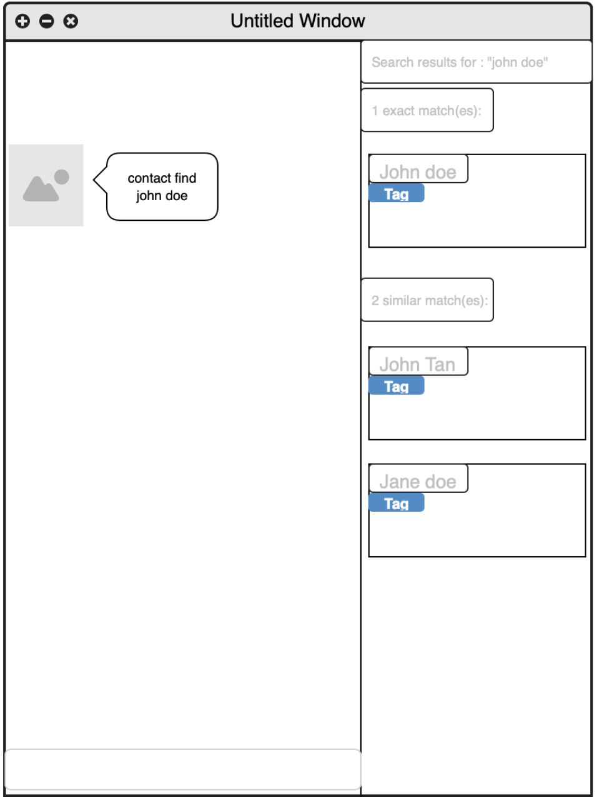
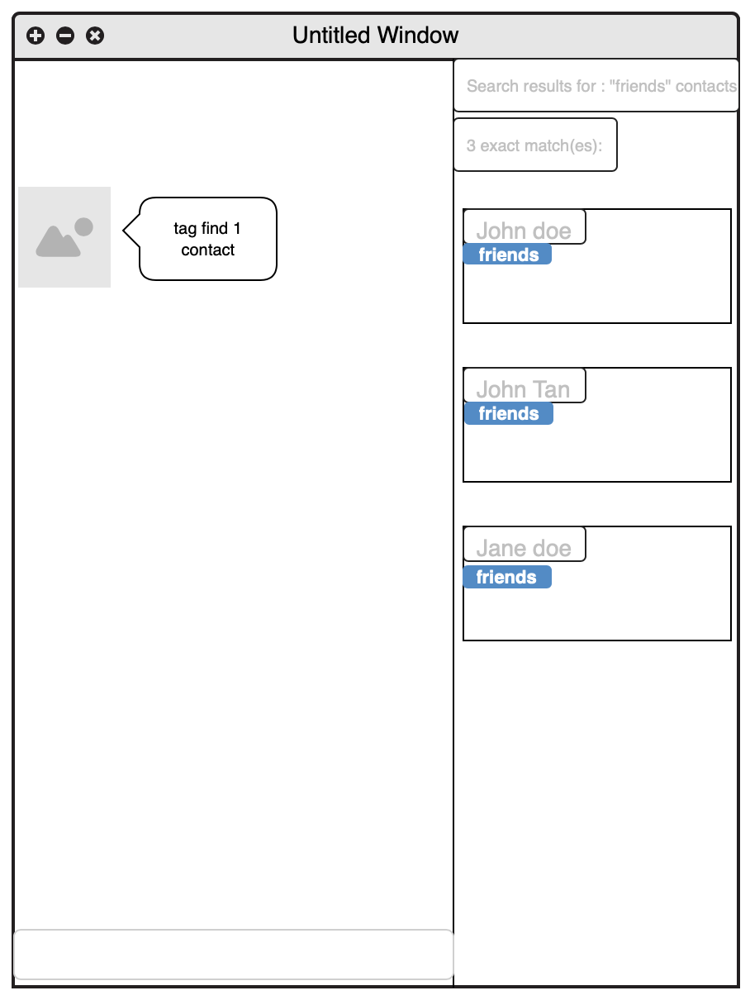
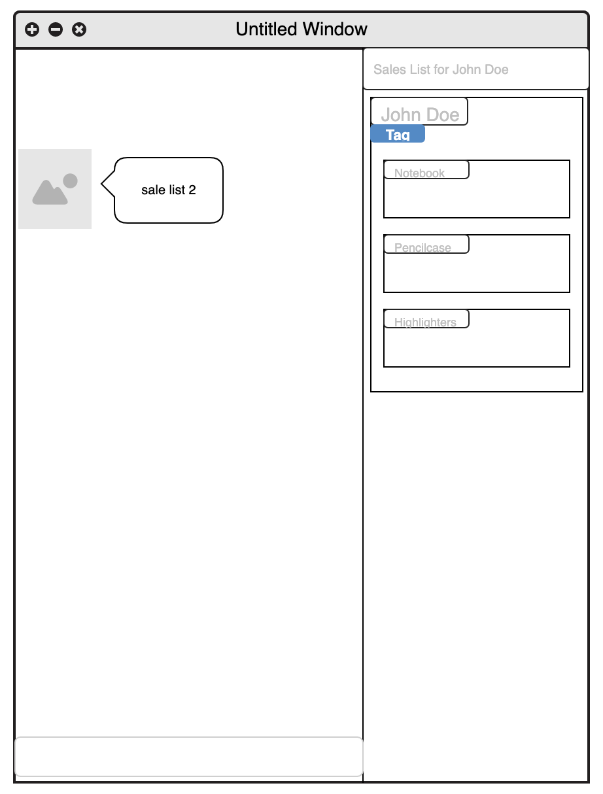
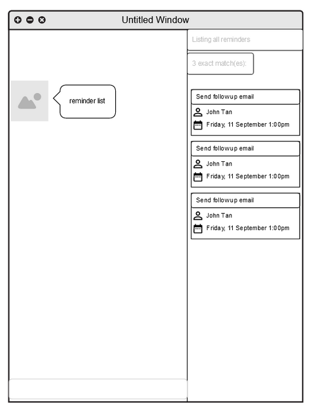
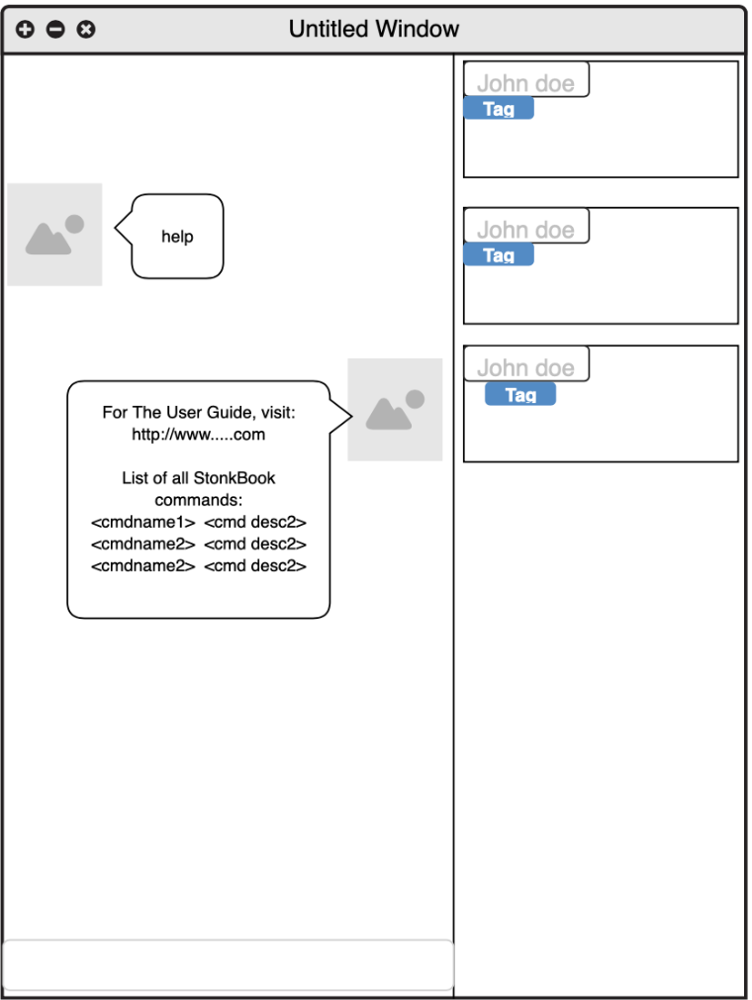

* Table of Contents
{:toc}

--------------------------------------------------------------------------------------------------------------------
## Introduction

StonksBook is a contact management application that is created for salesmen.

Many salesmen waste their time manually managing their contacts and sales data. They often require
 several different applications to carry out these tasks.

 StonksBook aims to integrate the key tools used by salesmen into an all-in-one application that can empower them to
  effectively curate their contact list. StonksBook also provides many tools that can boost one's sales peformance
  through the use of sophisticated data analysis techniques.

--------------------------------------------------------------------------------------------------------------------

## Quick start

This section will provide a quick guide to get StonksBook up and running on your computer.

1. Ensure you have Java `11` or above installed in your Computer.

1. Download the latest `stonksbook.jar` from [here](https://github.com/AY2021S1-CS2103T-T11-1/tp/releases).

1. Copy the file to the folder you want to use as the _home folder_ for StonksBook.

1. Double-click the file to start the app. The GUI similar to the below should appear in a few seconds. Note how the app contains some sample data. 
   

1. Type the command in the command box and press Enter to execute it. e.g. typing **`help`** and pressing Enter will open the help window. 
   Some example commands you can try:

   * **`contact list`** : Lists all contacts.

   * **`contact add`**`n/John Doe p/98765432 e/johnd@example.com a/John street, block 123, #01-01` : Adds a contact named `John Doe` to StonksBook.

   * **`contact delete`**`3` : Deletes the 3rd contact shown in the current list.

   * **`purge`** : Deletes all contacts.

   * **`exit`** : Exits the app.

1. Refer to the [Features](#features) below for details of each command.

--------------------------------------------------------------------------------------------------------------------

## Features

**:information_source: Notes about the command format:** 

* Words in `UPPER_CASE` are the parameters to be supplied by the user. 
  e.g. in `contact add n/NAME`, `NAME` is a parameter which can be used as `contact add n/John Doe`.

* Items in square brackets are optional. 
  e.g `n/NAME [t/TAG]` can be used as `n/John Doe t/friend` or as `n/John Doe`.

* Items with `…`​ after them can be used multiple times including zero times. 
  e.g. `[t/TAG]…​` can be used as ` ` (i.e. 0 times), `t/friend`, `t/friend t/family` etc.

* Parameters can be in any order. 
  e.g. if the command specifies `n/NAME p/PHONE_NUMBER`, `p/PHONE_NUMBER n/NAME` is also acceptable.

### Contacts

#### Adding a contact: `contact add`
Adds a contact to StonksBook.

Format: `contact add n/NAME p/PHONE_NUMBER e/EMAIL a/ADDRESS [t/TAG]… [r/REMARK]…​`

:bulb: Tip: A contact can have any number of tags (including 0)

* The contact tags provided must exist in StonksBook before you can associate this contact with them.

Examples:
* `contact add n/John Doe p/98765432 e/johnd@example.com a/John street, block 123, #01-01`
* `contact add n/Betsy Crowe t/friend e/betsycrowe@example.com a/Newgate Prison p/1234567 t/criminal r/blacklisted`

#### Editing a contact: `contact edit`
Edits an existing contact in StonksBook.

Format: `contact edit INDEX [n/NAME] [p/PHONE] [e/EMAIL] [a/ADDRESS] [t/TAG]… [r/REMARK]`

* Edits the contact at the specified `INDEX`. The index refers to the index number shown in the displayed contact list. The index must be a positive integer 1, 2, 3, …​
* At least one of the optional fields must be provided.
* Existing values will be updated to the input values.
* When editing a contact's tags, the existing tags of the contact will be removed i.e adding of tags is not cumulative.
* When editing a contact's remark, the previous remark will also be removed/overwritten.
* You can remove all the contact’s tags/remark by typing `t/` or  `r/` respectively without specifying any tags/remark after it.
* The contact tags provided must exist in StonksBook before you can associate this contact with them.

Examples:
* `contact edit 1 p/91234567 e/johndoe@example.com` edits the phone number and email address of the 1st contact to be 91234567 and johndoe@example.com respectively.
* `contact edit 2 n/Betsy Crower t/` edits the name of the 2nd contact to be Betsy Crower and clears all existing tags.

#### Listing all contacts: `contact list`
Shows a list of all contacts in StonksBook.

Format:`contact list`

#### Locating contacts by name: `contact find`
Finds contacts whose names exactly match or is similar to any of the given keywords.

Format: `contact find KEYWORD [MORE_KEYWORDS]`

* The search is case-insensitive. e.g hans will match Hans

* The order of the keywords does not matter. e.g. Hans Bo will match Bo Hans

* You can only search based on the contact name.

* Contacts matching at least one keyword will be returned (i.e. OR search). e.g. Hans Bo will return Hans Gruber, Bo Yang

* keyword does not have to exactly match a contact name. e.g. alx will return Alex Yeoh

* The contact list is ordered by non-ascending similarity.

* Exact matches (if exist) will appear as the first few results.

Examples:
* `contact find alex david` returns Alex Yeoh, David Li
* `contact find alx` returns Alex Yeoh
* `contact find alx david` returns David Li, Alex Yeoh

#### Sorting contacts: `contact sort`
Sorts contacts based on the name, email address or the total sale amount associated to the contact.

Format: `contact sort KEYWORD [ORDER]`

* `KEYWORD` must exactly match to one of the following:
    * `n/` for name
    * `e/` for email address
    * `s/` for total sales amount

* If `ORDER` is present, `ORDER` must exactly match `desc`.

* If `ORDER` is absent, contacts will be sorted in non-descending order. Otherwise, contacts will be sorted in non-ascending order.

* The sorted result will last until other contact commands (except `contact delete`) are executed.

Examples:
* `contact sort e/ desc` sorts the contact list based on the email address in non-ascending order
* `contact find n/`  sorts the contact list based on the contact name in non-descending order
* `contact find s/ desc` sorts the contact list based on the total sales amount in non-ascending order

#### Deleting a contact: `contact delete`
Deletes the specified contact from StonksBook. All associated reminders and meetings will be deleted as well.

Format: `contact delete INDEX`
* Deletes the contact at the specified `INDEX`.
* The index refers to the index number shown in the displayed contact list.
* The index must be a positive integer 1, 2, 3, …​

Examples:
`contact list` followed by `contact delete 2` deletes the 2nd contact in StonksBook.
`contact find Betsy` followed by `contact delete 1` deletes the 1st contact in the results of the find command.

### Tags

#### Adding a tag: `tag add` \[Wang Luo\]

Adds a new customised tag of the specified name to either the contact tags or sales tags. If there is an existing tag with this name, this command will not result in any change in state.

Format: `tag add c/ (or s/) t/TAG`

* Adds a tag with the specified `TAG` as the tag name to the contact tag list or sales tag list.
* If this tag name already exists in the tag list, there will be no change in the program state.
* The type of tag is specified by the empty prefix `c/` or `s/`, where `c/` adds the tag to the contact tag list, whilst `s/` adds the tag to the sales tag list.
* The `TAG` field must be provided.

Examples:

* `tag add s/ t/electronics` adds the tag `electronics` to the sales tag list in StonksBook.

#### Listing all tags: `tag list` \[Wang Luo\]

Displays a list of all tags created so far.

Format: `tag list`

Examples:

* `tag list` displays all tags available in StonksBook.

#### Editing a tag: `tag edit` \[Wang Luo\]

Edits an existing tag in StonksBook to the specified tag name. All entries previously associated with this tag will be updated to associated with the updated tag.

Format: `tag edit (ct/ or st/)INDEX t/TAG`

* Edits the name of the contact tag or sales tag at the specified `INDEX` to be the specified `NAME`. The `INDEX` refers to the index number shown in the contact tags list or sales tags list displayed by the `tag list` command.
* `ct/` stands for contact tag, `st/` stands for sales tag.
* The `INDEX` must be a positive integer 1, 2, 3, ...
* The `TAG` and `INDEX` fields must be provided.
* All contacts or sales that have been previously associated with this tag will be updated automatically to be associated with the updated tag.

Examples:

* `tag edit ct/1 t/friends` updates the name of the first contact tag to `friends`.
* `tag edit st/1 t/electronics` updates the name of the first sales tag to `electronics`.

#### Deleting a tag: `tag delete` \[Wang Luo\]

Deletes the specified tag from the tag list. The tag information in all entries previously associated with this tag will also be cleared.

Format: `tag delete (st/ or ct/)INDEX`

* Deletes the the contact tag or sales tag at the specified `INDEX`. The `INDEX` refers to the index number shown in the list displayed by the `tag list` command.
* The `INDEX` must be a positive integer 1, 2, 3, ...
* The `INDEX` field must be provided.
* All contacts that have been previously associated with this tag will be updated so that their associations with this tag will be cleared.

Examples:

* `tag delete ct/1` deletes the first contact tag from the contact tags list.
* `tag delete st/1` deletes the first sales tag from the sales tags list.

#### Retrieving entries by tag: `tag find` \[Wang Luo\]

Displays all entries (including contacts, items, etc.) that are associated with the specified tag.

Format: `tag find (ct/ or st/)INDEX [cl/]`

* Displays all entries of associated with the tag at `INDEX`. The `INDEX` refers to the index number shown in the list displayed by the `tag list` command.
* The `INDEX` must be a positive integer 1, 2, 3, ...
* The `INDEX` field must be provided.
* An additional `cl/` field can be provided when performing searching on sales tags. This field results in all contacts who purchased sales items associated with this tag to be displayed. Adding this field will have no effect on the search results for contact tags.

Examples:
* `tag find ct/1` displays all contacts associated with the first contact tag displayed by the `tag list` command.
* `tag find st/2` displays all sales associated with the second sales tag displayed by the `tag list` command.
* `tag find st/3 cl/` displays all contacts who have purchased items associated with the third sales tag.

### Sales

#### Adding a sale to a customer: `sale add`

Adds a sale of specified name, unit price and quantity, to the specified contact.

Format: `sale add c/CONTACT_INDEX n/ITEM_NAME d/DATETIME_OF_PURCHASE p/UNIT_PRICE q/QUANTITY t/TAG…`

* Adds a sale made to the contact at the specified `CONTACT_INDEX`, with details such as the name of item sold, the unit price, and the quantity.
* The `CONTACT_INDEX` refers to the index number shown in the displayed contact list. The contact index must be a positive integer 1, 2, 3, …​
* The `DATETIME_OF_PURCHASE` must be in the format `yyyy-MM-dd HH:mm`
* The `UNIT_PRICE` must be a positive number with 2 decimal places, in format `DOLLARS.CENTS`.
* The `QUANTITY` must be a positive integer 1, 2, 3, …​
* It is compulsory to have a tag for the sales item. This is to ensure the ease of data analytics.
* The tags provided must exist in StonksBook first before you can associate the sales item to them.

Examples:
* `sale add c/4 n/Notebook d/2020-10-30 15:00 p/6.00 q/2 t/stationery` Adds a sale made to the contact that is ordered 4th on the displayed contact list. This is a sale of 2 Notebooks, each of price $6.00, made on 30 October at 3.00, with the tag "stationery".

#### Editing an existing sale: `sale edit`

Edits an existing sale in StonksBook.

Format: `sale edit SALE_INDEX [c/CONTACT_INDEX] [n/ITEM_NAME] [d/DATETIME_OF_PURCHASE] [p/UNIT_PRICE] [q/QUANTITY] [t/TAG]…`

* Edits the sale at the specified `SALE_INDEX`.
* At least one of the optional fields must be provided.
* Existing values will be updated to the input values.
* When editing a sale's tags, the existing tags of the sale will be removed i.e adding of tags is not cumulative.
* You can remove all the sale’s tags by typing `t/` without specifying any tags after it.

Examples:
* `sale edit 2 n/B5 Notebook p/4.00 q/10` edits the name of the 2nd sale to be B5 Notebook, and assigns it a quantity of 10 with unit price $4.00.
* `sale edit 3 t/` clears the tags of the 3rd sale.

#### Listing all sales: `sale list`

Shows a list of sales.

Format: `sale list [c/CONTACT_INDEX] [m/MONTH y/YEAR]`

* At most one optional parameter can be present.

* `CONTACT_INDEX` refers to the index number
  shown in the displayed contact list and
  must be a positive integer 1, 2, 3, …​
* `MONTH` must be an integer between 1 and 12 inclusive.
* `YEAR` must be an integer greater than 0.

* If no optional parameter is present:
   * all sales are listed.

* If optional parameter `CONTACT_INDEX` is present:
   * all sales made to a contact with the specified index are listed.

* If optional parameter `[m/MONTH y/YEAR]` is present:
   * all sales whose associated date is in the specified `MONTH` and `YEAR` are listed.

Examples:
* `sale list` lists all sales.
* `sale list c/5` lists all sales made to the 5th contact in the contact list.
* `sale list m/6 y/2020` lists all sales whose associated date is within June 2020.

#### Deleting a sales item: `sale delete`

Deletes a sales item of specified index.

Format: `sale delete s/SALE_INDEX`

* In the list of sales, the sale of `SALE_INDEX` is deleted.
* The  `SALE_INDEX` refers to the index number shown in the displayed sale list, and must be a positive integer 1, 2, 3, …​

Examples:
* `sale delete s/4` deletes the 4th sale made in the list.

### Scheduled Meetings

StonksBook allows you to manage your scheduled meetings within the application.

#### Listing all meetings: `meeting list` \[Sebastian Toh Shi Jian\]

Shows a list of all meetings. By default, the list only shows upcoming meetings. This list is sorted in increasing order based on the date the meeting is scheduled.

**Format**: `meeting list [c/CONTACT_INDEX] [a/]`

* When an index is specified, the list will only show meetings associated with the contact at the specified index.
* You can show all meetings, including past meetings, by typing `a/`.

**Example:**
Suppose you want to view all upcoming meetings scheduled with Alex Yeoh. This is what you need to do:

1. Type `contact find alex` in the **Command Box** and press <kbd>Enter</kbd>. 
    - This is to identify the contact index corresponding to Alex Yeoh. Let us assume that Alex Yeoh is at the first
     index.
     

    
2. The **Result Box** will display a message of the number of contacts listed.
 

 
3. Type `meeting list c/1` in the **Command Box** and press <kbd>Enter</kbd>.

4. The **Result Box** will display a message noting that the command was successful, and the **Meeting List** will
 show a list of upcoming meetings scheduled with Alex Yeoh.

#### Adding a meeting: `meeting add` \[Sebastian Toh Shi Jian\]

Adds a scheduled meeting with the specified contact in StonksBook.

Format: `meeting add c/CONTACT_INDEX m/MESSAGE d/START_DATETIME du/DURATION`

* Adds a scheduled meeting with the contact at the specified `CONTACT_INDEX`.
* The index refers to the index number shown in the displayed contact list.
* The index must be a positive integer 1, 2, 3, …​
* The start datetime must be in the format `yyyy-MM-dd HH:mm`
* The duration is specified in minutes and must be a positive integer.

Example:
Let's say that you successfully secured a lunch meeting with John Doe that is scheduled for 3 December 2020 12pm
and lasts 60 minutes. Here's how you can add this new meeting into StonksBook.
 
 1. Identify the index corresponding to John Doe in the contact list. If you have a large list of contacts, it may be
  convenient to search for John Doe by typing `contact find John Doe` in the command box. The contact list will update
   to show all contacts with the name John Doe. 
 
 2. Suppose John Doe is at the second index in the contact list. Then, type `meeting add c/2 m/Lunch with John Doe d/2020-12-03 12:00 du/90` 
 in the command box, and press Enter to execute it.
 
 3. You should see the newly created meeting in the meetings list. 

To prevent the situation in which you unknowingly scheduled conflicting meetings, StonksBook will not allow you to
 add a new meeting if it conflicts with some meeting in StonksBook!

#### Deleting a meeting: `meeting delete` \[Sebastian Toh Shi Jian\]

Deletes the specified meeting from StonksBook.

Format: `meeting delete INDEX`

* Deletes the schedule at the specified `INDEX`.
* The index refers to the index number shown in the displayed meetings list.
* The index must be a positive integer 1, 2, 3, …​

Example:
Let's say that you have just received an unfortunate email from John Doe who no longer wishes to meet with you on 15
 December 2020, 12pm. Here's how you can delete this meeting in StonksBook:

 1. Identify the index corresponding to the meeting to be deleted in the meeting list. If you have a large list of
    meetings, it may be convenient to filter for all meetings with John Doe. Assuming that John Doe is the 2nd contact
    currently displayed in the contact list, you can type `meeting list c/2` and the meeting list will update to show
    only upcoming meetings with John Doe.
    
 2. Suppose the meeting to be deleted is at the third index in the meeting list. Then, type `meeting delete 3` in the command box, and press Enter to execute it.
 
 3. You should see that the meeting has been deleted from the meeting list.
 
#### Editing a meeting: `meeting edit` \[Sebastian Toh Shi Jian\]
Edits an existing meeting in StonksBook.

Format: `meeting edit INDEX [c/CONTACT_INDEX] [m/MESSAGE] [d/DATETIME] [du/DURATION]`

* Edits the meeting at the specified `INDEX`. The index refers to the index number shown in the displayed meeting list. The index must be a positive integer 1, 2, 3, …​
* At least one of the optional fields must be provided.
* Existing values will be updated to the input values.

Example:
Let's say that you have just received an email from John Doe who wishes to reschedule his lunch meeting with you to 15
 December 2020, 12pm. Here's how you can make this change in StonksBook:
 
 1. Identify the index corresponding to the meeting to be rescheduled in the meeting list. If you have a large list of
  meetings, it may be convenient to filter for all meetings with John Doe. Assuming that John Doe is the 2nd contact
   currently displayed in the contact list, you can type `meeting list c/2` and the meeting list will update to show
    only upcoming meetings with John Doe.
    
 2. Suppose the meeting to be rescheduled is at the third index in the meeting list. Then, type `meeting edit 3 d/2020-12-15 12:00` in the command box, and press Enter to execute it.
  
 3. You should see that the meeting has been updated to reflect this new scheduled date.

Similar to when adding a meeting, StonksBook will not allow you to edit a meeting if it will conflicts with some meeting
 in StonksBook!

#### Analysing meetings: `meeting stats`
Analyses the meeting data and visualises the statistical result.

Format: `meeting stats [NUMBER_OF_MONTHS] [m/MONTH y/YEAR]`

* At most one optional parameter can be present.

* `NUMBER_OF_MONTHS` refers to the number of months to be included in the result.
* `NUMBER_OF_MONTHS` must be an integer between 2 and 6 inclusive.
* `MONTH` must be an integer between 1 and 12 inclusive.
* `YEAR` must be an integer greater than 0.

* If no optional parameter is present:
   * The result is the number of meetings whose start date is in the current month and year

* If optional parameter `[m/MONTH y/YEAR]` is present:
   * The result is the number of meetings whose start date is in the specified `MONTH` and `YEAR`

* If optional parameter `[NUMBER_OF_MONTHS]` is present:
   * The result is a bar chart on the number of meetings
     whose start date is within each of the previous `NUMBER_OF_MONTHS` - 1 months and
     the current month and year.

Examples:
* `meeting stats` will return the number of meetings whose start date is in the October 2020
   if the current month is October and the current year is 2020.
* `meeting stats m/8 y/2020` will return the number of meetings whose start date is in August 2020.
* `meeting stats 3` will return a bar chart containing the number of meetings whose start date is within
   June 2020, July 2020 and August 2020 respectively if the current month is August and the current year is 2020.

### Reminders

StonksBook allows you to manage your reminders within the application.

#### Adding reminders: `reminder add` \[Sebastian Toh Shi Jian\]

Adds a reminder scheduled on a particular date that is associated with the specified contact to StonksBook.

Format: `reminder add c/CONTACT_INDEX m/MESSAGE d/DATETIME`

* Adds a reminder associated with the contact at the specified `CONTACT_INDEX`.
* The index refers to the index number shown in the displayed contact list.
* The index must be a positive integer 1, 2, 3, …​
* The datetime must be in the format `yyyy-MM-dd HH:mm`

Examples:
* `reminder add c/2 m/Send email to follow up d/2020-10-30 15:00` Adds a reminder associated with the 2nd contact
 that is scheduled for 30th October 2020 3PM, with the message `Send email to follow up`

#### Editing a reminder: `reminder edit` \[Sebastian Toh Shi Jian\] and \[Wang Luo\]
Edits an existing reminder in StonksBook.

Format: `reminder edit INDEX [c/CONTACT_INDEX] [m/MESSAGE] [d/DATETIME] [st/STATUS]`

* Edits the reminder at the specified `INDEX`. The index refers to the index number shown in the displayed reminder list. The index must be a positive integer 1, 2, 3, …​
* At least one of the optional fields must be provided.
* Existing values will be updated to the input values.
* `STATUS` can be either `pending` or `completed`.

Examples:
* `reminder edit 1 c/2` edits the 1st reminder to be associated with the second contact in the displayed contact list.
* `reminder edit 3 m/ d/2020-11-28 13:00` edits the message and scheduled date of the 3rd reminder to be "Call to follow up" and "28th November 2020, 1PM" respectively.

#### Listing reminders: `reminder list` \[Sebastian Toh Shi Jian\] \[Wang Luo\]

Shows a list of all reminders created, sorted in increasing order based on the date the reminder is scheduled.

Format: `reminder list [st/STATUS]`

* `STATUS` can be either `completed` or `pending`.

Examples:
* `reminder list st/completed` displays all reminders that have been marked as completed.

#### Deleting a reminder: `reminder delete` \[Sebastian Toh Shi Jian\]

Deletes the specified reminder from StonksBook.

Format: `reminder delete INDEX`

* Deletes the reminder at the specified `INDEX`.
* The index refers to the index number shown in the displayed reminders list.
* The index must be a positive integer 1, 2, 3, …​

Examples:
* `reminder list` followed by `reminder delete 2` deletes the 2nd reminder in StonksBook.

### Archive

StonksBook allows you to archive contacts who are no longer active so that you can focus on contacts who can bring you the Stonks.

#### Adding a contact to the archive: `archive add`

Adds the specified contact to the archive.

Format: `archive add INDEX`

* Adds the contact at the specified `INDEX` to the archive.
* Can only be used when the contacts list is displayed.
* The index must be a positive integer 1, 2, 3, …

Example:
* When the contact list is displayed on your StonksBook, entering `archive add 3` adds the third contact on your list to the archive.

#### Listing contacts in the archive: `archive list`

Shows the list of your archived contacts.

Format: `archive list`

* When entered, if the contacts list is displayed it will be replaced with the archived contacts list.
* You can edit and delete contacts in the archive using `contact edit` and `contact delete` when the archived contacts list is displayed.

Examples:
* Entering `archive list` displays all your archived contacts.
* Entering `archive list` followed by `contact delete 2` deletes the second contact on your archived contacts list from StonksBook.

#### Removing contacts from the archive: `archive remove`

Removes the specified contact from the archive. The specified contact will appear on your contact list again.

Format: `archive remove INDEX`

* Removes the contact at the specified `INDEX` from the archive.
* Does not delete the contact from StonksBook. To delete the contact use `contact delete`.
* Can only be used when the archived contacts list is displayed.
* The index must be a positive integer 1, 2, 3, …

Example:
* When the archived contacts list is displayed on your StonksBook, entering `archive remove 2` removes the fourth contact on your list from the archive back to your contacts list.

### Miscellaneous

#### Error resolution suggestion:
Gives an approximate match (if exists) of the most similar command to an unknown user input.

Examples:
* `contac add` will return a suggestion of `contact add`
* `contt ad` will return a suggestion of `contact add`
* `contacta ` will return a suggestion of `contact add`

#### Navigate between previous inputs within the session:
Pressing the up and down keys retrieves the previous and next input respectively, if there is one.

#### Viewing help: `help`
Lists the command word, command description and example
usage for each available command as well as the link to the User Guide.

Format: `help`

#### Clearing all past interactions: `clear`
Clears all past interactions with the StonksBook GUI within the session.

Format: `clear`
#### Removing all data: `purge`
Clears all data from StonksBook.

Format: `purge`
#### Exiting the program: `exit`

Exits the program.

Format: `exit`

--------------------------------------------------------------------------------------------------------------------

## FAQ

**Q**: How do I transfer my data to another Computer? 
**A**: Install the app in the other computer and overwrite the empty data file it creates with the file that contains the data of your previous StonksBook home folder.

--------------------------------------------------------------------------------------------------------------------

## Command summary

Action | Format, Examples
--------|------------------
**Contact Add** | `contact add n/NAME p/PHONE_NUMBER e/EMAIL a/ADDRESS [t/TAG]…​[r/REMARK]…`   e.g., `contact add n/James Ho p/22224444 e/jamesho@example.com a/123, Clementi Rd, 1234665 t/friend t/colleague r/birthday: 20 August`
**Contact Delete** | `contact delete INDEX`   e.g., `contact delete 3`
**Contact Edit** | `contact edit INDEX [n/NAME] [p/PHONE_NUMBER] [e/EMAIL] [a/ADDRESS] [t/TAG]…​[r/REMARK]…`   e.g., `edit 2 n/James Lee e/jameslee@example.com`
**Contact Find** | `contact find KEYWORD [MORE_KEYWORDS]`   e.g., `contact find James Jake`
**Contact Sort** | `contact sort KEYWORD [ORDER]`   e.g., `contact sort n/ desc`
**Contact List** | `contact list`
**Sale Add** | `sale add c/CONTACT_INDEX d/DATETIME_OF_PURCHASE n/ITEM_NAME p/UNIT_PRICE q/QUANTITY [t/TAG]…`   e.g., `sale add c/4 n/Notebook d/2020-10-30 15:00 p/6.00 q/2 t/stationery`
**Sale Edit** | `sale edit SALE_INDEX [c/CONTACT_INDEX] [n/ITEM_NAME] [d/DATETIME_OF_PURCHASE] [p/UNIT_PRICE] [q/QUANTITY] [t/TAG]…`    e.g., `sale edit 2 n/B5 Notebook p/4.00 q/10`
**Sale List** | `sale list [c/CONTACT_INDEX] [m/MONTH y/YEAR]`    e.g., `sale delete c/3`
**Sale Delete** | `sale delete s/SALE_INDEX`   e.g., `sale delete s/4`
**Tag Add** | `tag add c/ (or s/) t/TAG`   e.g., `tag add c/ t/important`
**Tag List** | `tag list`
**Tag Edit** | `tag edit INDEX n/NAME`   e.g., `tag edit 1 n/family`
**Tag Delete** | `tag delete INDEX`   e.g., `tag delete 1`
**Tag Find** | `tag find INDEX [MODEL]`   e.g., `tag find 1 c/`
**Meeting Add** | `meeting add c/CONTACT_INDEX m/TITLE d/START_DATETIME du/DURATION`   e.g., `meeting add 2 m/Product Demo d/2020-10-30 15:00 du/60`
**Meeting List** | `meeting list [c/CONTACT_INDEX] [a/]`
**Meeting Delete** | `meeting delete INDEX`   e.g., `meeting delete 3`
**Meeting Stats** | `meeting stats [NUMBER_OF_MONTHS] [m/MONTH y/YEAR]`   e.g., `meeting stats 3`
**Reminder Add** | `reminder add c/CONTACT_INDEX m/MESSAGE d/DATETIME`   e.g., `reminder add 2 m/Send email to follow up d/2020-10-30 15:00`
**Reminder Edit** | `reminder edit INDEX [c/CONTACT_INDEX] [m/MESSAGE] [d/DATETIME]`   e.g., `reminder edit 3 m/Call to follow up d/2020-11-28 13:00`
**Reminder List** | `reminder list`
**Reminder Delete** | `reminder delete INDEX`   e.g., `reminder delete 4`
**Archive Add** | `archive add INDEX`   e.g., `archive add 1`
**Archive List** | `archive list`
**Archive Remove** | `archive remove INDEX`   e.g., `archive remove 2`
**Help** | `help`
**Clear Chatbox** | `clear`
**Delete All Data Entries** | `purge`
**Exit Application** | `exit`

