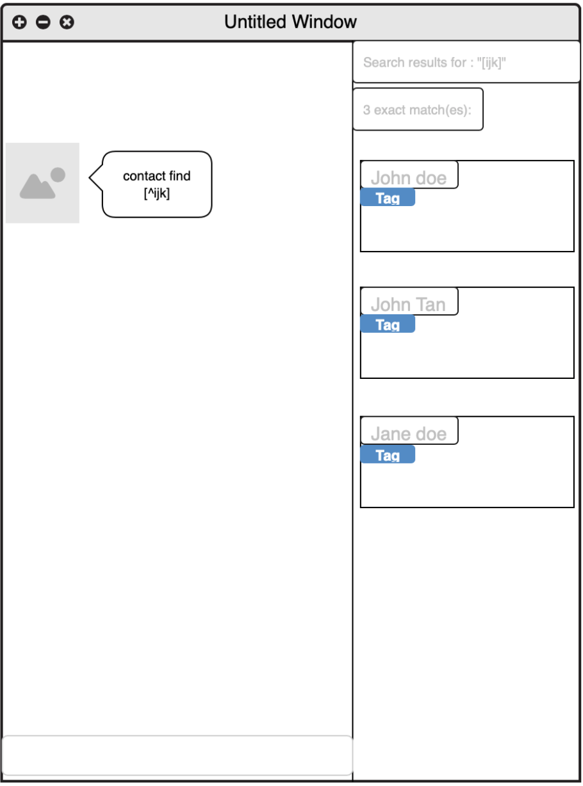
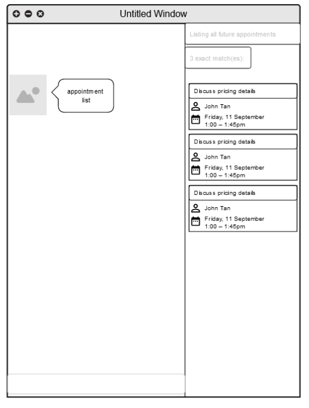
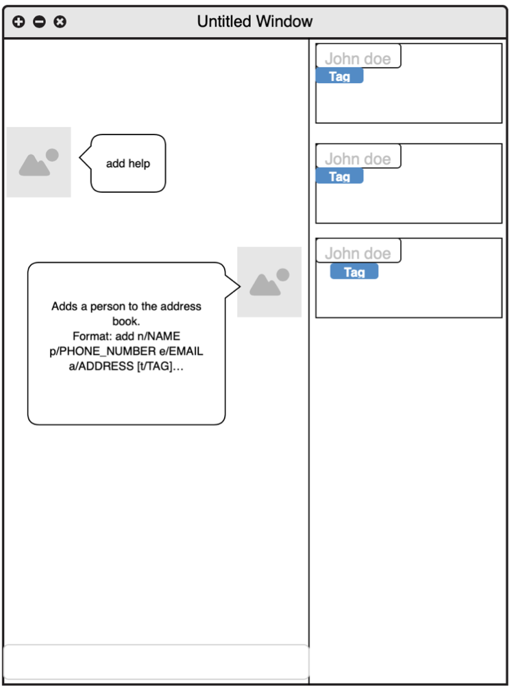

#StonksBook User Guide

1. [**Introduction**](#introduction)
2. [**Quick Start (WIP)**](#quick-start-wip)
3. [**Features**](#features)

    3.1. [Contacts](#contacts)
    1. [Adding a contact: `contact add`](#adding-a-contact-contact-add)
    2. [Editing a contact: `contact edit`](#editing-a-contact-contact-edit)
    3. [Listing all contacts: `contact list`](#listing-all-contacts-contact-list)
    4. [Locating contacts by name: `contact find`](#locating-contacts-by-name-contact-find)
    5. [Deleting a contact: `contact delete`](#deleting-a-contact-contact-delete)
    
    3.2. [Tags](#tags)
    1. [Adding a tag: `tag add`](#adding-a-tag-tag-add)
    2. [Listing all tags: `tag list`](#listing-all-tags-tag-list)
    3. [Editing a tag: `tag edit`](#editing-a-tag-tag-edit)
    4. [Deleting a tag: `tag delete`](#deleting-a-tag-tag-delete)
    5. [Retrieving entries by tag: `tag find`](#retrieving-entries-by-tag-tag-find)
    
    3.3. [Sales](#sales)
    1. [Adding a sale to a customer: `sale add`](#adding-a-sale-to-a-customer-sale-add)
    2. [Listing all sales items: `sale list`](#listing-all-sales-items-sale-list)
    3. [Deleting a sales item: `sale delete`](#deleting-a-sales-item-sale-delete)
    
    3.4. [Scheduled Appointments](#scheduled-appointments)
    1. [Adding a scheduled appointment: `appointment add`](#adding-a-scheduled-appointment-appointment-add)
    2. [Listing all appointments: `appointment list`](#listing-all-appointments-appointment-list)
    3. [Deleting an appointment: `appointment delete`](#deleting-an-appointment-appointment-delete)
    
    3.5. [Reminders](#reminders) 
    1. [Adding reminders: `reminder add`](#adding-reminders-reminder-add)
    2. [Listing all reminders: `reminder list`](#listing-all-reminders-reminder-list)
    3. [Deleting a reminder: `reminder delete`](#deleting-a-reminder-reminder-delete)
    
    3.6. [Miscellaneous](#miscellaneous)  
    1.  [Viewing help: `help`](#viewing-help-help)
    2. [Clearing all past interactions: `clear`](#clearing-all-past-interactions-clear)
    3. [Removing all data: `purge`](#removing-all-data-purge)
    4. [Exiting the program: `exit`](#exiting-the-program-exit)
    
    3.7. [FAQ (WIP)](#faq-wip)   
    
    3.8 [Command summary](#command-summary)
         
--------------------------------------------------------------------------------------------------------------------
## Introduction
StonksBook is a **desktop app for managing contacts, optimized for use via a Command Line Interface** (CLI) while still having the benefits of a Graphical User Interface (GUI). If you can type fast, StonksBook can get your contact management tasks done faster than traditional GUI apps. 

--------------------------------------------------------------------------------------------------------------------

## Quick start (WIP)

1. Ensure you have Java `11` or above installed in your Computer.

1. Download the latest `addressbook.jar` from [here](https://github.com/AY2021S1-CS2103T-T11-1/tp/releases).

1. Copy the file to the folder you want to use as the _home folder_ for your AddressBook.

1. Double-click the file to start the app. The GUI similar to the below should appear in a few seconds. Note how the app contains some sample data. 
   

1. Type the command in the command box and press Enter to execute it. e.g. typing **`help`** and pressing Enter will open the help window. 
   Some example commands you can try:

   * **`list`** : Lists all contacts.

   * **`add`**`n/John Doe p/98765432 e/johnd@example.com a/John street, block 123, #01-01` : Adds a contact named `John Doe` to the Address Book.

   * **`delete`**`3` : Deletes the 3rd contact shown in the current list.

   * **`clear`** : Deletes all contacts.

   * **`exit`** : Exits the app.

1. Refer to the [Features](#features) below for details of each command.

--------------------------------------------------------------------------------------------------------------------

## Features

**:information_source: Notes about the command format:** 

* Words in `UPPER_CASE` are the parameters to be supplied by the user. 
  e.g. in `add n/NAME`, `NAME` is a parameter which can be used as `add n/John Doe`.

* Items in square brackets are optional. 
  e.g `n/NAME [t/TAG]` can be used as `n/John Doe t/friend` or as `n/John Doe`.

* Items with `…`​ after them can be used multiple times including zero times. 
  e.g. `[t/TAG]…​` can be used as ` ` (i.e. 0 times), `t/friend`, `t/friend t/family` etc.

* Parameters can be in any order. 
  e.g. if the command specifies `n/NAME p/PHONE_NUMBER`, `p/PHONE_NUMBER n/NAME` is also acceptable.

### Contacts

#### Adding a contact: `contact add`

#### Editing a contact: `contact edit`

#### Listing all contacts: `contact list`

#### Locating contacts by name: `contact find`
* Finds contacts whose names contain any of the given keywords.

Format: `contact find KEYWORD [MORE_KEYWORDS]`

* The search is case-insensitive. e.g hans will match Hans

* The order of the keywords does not matter. e.g. Hans Bo will match Bo Hans

* Only the name is searched.

* Contacts matching at least one keyword will be returned (i.e. OR search). e.g. Hans Bo will return Hans Gruber, Bo Yang

* There are two search result categories: exact matches and similar matches.

* For exact matches:

    * Only full words will be matched e.g. Han will not match Hans

* For similar matches:

    * Partial words will be matched e.g.  Han will match Hans
    

* Format: `contact find REGEX`

* Returns results that satisfies the regular expression under exact matches.

Examples:
* `contact find John` returns john and John Doe
* `contact find alex david` returns Alex Yeoh, David Li

#### Deleting a contact: `contact delete`

### Tags

#### Adding a tag: `tag add`

Adds a new customised tag of the specified name. If there is an existing tag with this name, this command will not result in any change in state.

Format: `tag add t/TAG`

* Adds a tag with the specified `TAG` as name. If this tag name already exists in the tag list, there will be no change in the program state. 
* The `TAG` field must be provided.

Examples:

* `tag add t/friends` adds the tag `friends` to the tag list in StonksBook.

#### Listing all tags: `tag list`

Displays a list of all tags created so far.

Format: `tag list`

Examples:

* `tag list` displays all tags available in StonksBook.

#### Editing a tag: `tag edit`

Edits an existing tag in StonksBook to the specified tag name. All entries previously associated with this tag will be updated to associated with the updated tag.

Format: `tag edit INDEX n/NAME`

* Edits the name of the tag at the specified `INDEX` to be the specified `NAME`. The `INDEX` refers to the index number shown in the list displayed by the `tag list` command.
* The `INDEX` must be a positive integer 1, 2, 3, ...
* The `NAME` and `INDEX` fields must be provided.
* All contacts that have been previously associated with this tag will be updated automatically to be associated with the updated tag.

Examples:

* `tag edit 1 n/friends` updates the name of the first tag to `close friends`.

#### Deleting a tag: `tag delete`

Deletes the specified tag from the tag list. The tag information in all entries previously associated with this tag will also be cleared.

Format: `tag delete INDEX`

* Deletes the name of the tag at the specified `INDEX`. The `INDEX` refers to the index number shown in the list displayed by the `tag list` command.
* The `INDEX` must be a positive integer 1, 2, 3, ...
* The `INDEX` field must be provided.
* All contacts that have been previously associated with this tag will be updated so that their associations with this tag will be cleared.

Examples:

* `tag delete 1` deletes the first tag from the tag list.

#### Retrieving entries by tag: `tag find`

Displays all entries (including contacts, items, etc.) that are associated with the specified tag.

Format: `tag find INDEX [MODEL]`

* Displays all entries of `[MODEL]` (optional, see point 3 below) associated with the tag at `INDEX`. The `INDEX` refers to the index number shown in the list displayed by the `tag list` command and `[MODEL]` refers to the model to search for (i.e. contacts, sales, etc.).
* The `INDEX` must be a positive integer 1, 2, 3, ...
* The `INDEX` field must be provided and the `[MODEL]` field is optional; when not provided, this command will display all entries that have been associated with the specified tag.

### Sales

#### Adding a sale to a customer: `sale add`

#### Listing all sales items: `sale list`

#### Deleting a sales item: `sale delete`

### Scheduled Appointments

#### Adding a scheduled appointment: `appointment add`

Adds a scheduled appointment with the specified contact in StonksBook.

Format: `appointment add CONTACT_INDEX t/TITLE s/START_DATETIME d/DURATION`

* Adds a scheduled appointment with the contact at the specified `CONTACT_INDEX`.
* The index refers to the index number shown in the displayed contact list.
* The index must be a positive integer 1, 2, 3, …​
* The start datetime must be in the format `YYYY-MM-DD HH:mm`
* The duration is specified in hours and must be a positive number (not necessarily an integer).

Examples:
* `appointment add 2 t/Follow-up appointment s/2020-10-30 15:00 d/1` Adds a 1-hour long appointment titled `Follow-up appointment` with the 2nd contact in StonksBook that is scheduled for 30th October 2020 at 3PM.
* `appointment add 3 t/Call to finalise details s/2020-10-30 08:00 d/0.5` Adds a 30-minute long appointment titled `Call to finalise details` with the 3rd contact in StonksBook that is scheduled for 30th October 2020 at 8AM.

#### Listing all appointments: `appointment list`

Shows a list of all appointments. By default, the list only shows upcoming appointments. This list is sorted in increasing order based on the date the appointment is scheduled.

Format: `appointments list [CONTACT_INDEX] [a/]`

* When an index is specified, the list will only show appointments associated with the contact at the specified index.
* You can show all appointments, including those that have passed, by typing `a/`.

#### Deleting an appointment: `appointment delete`

Deletes the specified appointment from StonksBook.

Format: `appointment delete INDEX`

* Deletes the schedule at the specified `INDEX`.
* The index refers to the index number shown in the displayed appointments list.
* The index must be a positive integer 1, 2, 3, …​

Examples:
* `appointment list 5` followed by `appointment delete 2` deletes the 2nd appointment that is associated with the 5th contact in StonksBook.

### Reminders

#### Adding reminders: `reminder add`

Adds a reminder scheduled on a particular date that is associated with the specified contact to StonksBook.

Format: `reminder add CONTACT_INDEX m/MESSAGE d/DATETIME`

* Adds a reminder associated with the contact at the specified `CONTACT_INDEX`.
* The index refers to the index number shown in the displayed contact list.
* The index must be a positive integer 1, 2, 3, …​
* The datetime must be in the format `YYYY-MM-DD HH:mm`

Examples:
* `reminder add 2 m/Send follow-up email d/2020-10-30 15:00` Adds a reminder associated with the 2nd contact that is scheduled for 30th October 2020 3PM, with the message `Send follow-up email`

#### Listing all reminders: `reminder list`

Shows a list of all reminders created, sorted in increasing order based on the date the reminder is scheduled.

Format: `reminder list`

#### Deleting a reminder: `reminder delete`

Deletes the specified reminder from StonksBook.

Format: `reminder delete INDEX`

* Deletes the reminder at the specified `INDEX`.
* The index refers to the index number shown in the displayed reminders list.
* The index must be a positive integer 1, 2, 3, …​

Examples:
* `reminder list` followed by `reminder delete 2` deletes the 2nd reminder in StonksBook.

### Miscellaneous

#### Viewing help: `help`

Lists the available commands, command description and example usage as well as the link to the User Guide.

Format: `COMMAND help`

* If `COMMAND` is not present, 
    * list the available commands and the link to the User Guide.

* If `COMMAND` is present
    * list the command description and example usage.

#### Clearing all past interactions: `clear`

#### Removing all data: `purge`

#### Exiting the program: `exit`

Exits the program.

Format: `exit`

--------------------------------------------------------------------------------------------------------------------

## FAQ (WIP)

**Q**: How do I transfer my data to another Computer? 
**A**: Install the app in the other computer and overwrite the empty data file it creates with the file that contains the data of your previous AddressBook home folder.

--------------------------------------------------------------------------------------------------------------------

## Command summary

Action | Format, Examples
--------|------------------
**Add** | `add n/NAME p/PHONE_NUMBER e/EMAIL a/ADDRESS [t/TAG]…​`   e.g., `add n/James Ho p/22224444 e/jamesho@example.com a/123, Clementi Rd, 1234665 t/friend t/colleague`
**Clear** | `clear`
**Delete** | `delete INDEX`  e.g., `delete 3`
**Edit** | `edit INDEX [n/NAME] [p/PHONE_NUMBER] [e/EMAIL] [a/ADDRESS] [t/TAG]…​`  e.g.,`edit 2 n/James Lee e/jameslee@example.com`
**Find** | `find KEYWORD [MORE_KEYWORDS]`  e.g., `find James Jake`
**List** | `list`
**Help** | `help`
