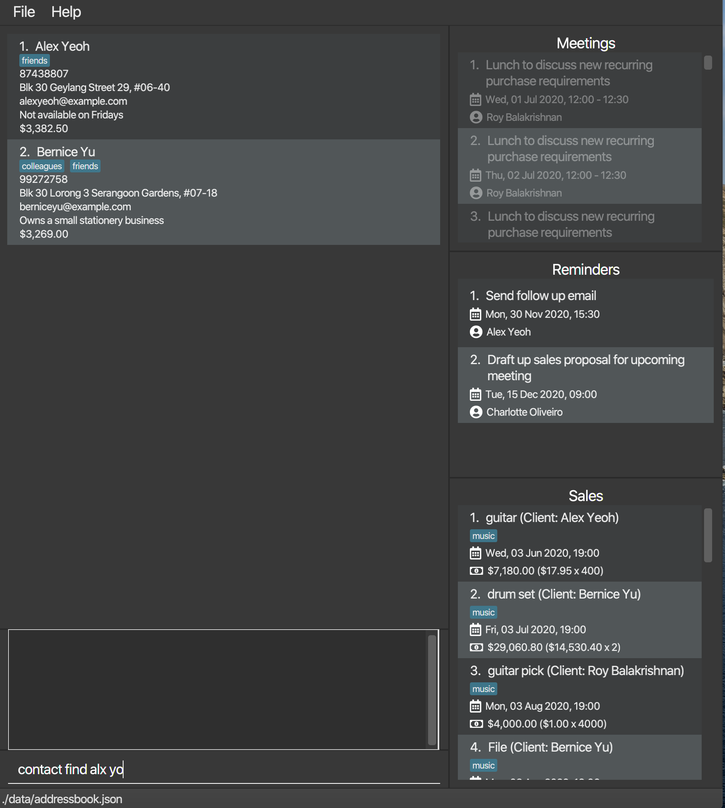
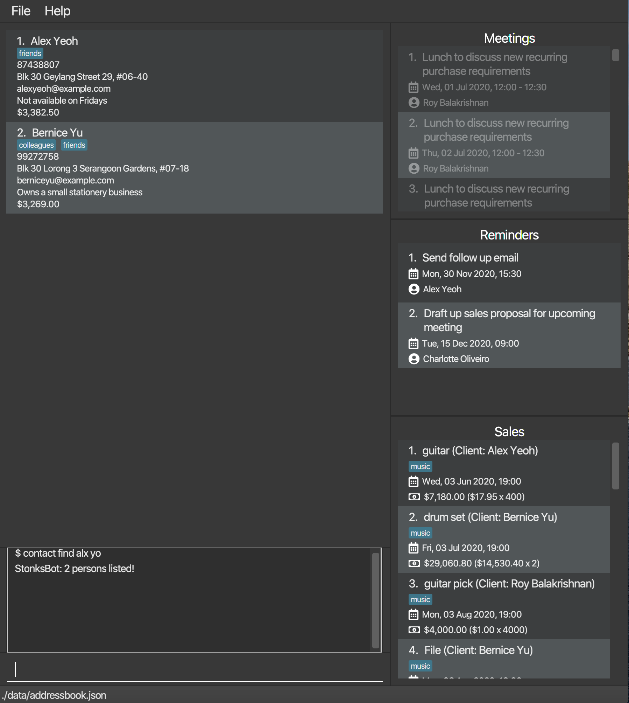
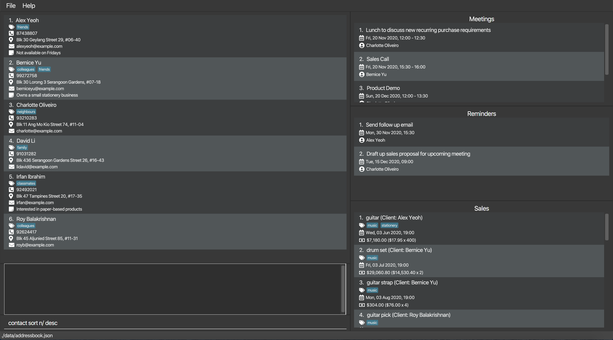
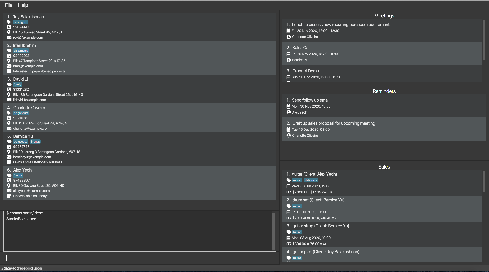
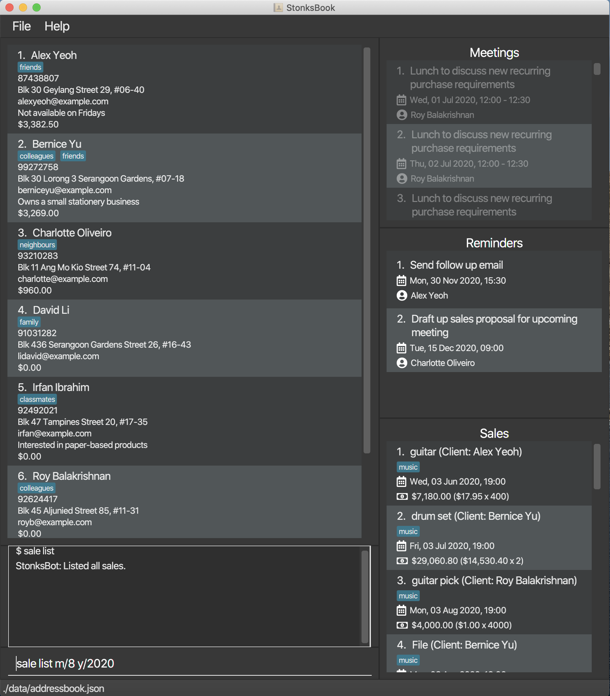
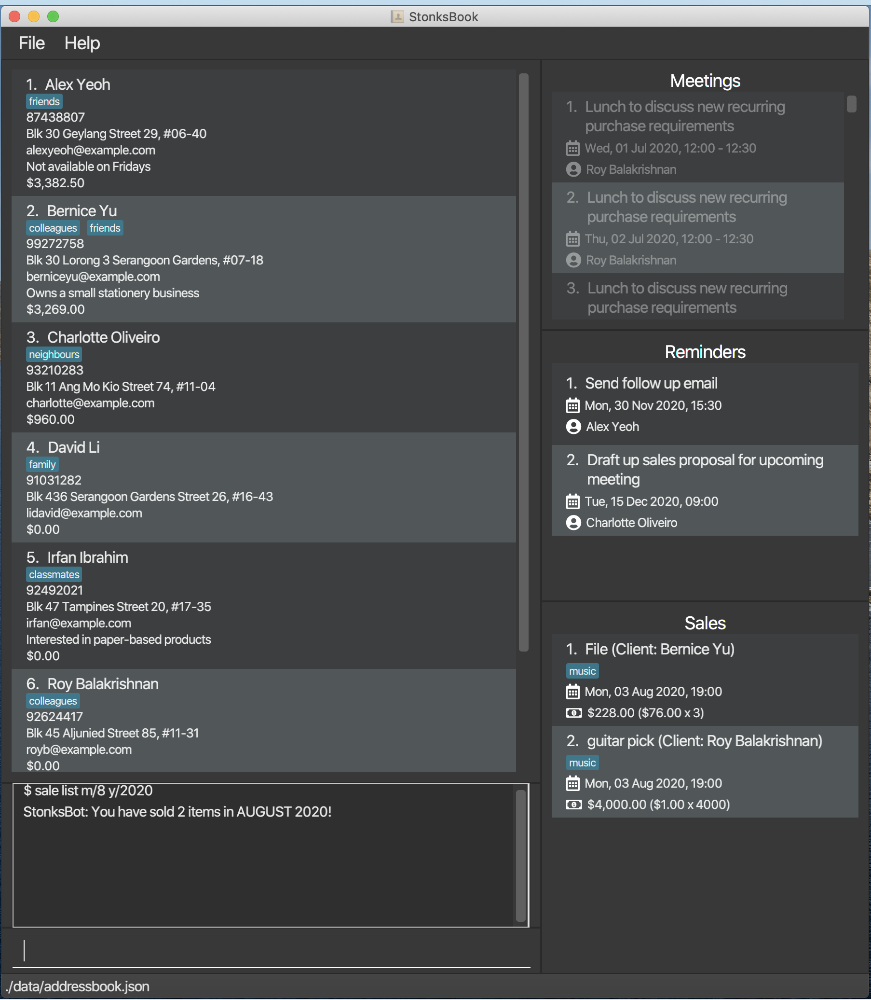

* Table of Contents
{:toc}

--------------------------------------------------------------------------------------------------------------------
## Introduction

StonksBook is a contact management application that is created for salesmen.

Many salesmen waste their time manually managing their contacts and sales data. They often require
 several different applications to carry out these tasks.

 StonksBook aims to integrate the key tools used by salesmen into an all-in-one application that can empower them to
  effectively curate their contact list. StonksBook also provides many tools that can boost one's sales peformance
  through the use of sophisticated data analysis techniques.
  
This is what StonksBook looks like:
  

--------------------------------------------------------------------------------------------------------------------

## Quick start

This section will provide a quick guide to get StonksBook up and running on your computer.

1. Ensure you have Java `11` or above installed in your Computer.

1. Download the latest `stonksbook.jar` from [here](https://github.com/AY2021S1-CS2103T-T11-1/tp/releases).

1. Copy the file to the folder you want to use as the _home folder_ for StonksBook.

1. Double-click the file to start the app. The GUI similar to the below should appear in a few seconds. Note how the app contains some sample data. 
   

1. Type the command in the **Command Box** and press <kbd>Enter</kbd> to execute it. e.g. typing **`help`** and pressing
 <kbd>Enter</kbd> will open the help window. 
   Some example commands you can try:

   * **`contact list`** : Lists all contacts.

   * **`contact add`**`n/John Doe p/98765432 e/johnd@example.com a/John street, block 123, #01-01` : Adds a contact named `John Doe` to StonksBook.

   * **`contact delete`**`3` : Deletes the 3rd contact shown in the current list.

   * **`purge`** : Deletes all contacts.

   * **`exit`** : Exits the app.

1. Refer to the [Features](#features) below for details of each command.

--------------------------------------------------------------------------------------------------------------------

## Features

**:information_source: Notes about the command format:** 

* Words in `UPPER_CASE` are the parameters to be supplied by the user. 
  e.g. in `contact add n/NAME`, `NAME` is a parameter which can be used as `contact add n/John Doe`.

* Items in square brackets are optional. 
  e.g `n/NAME [t/TAG]` can be used as `n/John Doe t/friend` or as `n/John Doe`.

* Items with `…`​ after them can be used multiple times including zero times. 
  e.g. `[t/TAG]…​` can be used as ` ` (i.e. 0 times), `t/friend`, `t/friend t/family` etc.

* Parameters can be in any order. 
  e.g. if the command specifies `n/NAME p/PHONE_NUMBER`, `p/PHONE_NUMBER n/NAME` is also acceptable.

### Contacts

#### Adding a contact: `contact add`
Adds a contact to StonksBook.

**Format**: `contact add n/NAME p/PHONE_NUMBER e/EMAIL a/ADDRESS [t/TAG]… [r/REMARK]…​`

:bulb: Tip: A contact can have any number of tags (including 0)

* The contact tags provided must exist in StonksBook before you can associate this contact with them.

**Examples**:
* `contact add n/John Doe p/98765432 e/johnd@example.com a/John street, block 123, #01-01`
* `contact add n/Betsy Crowe t/friend e/betsycrowe@example.com a/Newgate Prison p/1234567 t/criminal r/blacklisted`

#### Editing a contact: `contact edit`
Edits an existing contact in StonksBook.

**Format**: `contact edit INDEX [n/NAME] [p/PHONE] [e/EMAIL] [a/ADDRESS] [t/TAG]… [r/REMARK]`

* Edits the contact at the specified `INDEX`. The index refers to the index number shown in the displayed contact list. The index must be a positive integer 1, 2, 3, …​
* At least one of the optional fields must be provided.
* Existing values will be updated to the input values.
* When editing a contact's tags, the existing tags of the contact will be removed i.e adding of tags is not cumulative.
* When editing a contact's remark, the previous remark will also be removed/overwritten.
* You can remove all the contact’s tags/remark by typing `t/` or  `r/` respectively without specifying any tags/remark after it.
* The contact tags provided must exist in StonksBook before you can associate this contact with them.

**Examples**:
* `contact edit 1 p/91234567 e/johndoe@example.com` edits the phone number and email address of the 1st contact to be 91234567 and johndoe@example.com respectively.
* `contact edit 2 n/Betsy Crower t/` edits the name of the 2nd contact to be Betsy Crower and clears all existing tags.

#### Listing all contacts: `contact list`
Shows a list of all contacts in StonksBook.

**Format**:`contact list`

#### Locating contacts by name: `contact find`
Finds contacts whose names exactly match or is similar to any of the given keywords.

**Format**: `contact find KEYWORD [MORE_KEYWORDS]`

* The search is case-insensitive. e.g hans will match Hans

* The order of the keywords does not matter. e.g. Hans Bo will match Bo Hans

* You can only search based on the contact name.

* Contacts matching at least one keyword will be returned (i.e. OR search). e.g. Hans Bo will return Hans Gruber, Bo Yang

* keyword does not have to exactly match a contact name. e.g. alx will return Alex Yeoh

* The contact list is ordered by non-ascending similarity.

* Exact matches (if exist) will appear as the first few results.

e.g. You want to find the contact Alex Yeoh but you only roughly remember the spellng the of the name as alx yo and you can do this as shown.
1. Type `contact find alx yo` in the **Command Box** and press <kbd>Enter</kbd>.

2. The contact list now contains contacts whose name is similar to alx yo.

3. Alex Yeoh appears as the first contact on the list.

**Examples**:
* `contact find alex david` returns Alex Yeoh, David Li
* `contact find alx` returns Alex Yeoh
* `contact find alx david` returns David Li, Alex Yeoh

#### Sorting contacts: `contact sort`
Sorts contacts based on the name, email address or the total sale amount associated to the contact.

**Format**: `contact sort KEYWORD [ORDER]`

* `KEYWORD` must exactly match to one of the following:
    * `n/` for name
    * `e/` for email address
    * `s/` for total sales amount

* If `ORDER` is present, `ORDER` must exactly match `desc`.

* If `ORDER` is absent, contacts will be sorted in non-descending order. Otherwise, contacts will be sorted in non-ascending order.

* The sorted result will last until other contact commands (except `contact delete`) are executed.

e.g. You want to see the contacts who have paid you the most for your sales and you can do so as shown.
1. Type `contact sort s/ desc` in the **Command Box** and press <kbd>Enter</kbd>.

2. The contact list is sorted by the total sales amount, from highest to lowest.
3. Your top paying contacts will be at the top of the list.

**Examples**:
* `contact sort e/ desc` sorts the contact list based on the email address in non-ascending order
* `contact find n/`  sorts the contact list based on the contact name in non-descending order
* `contact find s/ desc` sorts the contact list based on the total sales amount in non-ascending order

#### Deleting a contact: `contact delete`
Deletes the specified contact from StonksBook. All associated reminders and meetings will be deleted as well.

**Format**: `contact delete INDEX`
* Deletes the contact at the specified `INDEX`.
* The index refers to the index number shown in the displayed contact list.
* The index must be a positive integer 1, 2, 3, …​

**Examples**:
`contact list` followed by `contact delete 2` deletes the 2nd contact in StonksBook.
`contact find Betsy` followed by `contact delete 1` deletes the 1st contact in the results of the find command.

### Tags

#### Adding a tag: `tag add` \[Wang Luo\]

Adds a new customised contact tag or sales tag to StonksBook.

StonksBook will not allow you to add a new contact tag (or sales tag) if there already exists a contact tag (or sales tag) of the same name.

**Format**: `tag add (ct/ or st/)TAG`

* `ct/` stands for contact tag, `st/` stands for sales tag.
* Adds a contact tag (if `ct/` is typed) or a sales tag (if `st/` is typed) with the specified `TAG` as the tag name to the contact tag list (or sales tag list).
* The `TAG` field must be provided.

**Examples**:

Let's say that you want to add a new sales tag called electronics. Here are the steps to follow:

1. Type `tag add st/electronics` in the **Command Box** and press <kbd>Enter</kbd>.

    
    
2. The **Result Box** will display a message noting that the command was successful, and the **Sales Tags** will now contain this new sales tag.

    

#### Listing all tags: `tag list` \[Wang Luo\]

Displays a list of all tags created so far.

**Format**: `tag list`

**Examples**:

Let's say that you want to see all the tags you have created so far. Here are the steps to follow:

1. Type `tag list` in the **Command Box** and press <kbd>Enter</kbd>.

    

2. The **Result Box** will display a message noting that the command was successful, and the bottom right box will now display **Contact Tags** and **Sales Tags**.

    

#### Editing a tag: `tag edit` \[Wang Luo\]

Edits an existing tag in StonksBook to the specified tag name.

All entries (contacts or sales) previously associated with this tag will be updated to associate with the updated tag.

**Format**: `tag edit (ct/ or st/)INDEX t/TAG`

* Edits the name of the contact tag or sales tag at the specified `INDEX` to be the specified `NAME`. The `INDEX` refers to the index number shown in the contact tags list or sales tags list displayed by the `tag list` command.
* The `INDEX` must be a positive integer 1, 2, 3, ...
* The `TAG` and `INDEX` fields must be provided.
* All contacts or sales that have been previously associated with this tag will be updated automatically to be associated with the updated tag.

**Examples**:

Let's say that you decides to change the tag colleagues to teammates instead. Here are the steps to follow:

1. Type `tag list` in the **Command Box** and press <kbd>Enter</kbd>.
    - This is to display the contact tags and sales tags in StonksBook.

    

2. Type `tag edit ct/2 t/teammates` in the **Command Box** and press <kbd>Enter</kbd>.

    

3. The **Result Box** will display a message noting that the command was successful, and the **Contact Tags** will now contain teammates instead of colleagues. Note that the tags are sorted alphabetically, hence, you may need to scroll up or down to see the updated tag. Also, note that the contact Bernice Yu is now tagged to teammates.

     

#### Deleting a tag: `tag delete` \[Wang Luo\]

Deletes the specified tag from the tag list. The tag information in all entries previously associated with this tag will also be cleared.

**Format**: `tag delete (st/ or ct/)INDEX`

* Deletes the the contact tag or sales tag at the specified `INDEX`. The `INDEX` refers to the index number shown in the list displayed by the `tag list` command.
* The `INDEX` must be a positive integer 1, 2, 3, ...
* The `INDEX` field must be provided.
* All contacts that have been previously associated with this tag will be updated so that their associations with this tag will be cleared.

**Examples**:

Let's say that you think one contact tag (colleagues) you created before is no longer relevant and you would like to get rid of it. Here are the steps to follow:

1. Type `tag list` in the **Command Box** and press <kbd>Enter</kbd>.
    - This is to display the contact tags and sales tags in StonksBook, and the contact tag colleagues is found to be at index 2.

    

2. Type `tag delete ct/2` in the **Command Box** and press <kbd>Enter</kbd>.

    

3. The **Result Box** will display a message noting that the command was successful, and the **Contact Tags** will no longer contain the contact tag colleagues. Also note that Bernice Yu is no longer tagged with colleagues.

    

#### Retrieving entries by tag: `tag find` \[Wang Luo\]

Displays all entries (contacts or sales) that are associated with the specified tag.

**Format**: `tag find (ct/ or st/)INDEX [cl/]`

* Displays all entries of associated with the tag at `INDEX`. The `INDEX` refers to the index number shown in the list displayed by the `tag list` command.
* The `INDEX` must be a positive integer 1, 2, 3, ...
* The `INDEX` field must be provided.
* An additional `cl/` (stands for 'client') field can be provided when performing searching on sales tags, if provided, instead of displaying sales associated to this tag, StonksBook will display the clients who have purchased items with this tag.
* If you are searching for contact tags using `ct/`, adding the `cl/` tag will have no effect on the search results.

**Examples**:

Let's say that you would like to find out who are the contacts tagged with friends. Here are the steps to follow:

1. Type `tag list` in the **Command Box** and press <kbd>Enter</kbd>.
    - This is to display the contact tags and sales tags in StonksBook, and the contact tag friends is found to be at index 3.

    

2. Type `tag find ct/3` in the **Command Box** and press <kbd>Enter</kbd>. 

    

3. The **Result Box** will display a message noting that the command was successful, as well as a list of contacts who are tagged with friends.

    

Now suppose that you would like to find out who purchased items that are tagged with music. Here are the steps to follow:

1. Type `tag list` in the **Command Box** and press <kbd>Enter</kbd>.
    - This is to display the contact tags and sales tags in StonksBook, and the contact tag friends is found to be at index 3.

    

2. Type `tag find st/2` in the **Command Box** and press <kbd>Enter</kbd>.

   

3. The **Result Box** will display a message noting that the command was successful, as well as a list of clients who purchased items tagged with music.

   

### Sales

StonksBook allows you to manage the sales you made within the application. 

#### Listing all sales: `sale list` [Kwek Min Yih]

Shows a list of sales. By default, all sales will be listed. 
This list is sorted in ascending order based on the date the sale is made.

**Format:** `sale list [c/CONTACT_INDEX] [m/MONTH y/YEAR]`

* When used without any arguments, all sales will be shown.
* At most one optional parameter can be present.

* `CONTACT_INDEX` refers to the index number
  shown in the displayed contact list and
  must be a positive integer 1, 2, 3, …​
* `MONTH` must be an integer between 1 and 12 inclusive.
* `YEAR` must be an integer greater than 0.

* If no optional parameter is present:
   * all sales are listed.

* If optional parameter `CONTACT_INDEX` is present:
   * all sales made to a contact with the specified index are listed.

* If optional parameter `[m/MONTH y/YEAR]` is present:
   * all sales whose associated date is in the specified `MONTH` and `YEAR` are listed.
   
e.g. you want to see the sales you have made in August 2020, you can do so as shown.
1. Type `sale list m/8 y/2020` in the **Command Box** and press <kbd>Enter</kbd>.

**Example:** Let's say you want to view all sales made to Bernice Yu. This is what you need to do:

1. Type `contact find bernice` in the **Command Box** and press <kbd>Enter</kbd>. 
    - This is to identify the contact index corresponding to Bernice Yu.     
    
2. The **Result Box** will display a message of the number of contacts listed and the **Contact List** updates to
 show only contacts with the name 'Bernice'. Identify the correct index that corresponds to Bernice Yu, which is 1 in this example. 
 
3. Type `sale list c/1` in the **Command Box** and press <kbd>Enter</kbd>.

4. The **Result Box** will display a message noting that the command was successful, and the **Sale List** will
 show a list of sales made to Bernice Yu.

#### Adding a sale to a customer: `sale add` [Kwek Min Yih]

Adds a sale to the specified contact in StonksBook.

**Format:** `sale add c/CONTACT_INDEX… n/ITEM_NAME d/DATETIME_OF_PURCHASE p/UNIT_PRICE q/QUANTITY t/TAG…`

* Adds a sale made to the contact at the specified `CONTACT_INDEX`, with details such as the name of item sold, the unit price, and the quantity.
* The `CONTACT_INDEX` refers to the index number shown in the displayed contact list, and must be a positive integer 1, 2, 3, …​
* Multiple `CONTACT_INDEX` can be specified, meaning that you can add a sale to multiple contacts.
* The `DATETIME_OF_PURCHASE` must be in the format `yyyy-MM-dd HH:mm`
* The `UNIT_PRICE` must be a positive number with 2 decimal places, in format `DOLLARS.CENTS`.
* The `QUANTITY` must be a positive integer 1, 2, 3, …​
* It is compulsory to have a tag for the sales item. This is to ensure the ease of data analytics.
* The tags provided must exist in StonksBook first before you can associate the sales item to them.

**Example:**
Suppose you successfully sold 100 guitar tuners at a unit price of $10 with Bernice Yu on 30 October 2020, 3pm. 
Here's how you can add this new sale into StonksBook:
 
1. Type `contact find bernice` in the **Command Box** and press <kbd>Enter</kbd>. 
     - This is to identify the contact index corresponding to Bernice Yu.      
     
2. The **Result Box** will display a message of the number of contacts listed and the **Contact List** updates to
  show only contacts with the name 'Bernice'. Identify the correct index that corresponds to Bernice Yu, which is 1 in this example.  
 
3. Type `sale add c/1 n/Guitar Tuner d/2020-10-30 15:00 p/10.00 q/100 t/music` in the **Command Box** and press <kbd>Enter</kbd>.
 
  
4. The **Result Box** will display a message noting that the command was successful, and the **Sale List** will
 contain this newly created sale.
    - You may have to scroll through your **Sale List** to find this newly created sale since sales are
     sorted in ascending order based on the date the sale is scheduled.

#### Deleting a sales item: `sale delete` [Kwek Min Yih]

Deletes a specified sales item from StonksBook.

**Format:** `sale delete s/SALE_INDEX…`

* Deletes the sale(s) at specified `SALE_INDEX`.
* The  `SALE_INDEX` refers to the index number shown in the displayed sale list, and must be a positive integer 1, 2, 3, …​
* Multiple `SALE_INDEX` can be specified, meaning that you can delete multiple sales with the same command.

**Examples:**
Let's say that you have just received the unfortunate news from Bernice Yu who no longer wishes to buy 2 drum sets from you.
Here's how you can delete this sale in StonksBook:

1. Type `contact find bernice` in the **Command Box** and press <kbd>Enter</kbd>. 
    - This is to identify the contact index corresponding to Bernice Yu.
    
2. The **Result Box** will display a message of the number of contacts listed and the **Contact List** updates to
 show only contacts with the name 'Bernice'. Identify the correct index that corresponds to Bernice Yu, which is 1 in this example.
 
3. Type `sale list c/1` in the **Command Box** and press <kbd>Enter</kbd>.

4. The **Result Box** will display a message noting that the command was successful, and the **Sale List** will
 show a list of sales made to Bernice Yu. Identify the index of the sale to be deleted. Let us assume it is at the third index.

5. Type `sale delete s/3` in the **Command Box**, and press <kbd>Enter</kbd> to execute it.
 
     
6. You should see that the sale has been deleted from the sale list.
 
#### Editing an existing sale: `sale edit` [Kwek Min Yih]

Edits an existing sale in StonksBook.

**Format:** `sale edit s/SALE_INDEX… [c/CONTACT_INDEX] [n/ITEM_NAME] [d/DATETIME_OF_PURCHASE] [p/UNIT_PRICE] [q/QUANTITY] [t/TAG]…`

* Edits the sale at the specified `SALE_INDEX`. 
* The `SALE_INDEX` refers to the index number shown in the displayed meeting list, and must be a positive integer 1, 2, 3, …​
* Multiple `SALE_INDEX` can be specified, meaning that you can edit multiple sales with the same command.
* At least one of the optional fields must be provided.
* Existing values will be updated to the input values.
* When editing a sale's tags, the existing tags of the sale will be removed i.e adding of tags is not cumulative.

**Examples:**
Suppose you have just received the good news that Bernice Yu would like to buy 20 Guitars instead of the 10 she previously specified. 
Here's how you can edit her sale in StonksBook:
 
1. Identify the index corresponding to the sale to be edited in the sale list. If you have a large list of
  sales, it may be convenient to filter for all sales made to Bernice Yu. Assuming that Bernice Yu is the 2nd contact
   currently displayed in the contact list, you can type `sale list c/2` and the sale list will update to show
    only sales made to Bernice Yu.
    
2. Suppose the sale to be edited is at the third index in the sale list. Then, type `sale edit s/3 q/20` in the **Command Box**, and press <kbd>Enter</kbd> to execute it.
  
3. You should see that the sale has been updated to reflect this new quantity.

#### Viewing a breakdown of sales made in each tag: `sale breakdown` [Kwek Min Yih]

Displays a breakdown of the top 5 tags and the number of sales with each tag.

**Format:** `sale breakdown`

* This will display a bar graph showing the top 5 tags and the number of sales with each tag in an external window.

#### Analysing sales: `sale stats`
Analyses the sale data and visualises the statistical result.

**Format**: `sale stats NUMBER_OF_MONTHS`

* `NUMBER_OF_MONTHS` refers to the number of months to be included in the result.
* `NUMBER_OF_MONTHS` must be an integer between 2 and 6 inclusive.
     
e.g. You can compare the number of meetings you have had in the past 6 months as shown.

1. Type `sale stats 6` and press <kbd>Enter</kbd>.

2. A new window containing the bar chart pops up.

**Examples**:
* `sale stats 3` will return a bar chart containing the number of sale whose sale date is within
   June 2020, July 2020 and August 2020 respectively if the current month is August and the current year is 2020.

### Scheduled Meetings

StonksBook allows you to manage your scheduled meetings within the application.

#### Listing all meetings: `meeting list` \[Sebastian Toh Shi Jian\]

Shows a list of all meetings. By default, the list only shows upcoming meetings. This list is sorted in ascending order
 based on the date the meeting is scheduled.

**Format**: `meeting list [c/CONTACT_INDEX] [a/]`

* When a contact index is specified, the list will only show meetings associated with the contact at the specified
 contact index.
* You can show all meetings, including past meetings, by including `a/`.

**Example**:
Suppose you want to view all upcoming meetings scheduled with Alex Yeoh. This is what you need to do:

1. Type `contact find alex` in the **Command Box** and press <kbd>Enter</kbd>. 
    - This is to identify the contact index corresponding to Alex Yeoh and can be skipped if you already know the
     index. Let us assume that Alex Yeoh is at the first index.
     
    
    
2. The **Result Box** will display a message of the number of contacts listed and the **Contact List** updates to
 show only contacts with the name 'Alex'.
 
    
 
3. Type `meeting list c/1` in the **Command Box** and press <kbd>Enter</kbd>.

    

4. The **Result Box** will display a message noting that the command was successful, and the **Meeting List** will
 show a list of upcoming meetings scheduled with Alex Yeoh.

    

#### Adding a meeting: `meeting add` \[Sebastian Toh Shi Jian\]

Adds a meeting with the specified contact in StonksBook.

To prevent the situation in which you unknowingly scheduled conflicting meetings, StonksBook will not allow you to
 add a new meeting if it conflicts with some meeting in StonksBook!

**Format**: `meeting add c/CONTACT_INDEX m/MESSAGE d/START_DATETIME du/DURATION`

* Adds a meeting with the contact at the specified `CONTACT_INDEX`.
* The index refers to the index number shown in the displayed contact list.
* The index must be a positive integer 1, 2, 3, …​
* The start datetime must be in the format `yyyy-MM-dd HH:mm`
* The duration is specified in minutes and must be a positive integer.

**Example**:
Let's say that you successfully secured a lunch meeting with Alex Yeoh that is scheduled for 3 December 2020 12pm
and lasts 90 minutes. Here's how you can add this new meeting into StonksBook:
 
 1. Type `contact find alex` in the **Command Box** and press <kbd>Enter</kbd>. 
     - This is to identify the contact index corresponding to Alex Yeoh and can be skipped if you already know the
      index. Let us assume that Alex Yeoh is at the first index.
      
    
 
 2. The **Result Box** will display a message of the number of contacts listed.
  
    
 
 3. Type `meeting add c/1 m/Lunch with Alex Yeoh d/2020-12-03 12:00 du/90` in the **Command Box** and press <kbd>Enter</kbd>.
 
    
  
4. The **Result Box** will display a message noting that the command was successful, and the **Meeting List** will
 contain this newly created meeting.
    - You may have to scroll through your **Meeting List** to find this newly created meeting since meetings are
     sorted in ascending order based on the date the meeting is scheduled.
 
    

#### Deleting a meeting: `meeting delete` \[Sebastian Toh Shi Jian\]

Deletes the specified meeting from StonksBook.

**Format**: `meeting delete INDEX`

* Deletes the schedule at the specified `INDEX`.
* The index refers to the index number shown in the displayed meetings list.
* The index must be a positive integer 1, 2, 3, …​

**Example**:
Let's say that you have just received an unfortunate email from Alex Yeoh who no longer wishes to meet with you on 3
 December 2020, 12pm. Here's how you can delete this meeting in StonksBook:

 1. Type `meeting list` in the **Command Box** and press <kbd>Enter</kbd>. 
     - This is to display all upcoming meetings in the **Meeting List**, which is necessary to identify the index of
      the meeting that is to be deleted. This step can be skipped if you already know the index. Let
       us assume that the meeting is at the third index.
    
    

 2. Type `meeting delete 3` in the **Command Box**, and press <kbd>Enter</kbd> to execute it.
 
    
     
 3. The **Result Box** will display a message noting that the command was successful, and the meeting is deleted from
  the **Meeting List**.
  
    
 
#### Editing a meeting: `meeting edit` \[Sebastian Toh Shi Jian\]

Edits an existing meeting in StonksBook.

Similar to when adding a meeting, StonksBook will not allow you to edit a meeting if it will conflicts with some meeting
 in StonksBook!

**Format**: `meeting edit INDEX [c/CONTACT_INDEX] [m/MESSAGE] [d/START_DATETIME] [du/DURATION]`

* Edits the meeting at the specified `INDEX`. The index refers to the index number shown in the displayed meeting list. The index must be a positive integer 1, 2, 3, …​
* At least one of the optional fields must be provided.
* Existing values will be updated to the input values.

**Example**:
Let's say that you have just received an email from Bernice Yu who wishes to reschedule her lunch meeting with you to 15
 December 2020, 12pm. Here's how you can make this change in StonksBook:
 
1. Type `meeting list` in the **Command Box** and press <kbd>Enter</kbd>. 
    - This is to display all upcoming meetings in the **Meeting List**, which is necessary to identify the index of
     the meeting that is to be edited. This step can be skipped if you already know the index. Let us assume that the meeting is at the third index.

2. Type `meeting edit 3 d/2020-12-15 12:00` in the **Command Box**, and press <kbd>Enter</kbd> to execute it.

3. The **Result Box** will display a message noting that the command was successful, and the meeting is updated in the 
     the **Meeting List**.

#### Analysing meetings: `meeting stats`
Analyses the meeting data and visualises the statistical result.

**Format**: `meeting stats [NUMBER_OF_MONTHS] [m/MONTH y/YEAR]`

* At most one optional parameter can be present.

* `NUMBER_OF_MONTHS` refers to the number of months to be included in the result.
* `NUMBER_OF_MONTHS` must be an integer between 2 and 6 inclusive.
* `MONTH` must be an integer between 1 and 12 inclusive.
* `YEAR` must be an integer greater than 0.

* If no optional parameter is present:
   * The result is the number of meetings whose start date is in the current month and year

* If optional parameter `[m/MONTH y/YEAR]` is present:
   * The result is the number of meetings whose start date is in the specified `MONTH` and `YEAR`

* If optional parameter `[NUMBER_OF_MONTHS]` is present:
   * The result is a bar chart on the number of meetings
     whose start date is within each of the previous `NUMBER_OF_MONTHS` - 1 months and
     the current month and year.
     
e.g. You can compare the number of meetings you have had in the past 6 months as shown.

1. Type `meeting stats 6` and press <kbd>Enter</kbd>.

2. A new window containing the bar chart pops up.

**Examples**:
* `meeting stats` will return the number of meetings whose start date is in the October 2020
   if the current month is October and the current year is 2020.
* `meeting stats m/8 y/2020` will return the number of meetings whose start date is in August 2020.
* `meeting stats 3` will return a bar chart containing the number of meetings whose start date is within
   June 2020, July 2020 and August 2020 respectively if the current month is August and the current year is 2020.

### Reminders

StonksBook allows you to manage your reminders within the application.

#### Listing reminders: `reminder list` \[Sebastian Toh Shi Jian\] \[Wang Luo\]

Shows a list of all reminders created, sorted in ascending order based on the date the reminder is scheduled.

**Format**: `reminder list [st/STATUS]`

* `STATUS` can be either `completed` or `pending`.

**Example**:
Let's say that you want to view all your pending reminders. Here's how you can do so:
 
1. Type `reminder list st/pending` in the **Command Box** and press <kbd>Enter</kbd>. 

2. The **Result Box** will display a message noting that the command was successful, and the **Reminder List** will
 show a list of pending reminders.

#### Adding reminders: `reminder add` \[Sebastian Toh Shi Jian\]

Adds a reminder scheduled on a particular date that is associated with the specified contact to StonksBook.

**Format**: `reminder add c/CONTACT_INDEX m/MESSAGE d/DATETIME`

* Adds a reminder associated with the contact at the specified `CONTACT_INDEX`.
* The index refers to the index number shown in the displayed contact list.
* The index must be a positive integer 1, 2, 3, …​
* The datetime must be in the format `yyyy-MM-dd HH:mm`

**Example**:
Let's say that you need to send a follow-up email to Bernice Yu on 30 October 2020, 3PM. Here's how you can add a reminder into StonksBook:
 
 1. Type `contact find bernice` in the **Command Box** and press <kbd>Enter</kbd>. 
     - This is to identify the contact index corresponding to Bernice Yu and can be skipped if you already know the
      index. Let us assume that Bernice Yu is at the second index.
       
 2. The **Result Box** will display a message of the number of contacts listed.
  
 3. Type `reminder add c/2 m/Send email to follow up d/2020-10-30 15:00` in the **Command Box** and press <kbd>Enter</kbd>.
   
4. The **Result Box** will display a message noting that the command was successful, and the **Reminder List** will
 contain this newly created reminder.
    - You may have to scroll through your **Reminder List** to find this newly created reminder since reminders are
     sorted in ascending order based on the date the reminder is scheduled.   
    
#### Deleting a reminder: `reminder delete` \[Sebastian Toh Shi Jian\]

Deletes the specified reminder from StonksBook.

**Format**: `reminder delete INDEX`

* Deletes the reminder at the specified `INDEX`.
* The index refers to the index number shown in the displayed reminders list.
* The index must be a positive integer 1, 2, 3, …​

**Examples**:
Let's say that a reminder in StonksBook is no longer applicable and you wish to delete it. Here's you can delete
 a reminder from StonksBook:

 1. Type `reminder list` in the **Command Box** and press <kbd>Enter</kbd>. 
     - This is to display all all reminders in the **Reminder List**, which is necessary to identify the index of
      the reminder that is to be deleted. This step can be skipped if you already know the index. Let
       us assume that the reminder is at the third index.

 2. Type `reminder delete 3` in the **Command Box**, and press <kbd>Enter</kbd> to execute it.
     
 3. The **Result Box** will display a message noting that the command was successful, and the reminder is deleted from
  the **Reminder List**.

#### Editing a reminder: `reminder edit` \[Sebastian Toh Shi Jian\] and \[Wang Luo\]

Edits an existing reminder in StonksBook.

**Format**: `reminder edit INDEX [c/CONTACT_INDEX] [m/MESSAGE] [d/DATETIME] [st/STATUS]`

* Edits the reminder at the specified `INDEX`. The index refers to the index number shown in the displayed reminder list. The index must be a positive integer 1, 2, 3, …​
* At least one of the optional fields must be provided.
* Existing values will be updated to the input values.
* `STATUS` can be either `pending` or `completed`.

**Examples**:

Let's say that Alex Yeoh would like to hear from you sooner for the follow up and you just sent the follow up email. Here are the steps to follow:

1. Type `reminder list` in the **Command Box** and press <kbd>Enter</kbd>.
    - This is to display all your reminders in StonksBook, and the reminder for follow up email for Alex Yeoh is found at index 1.

    

2. Type `reminder edit 1 d/2020-10-30 16:30 st/completed` in the **Command Box** and press <kbd>Enter</kbd>. 

    

3. The **Result Box** will display a message noting that the command was successful, as well as the details of the updated reminder.

    

### Archive

StonksBook allows you to archive contacts who are no longer active so that you can focus on contacts who can bring you the Stonks.

#### Adding a contact to the archive: `archive add` \[Leong Jin Ming\]

Adds the specified contact to the archive.

StonksBook will not archive a contact if it is already archived!

**Format**: `archive add INDEX`

* Adds the contact at the specified `INDEX` to the archive.
* Can only be used when the contacts list is displayed.
* The index must be a positive integer 1, 2, 3, …

**Example**:
Suppose you want to archive your contact David Li, who is no longer doing business with you. Simply follow the steps below:

1. Identify the index of the contact entry in the contact list. Here David Li is the third contact in the list. Alternatively you can use `contact find` to find the contact.
2. Type `archive add 3` in the **Command Box** and press <kbd>Enter</kbd>.
3. The contact entry will disappear from the contact list, and the **Result Box** will inform you that the command is successful.

#### Listing contacts in the archive: `archive list` \[Leong Jin Ming\]

Shows the list of your archived contacts.

**Format**: `archive list`

* When entered, if the contacts list is displayed it will be replaced with the archived contacts list.
* You can edit and delete contacts in the archive using `contact edit` and `contact delete` when the archived contacts list is displayed.

**Example**:
To see all your archived contacts, type `archive list` into the **Command Box** and press <kbd>Enter</kbd>. The **Result Box** will inform you that the command was successful, and the archived contacts list will appear.

#### Removing contacts from the archive: `archive remove` \[Leong Jin Ming\]

Removes the specified contact from the archive. The specified contact will appear on your contact list again.

StonksBook will not remove a contact from the archive if it is not in the archive!

**Format**: `archive remove INDEX`

* Removes the contact at the specified `INDEX` from the archive.
* Does not delete the contact from StonksBook. To delete the contact use `contact delete`.
* The index must be a positive integer 1, 2, 3, …

**Example**:
Let's say your archived contact David Li wants to start buying electronics from you again, and so you would like to bring his contact entry back to the contacts list. Simply follow the steps below:

1. Make sure you are on the archived contacts list. If not, simply use the `archive list` command to get all your archived contacts.
2. Identify the index of your contact in the list. In this case, David is the second entry in your list.
3. Type `archive remove 3` in the **Command Box** and press <kbd>Enter</kbd>.
4. The contact entry will disappear from your archive, and the **Result Box** will inform you that the command is successful.

### Miscellaneous

#### Error resolution suggestion:
Gives an approximate match (if exists) of the most similar command to an unknown user input.

**Examples**:
* `contac add` will return a suggestion of `contact add`
* `contt ad` will return a suggestion of `contact add`
* `contacta ` will return a suggestion of `contact add`

#### Navigating between previous inputs within the session:
Pressing the up and down keys retrieves the previous and next input respectively, if there is one.

#### Switching between light and dark themes: `lightmode`/`darkmode`
Changes the theme of the GUI to light and dark theme respectively. The default theme for StonksBook is dark, and the light theme looks like the following:

Format: `lightmode`/`darkmode`

#### Viewing help: `help`
Lists the command word, command description and example
usage for each available command as well as the link to the User Guide.

You can access the help page quickly as shown.
1. Type `help` in the **Command Box** and press <kbd>Enter</kbd>.

2. The help window pops up.

**Format**: `help`

#### Clearing all past interactions: `clear`
Clears all past interactions with the StonksBook GUI within the session.

**Format**: `clear`
#### Removing all data: `purge`
Clears all data from StonksBook.

**Format**: `purge`
#### Exiting the program: `exit`

Exits the program.

**Format**: `exit`

--------------------------------------------------------------------------------------------------------------------

## FAQ

**Q**: How do I transfer my data to another Computer? 
**A**: Install the app in the other computer and overwrite the empty data file it creates with the file that contains the data of your previous StonksBook home folder.

--------------------------------------------------------------------------------------------------------------------

## Command summary

Action | Format, Examples
--------|------------------
**Contact List** | `contact list`
**Contact Add** | `contact add n/NAME p/PHONE_NUMBER e/EMAIL a/ADDRESS [t/TAG]…​[r/REMARK]…`   e.g., `contact add n/James Ho p/22224444 e/jamesho@example.com a/123, Clementi Rd, 1234665 t/friend t/colleague r/birthday: 20 August`
**Contact Delete** | `contact delete INDEX`   e.g., `contact delete 3`
**Contact Edit** | `contact edit INDEX [n/NAME] [p/PHONE_NUMBER] [e/EMAIL] [a/ADDRESS] [t/TAG]…​[r/REMARK]…`   e.g., `edit 2 n/James Lee e/jameslee@example.com`
**Contact Find** | `contact find KEYWORD [MORE_KEYWORDS]`   e.g., `contact find James Jake`
**Contact Sort** | `contact sort KEYWORD [ORDER]`   e.g., `contact sort n/ desc`
**Sale List** | `sale list [c/CONTACT_INDEX] [m/MONTH y/YEAR]`    e.g., `sale delete c/3`
**Sale Add** | `sale add c/CONTACT_INDEX d/DATETIME_OF_PURCHASE n/ITEM_NAME p/UNIT_PRICE q/QUANTITY [t/TAG]…`   e.g., `sale add c/4 n/Notebook d/2020-10-30 15:00 p/6.00 q/2 t/stationery`
**Sale Delete** | `sale delete s/SALE_INDEX`   e.g., `sale delete s/4`
**Sale Edit** | `sale edit SALE_INDEX [c/CONTACT_INDEX] [n/ITEM_NAME] [d/DATETIME_OF_PURCHASE] [p/UNIT_PRICE] [q/QUANTITY] [t/TAG]…`    e.g., `sale edit 2 n/B5 Notebook p/4.00 q/10`
**Sale Breakdown** | `sale breakdown`
**Sale Stats** | `sale stats NUMBER_OF_MONTHS`   e.g., `sale stats 3`
**Tag List** | `tag list`
**Tag Add** | `tag add (ct/ or st/)TAG`   e.g., `tag add ct/important`
**Tag Delete** | `tag delete INDEX`   e.g., `tag delete 1`
**Tag Edit** | `tag edit INDEX n/NAME`   e.g., `tag edit 1 n/family`
**Tag Find** | `tag find INDEX [MODEL]`   e.g., `tag find 1 c/`
**Meeting List** | `meeting list [c/CONTACT_INDEX] [a/]`
**Meeting Add** | `meeting add c/CONTACT_INDEX m/TITLE d/START_DATETIME du/DURATION`   e.g., `meeting add 2 m/Product Demo d/2020-10-30 15:00 du/60`
**Meeting Delete** | `meeting delete INDEX`   e.g., `meeting delete 3`
**Meeting Edit** | `meeting edit INDEX [c/CONTACT_INDEX] [m/MESSAGE] [d/START_DATETIME] [du/DURATION]`   e.g., `meeting edit 3 d/2020-12-15 12:00`
**Meeting Stats** | `meeting stats [NUMBER_OF_MONTHS] [m/MONTH y/YEAR]`   e.g., `meeting stats 3`
**Reminder List** | `reminder list [st/STATUS]`   e.g., `reminder list st/completed`
**Reminder Add** | `reminder add c/CONTACT_INDEX m/MESSAGE d/DATETIME`   e.g., `reminder add 2 m/Send email to follow up d/2020-10-30 15:00`
**Reminder Delete** | `reminder delete INDEX`   e.g., `reminder delete 4`
**Reminder Edit** | `reminder edit INDEX [c/CONTACT_INDEX] [m/MESSAGE] [d/DATETIME]`   e.g., `reminder edit 3 m/Call to follow up d/2020-11-28 13:00`
**Archive List** | `archive list`
**Archive Add** | `archive add INDEX`   e.g., `archive add 1`
**Archive Remove** | `archive remove INDEX`   e.g., `archive remove 2`
**Light/Dark Theme** | `lightmode`/`darkmode`
**Help** | `help`
**Clear Chatbox** | `clear`
**Delete All Data Entries** | `purge`
**Exit Application** | `exit`
