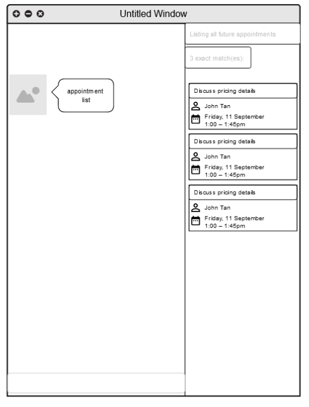

* Table of Contents
{:toc}

--------------------------------------------------------------------------------------------------------------------
## Introduction

StonksBook is a **desktop app for managing contacts, optimized for use via a Command Line Interface** (CLI) while still having the benefits of a Graphical User Interface (GUI). If you can type fast, StonksBook can get your contact management tasks done faster than traditional GUI apps.

--------------------------------------------------------------------------------------------------------------------

## Quick start (WIP)

1. Ensure you have Java `11` or above installed in your Computer.

1. Download the latest `stonksbook.jar` from [here](https://github.com/AY2021S1-CS2103T-T11-1/tp/releases).

1. Copy the file to the folder you want to use as the _home folder_ for your StonksBook.

1. Double-click the file to start the app. The GUI similar to the below should appear in a few seconds. Note how the app contains some sample data. 
   

1. Type the command in the command box and press Enter to execute it. e.g. typing **`help`** and pressing Enter will open the help window. 
   Some example commands you can try:

   * **`contact list`** : Lists all contacts.

   * **`contact add`**`n/John Doe p/98765432 e/johnd@example.com a/John street, block 123, #01-01` : Adds a contact named `John Doe` to StonksBook.

   * **`contact delete`**`3` : Deletes the 3rd contact shown in the current list.

   * **`purge`** : Deletes all contacts.

   * **`exit`** : Exits the app.

1. Refer to the [Features](#features) below for details of each command.

--------------------------------------------------------------------------------------------------------------------

## Features

**:information_source: Notes about the command format:** 

* Words in `UPPER_CASE` are the parameters to be supplied by the user. 
  e.g. in `add n/NAME`, `NAME` is a parameter which can be used as `add n/John Doe`.

* Items in square brackets are optional. 
  e.g `n/NAME [t/TAG]` can be used as `n/John Doe t/friend` or as `n/John Doe`.

* Items with `…`​ after them can be used multiple times including zero times. 
  e.g. `[t/TAG]…​` can be used as ` ` (i.e. 0 times), `t/friend`, `t/friend t/family` etc.

* Parameters can be in any order. 
  e.g. if the command specifies `n/NAME p/PHONE_NUMBER`, `p/PHONE_NUMBER n/NAME` is also acceptable.

### Contacts

#### Adding a contact: `contact add`
Adds a contact to StonksBook.

Format: `contact add n/NAME p/PHONE_NUMBER e/EMAIL a/ADDRESS [t/TAG]… [r/REMARK]…​`

:bulb: Tip: A contact can have any number of tags (including 0)

Examples:
* `contact add n/John Doe p/98765432 e/johnd@example.com a/John street, block 123, #01-01`
* `contact add n/Betsy Crowe t/friend e/betsycrowe@example.com a/Newgate Prison p/1234567 t/criminal r/blacklisted`

#### Editing a contact: `contact edit`
Edits an existing contact in StonksBook.

Format: `contact edit INDEX [n/NAME] [p/PHONE] [e/EMAIL] [a/ADDRESS] [t/TAG]… [r/REMARK]`

* Edits the contact at the specified `INDEX`. The index refers to the index number shown in the displayed contact list. The index must be a positive integer 1, 2, 3, …​
* At least one of the optional fields must be provided.
* Existing values will be updated to the input values.
* When editing a contact's tags, the existing tags of the contact will be removed i.e adding of tags is not cumulative.
* When editing a contact's remark, the previous remark will also be removed/overwritten.
* You can remove all the contact’s tags/remark by typing `t/` or  `r/` respectively without specifying any tags/remark after it.

Examples:
* `contact edit 1 p/91234567 e/johndoe@example.com` edits the phone number and email address of the 1st contact to be 91234567 and johndoe@example.com respectively.
* `contact edit 2 n/Betsy Crower t/` edits the name of the 2nd contact to be Betsy Crower and clears all existing tags.

#### Listing all contacts: `contact list`
Shows a list of all contacts in StonksBook.

Format:`contact list`

#### Locating contacts by name: `contact find`
Find contacts whose names exactly match or is similar to any of the given keywords.

Format: `contact find KEYWORD [MORE_KEYWORDS]`

* The search is case-insensitive. e.g hans will match Hans

* The order of the keywords does not matter. e.g. Hans Bo will match Bo Hans

* You can only search based on the contact name.

* Contacts matching at least one keyword will be returned (i.e. OR search). e.g. Hans Bo will return Hans Gruber, Bo Yang

* keyword does not have to exactly match a contact name. e.g. alx will return Alex Yeoh

* The contact list is ordered by non-ascending similarity.

* Exact matches (if exists) will appear as the first few results.

Examples:
* `contact find alex david` returns Alex Yeoh, David Li
* `contact find alx` returns Alex Yeoh
* `contact find alx dvd` returns Alex Yeoh, David Li

#### Sorting contacts: `contact sort`
Sort contacts based on the name, email address or the total sales amount of a contact.

Format: `contact sort KEYWORD [ORDER]`

* `KEYWORD` can only either be `n/` for name, `e/` for email address, or 's/' for total sales amount.

* `ORDER` can only be `desc`.

* If `ORDER` is absent, contacts will be sorted in non-descending order. Otherwise, contacts will be sorted in non-ascending order.

* The sorted result will last until other contact commands (except `contact delete`) are executed.

Examples:
* `contact sort e/ desc` sorts the contact list based on the email address in non-ascending order
* `contact find n/`  sorts the contact list based on the contact name in non-descending order
* `contact find s/ desc` sorts the contact list based on the total sales amount in non-ascending order

#### Deleting a contact: `contact delete`
Deletes the specified contact from StonksBook.

Format: `contact delete INDEX`
* Deletes the contact at the specified `INDEX`.
* The index refers to the index number shown in the displayed contact list.
* The index must be a positive integer 1, 2, 3, …​

Examples:
`contact list` followed by `contact delete 2` deletes the 2nd contact in StonksBook.
`contact find Betsy` followed by `contact delete 1` deletes the 1st contact in the results of the find command.

### Tags

#### Adding a tag: `tag add`

Adds a new customised tag of the specified name to either the contact tags or sales tags. If there is an existing tag with this name, this command will not result in any change in state.

Format: `tag add c/ (or s/) t/TAG`

* Adds a tag with the specified `TAG` as the tag name to the contact tag list or sales tag list.
* If this tag name already exists in the tag list, there will be no change in the program state.
* The type of tag is specified by the empty prefix `c/` or `s/`, where `c/` adds the tag to the contact tag list, whilst `s/` adds the tag to the sales tag list.
* The `TAG` field must be provided.

Examples:

* `tag add s/ t/electronics` adds the tag `electronics` to the sales tag list in StonksBook.

#### Listing all tags: `tag list`

Displays a list of all tags created so far.

Format: `tag list`

Examples:

* `tag list` displays all tags available in StonksBook.

#### Editing a tag: `tag edit`

Edits an existing tag in StonksBook to the specified tag name. All entries previously associated with this tag will be updated to associated with the updated tag.

Format: `tag edit INDEX t/NAME`

* Edits the name of the tag at the specified `INDEX` to be the specified `NAME`. The `INDEX` refers to the index number shown in the list displayed by the `tag list` command.
* The `INDEX` must be a positive integer 1, 2, 3, ...
* The `NAME` and `INDEX` fields must be provided.
* All contacts or sales that have been previously associated with this tag will be updated automatically to be associated with the updated tag.

Examples:

* `tag edit 1 n/friends` updates the name of the first tag to `close friends`.

#### Deleting a tag: `tag delete`

Deletes the specified tag from the tag list. The tag information in all entries previously associated with this tag will also be cleared.

Format: `tag delete INDEX`

* Deletes the name of the tag at the specified `INDEX`. The `INDEX` refers to the index number shown in the list displayed by the `tag list` command.
* The `INDEX` must be a positive integer 1, 2, 3, ...
* The `INDEX` field must be provided.
* All contacts that have been previously associated with this tag will be updated so that their associations with this tag will be cleared.

Examples:

* `tag delete 1` deletes the first tag from the tag list.

#### Retrieving entries by tag: `tag find`

Displays all entries (including contacts, items, etc.) that are associated with the specified tag.

Format: `tag find INDEX [c/]`

* Displays all entries of associated with the tag at `INDEX`. The `INDEX` refers to the index number shown in the list displayed by the `tag list` command.
* The `INDEX` must be a positive integer 1, 2, 3, ...
* The `INDEX` field must be provided.
* An additional `c/` field can be provided when performing searching on sales tags. This field results in all contacts who purchased sales items associated with this tag to be displayed. Adding this field will have no effect on the search results for contact tags.

Examples:
* `tag find 1` displays all contacts associated with the first tag displayed by the `tag list` command, assuming there are more than one contact tags.
* `tag find 5` displays all sales associated with the seventh tag displayed by the `tag list` command, assuming there are less than five contact tags.
* `tag find 5 c/` displays all contacts who have purchased items associated with the tenth tag, assuming there are less than five contact tags.

### Sales

#### Adding a sale to a customer: `sale add`

Adds a sale of specified name, unit price and quantity, to the specified contact.

Format: `sale add c/CONTACT_INDEX n/ITEM_NAME p/UNIT_PRICE q/QUANTITY`

* Adds a sale made to the contact at the specified `CONTACT_INDEX`, with details such as the name of item sold, the unit price, and the quantity.
* The `CONTACT_INDEX` refers to the index number shown in the displayed contact list.
* The `CONTACT_INDEX` must be a positive integer 1, 2, 3, …​
* `UNIT_PRICE` must be a positive number with 2 decimal places, in format `DOLLARS.CENTS`.
* The `QUANTITY` must be a positive integer 1, 2, 3, …​

Examples:
* `sale add c/4 n/Notebook p/6.00 q/2` Adds a sale made to the contact that is ordered 4th on the displayed contact list. This is a sale of 2 Notebooks, each of price $6.00.

#### Listing all sales items: `sale list`

Shows a list of all sales to a specified contact.

Format: `sale list CONTACT_INDEX`

* Lists all sales made to a contact with the specified `CONTACT_INDEX`.
* The index refers to the index number shown in the displayed contact list.
* The index must be a positive integer 1, 2, 3, …​

#### Deleting a sales item: `sale delete`

Deletes a sales item of specified index.

Format: `sale delete c/CONTACT_INDEX s/SALE_INDEX`

* In the list of all sales made to a contact with the specified `CONTACT_INDEX`, the sale of `SALE_INDEX` is deleted.
* The  `CONTACT_INDEX` refers to the index number shown in the displayed contact list, while `SALE_INDEX` refers to the index number shown in the sale list of the specified contact.
* Both `CONTACT_INDEX` and `SALE_INDEX` must be a positive integer 1, 2, 3, …​

Examples:
* `sale delete c/2 s/4` deletes the 4th sale made to the contact of index number 2.

### Scheduled Meetings

#### Adding a scheduled meeting: `meeting add`

Adds a scheduled meeting with the specified contact in StonksBook.

Format: `meeting add c/CONTACT_INDEX m/MESSAGE d/START_DATETIME du/DURATION`

* Adds a scheduled meeting with the contact at the specified `CONTACT_INDEX`.
* The index refers to the index number shown in the displayed contact list.
* The index must be a positive integer 1, 2, 3, …​
* The start datetime must be in the format `yyyy-MM-dd HH:mm`
* The duration is specified in minutes and must be a positive integer.

Examples:
* `meeting add c/2 m/Follow-up meeting d/2020-10-30 15:00 du/60` Adds a 1-hour long meeting titled `Follow-up meeting` with the 2nd contact in StonksBook that is scheduled for 30th October 2020 at 3PM.
* `meeting add c/3 m/Call to finalise details d/2020-10-30 08:00 du/30` Adds a 30-minute long meeting titled `Call to finalise details` with the 3rd contact in StonksBook that is scheduled for 30th October 2020 at 8AM.

#### Listing all meetings: `meeting list`

Shows a list of all meetings. By default, the list only shows upcoming meetings. This list is sorted in increasing order based on the date the meeting is scheduled.

Format: `meeting list [c/CONTACT_INDEX] [a/]`

* When an index is specified, the list will only show meetings associated with the contact at the specified index.
* You can show all meetings, including those that have passed, by typing `a/`.

#### Deleting an meeting: `meeting delete`

Deletes the specified meeting from StonksBook.

Format: `meeting delete INDEX`

* Deletes the schedule at the specified `INDEX`.
* The index refers to the index number shown in the displayed meetings list.
* The index must be a positive integer 1, 2, 3, …​

Examples:
* `meeting list 5` followed by `meeting delete 2` deletes the 2nd meeting that is associated with the 5th contact in StonksBook.

### Reminders

#### Adding reminders: `reminder add`

Adds a reminder scheduled on a particular date that is associated with the specified contact to StonksBook.

Format: `reminder add c/CONTACT_INDEX m/MESSAGE d/DATETIME`

* Adds a reminder associated with the contact at the specified `CONTACT_INDEX`.
* The index refers to the index number shown in the displayed contact list.
* The index must be a positive integer 1, 2, 3, …​
* The datetime must be in the format `yyyy-MM-dd HH:mm`

Examples:
* `reminder add c/2 m/Send follow-up email d/2020-10-30 15:00` Adds a reminder associated with the 2nd contact that is scheduled for 30th October 2020 3PM, with the message `Send follow-up email`

#### Listing all reminders: `reminder list`

Shows a list of all reminders created, sorted in increasing order based on the date the reminder is scheduled.

Format: `reminder list`

#### Deleting a reminder: `reminder delete`

Deletes the specified reminder from StonksBook.

Format: `reminder delete INDEX`

* Deletes the reminder at the specified `INDEX`.
* The index refers to the index number shown in the displayed reminders list.
* The index must be a positive integer 1, 2, 3, …​

Examples:
* `reminder list` followed by `reminder delete 2` deletes the 2nd reminder in StonksBook.

### Miscellaneous

#### Error resolution suggestion:
Gives an approximate match (if exists) of the most similar command to an unknown user input.

Examples:
* `contac add` will return a suggestion of `contact add`
* `contt ad` will return a suggestion of `contact add`
* `contacta ` will return a suggestion of `contact add`

#### Viewing help: `help`
Lists useful information about the available commands.

Format: `help`

 * Lists the available commands, command description and example usage as well as the link to the User Guide.

#### Clearing all past interactions: `clear`
Clears all past interactions with the StonksBook GUI within the session.

Format: `clear`
#### Removing all data: `purge`
Clears all data from StonksBook.

Format: `purge`
#### Exiting the program: `exit`

Exits the program.

Format: `exit`

--------------------------------------------------------------------------------------------------------------------

## FAQ (WIP)

**Q**: How do I transfer my data to another Computer? 
**A**: Install the app in the other computer and overwrite the empty data file it creates with the file that contains the data of your previous StonksBook home folder.

--------------------------------------------------------------------------------------------------------------------

## Command summary

Action | Format, Examples
--------|------------------
**Contact Add** | `add n/NAME p/PHONE_NUMBER e/EMAIL a/ADDRESS [t/TAG]…​[r/REMARK]…`   e.g., `add n/James Ho p/22224444 e/jamesho@example.com a/123, Clementi Rd, 1234665 t/friend t/colleague r/birthday: 20 August`
**Contact Delete** | `contact delete INDEX`   e.g., `contact delete 3`
**Contact Edit** | `contact edit INDEX [n/NAME] [p/PHONE_NUMBER] [e/EMAIL] [a/ADDRESS] [t/TAG]…​[r/REMARK]…`   e.g., `edit 2 n/James Lee e/jameslee@example.com`
**Contact Find** | `contact find KEYWORD [MORE_KEYWORDS]`   e.g., `contact find James Jake`
**Contact Sort** | `contact sort KEYWORD [ORDER]`   e.g., `contact sort n/ desc`
**Contact List** | `contact list`
**Sale Add** | `sale add c/CONTACT_INDEX n/ITEM_NAME p/UNIT_PRICE q/QUANTITY`   e.g., `sale add c/4 n/Notebook p/6.00 q/2`
**Sale List** | `sale list`
**Sale Delete** | `sale delete c/CONTACT_INDEX s/SALE_INDEX`   e.g., `sale delete c/2 s/4`
**Tag Add** | `tag add t/TAG`   e.g., `tag add t/important`
**Tag List** | `tag list`
**Tag Edit** | `tag edit INDEX n/NAME`   e.g., `tag edit 1 n/family`
**Tag Delete** | `tag delete INDEX`   e.g., `tag delete 1`
**Tag Find** | `tag find INDEX [MODEL]`   e.g., `tag find 1 contact`
**Meeting Add** | `meeting add c/CONTACT_INDEX m/TITLE d/START_DATETIME du/DURATION`   e.g., `meeting add 2 m/Follow-up meeting d/2020-10-30 15:00 du/60`
**Meeting List** | `meeting list [c/CONTACT_INDEX] [a/]`
**Meeting Delete** | `meeting delete INDEX`   e.g., `meeting delete 3`
**Reminder Add** | `reminder add c/CONTACT_INDEX m/MESSAGE d/DATETIME`   e.g., `reminder add 2 m/Send follow-up email d/2020-10-30 15:00`
**Reminder List** | `reminder list`
**Reminder Delete** | `reminder delete INDEX`   e.g., `reminder delete 4`
**Help** | `help`
**Clear Chatbox** | `clear`
**Delete All Data Entries** | `purge`
**Exit Application** | `exit`

